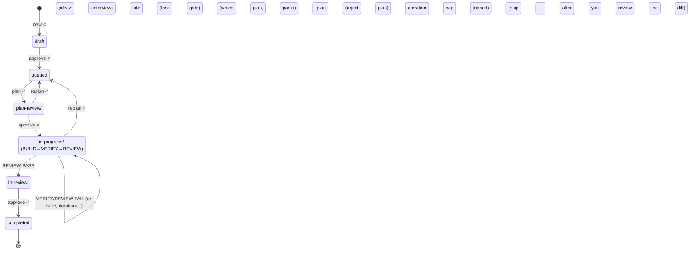
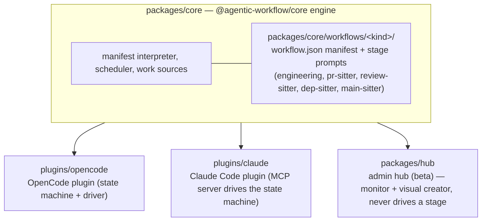

# AGENTS.md

Guidance for AI coding agents working in this repository.

## Repository Overview

`agentic-workflow` is a multi-kind agentic-workflow framework (shared engine in
`@agentic-workflow/core`, shipping both an OpenCode and a Claude Code plugin); this
guide covers the OpenCode plugin — see `plugins/claude/README.md` for the
Claude Code equivalent. It has two ways to work: an **automatic loop** that
drives a backlog task through its whole lifecycle unattended, and **ad-hoc,
skill-driven execution** for a single request that doesn't need a loop. The
sections below cover each.

1. **The automatic agentic loop** (`/agentic-workflow:engineering`) — a real plugin
   (`plugins/opencode/src/`, agents/commands under `plugins/opencode/`) that
   drives the whole lifecycle from one command: `/agentic-workflow:engineering new` interviews you
   into a planless draft task (`new <idea>` — always), `retask <id>` reshapes
   a planless task in place (a draft, or a `queued/` task sent back to `draft/`
   first), `approve [id]` is the one folder-driven gate (draft →
   queued, parked plan → in-progress, finished review parked in `in-review/`
   → completed), and
   `replan [id]` sends a parked plan back, and `remove <id>` hard-deletes a
   task from the backlog entirely (from any folder — the file is deleted and
   the removal committed, not moved; refused while a loop drives it or a claim
   is held);
   the loop claims build-ready work (`claim`, or a `watch [trigger]` worker
   session polling on idle events plus a timer — both scoped to the
   engineering kind; `unwatch` takes this session back out) and drives
   BUILD→VERIFY→REVIEW unattended on plan-approved tasks; a queued task is
   planned only on demand via `plan <id>` (PLAN parks the plan in
   `plan-review/` for your gate and exits — `claim`/`watch` never auto-plan). `recover <id>` resumes a run that stopped early (crash or ESC
   interrupt); `stop`/`abort` ends a run outright; `status` reports the
   current loop plus a backlog roll-up; `kinds` lists which workflow kinds this
   repo has enabled; `doctor [fix]` audits (and optionally repairs) backlog
   structural damage. Use this
   when a goal should run the whole lifecycle largely unattended. See the
   `workflow-orchestration` skill for the pipeline, gates, and verdict contracts,
   and `task-backlog-management` for driving it from
   `docs/tasks/`.
   That pipeline is the **engineering workflow kind** — the default of several
   declarative kinds under `packages/core/workflows/<kind>/` (manifest + stage prompts) run by
   the shared `@agentic-workflow/core` engine. Other kinds are enabled via
   `workflows.<kind>` in `.agentic-workflow.json`. `pr-sitter` and
   `review-sitter` are **stable and always on** — no off switch, and
   `enabled: false` on either is a config error; `engineering` is on unless
   disabled; `dep-sitter` and `main-sitter` are **experimental** and opt-in via
   `enabled: true` (their manifests and config keys may still change). The
   four: `pr-sitter` (agents
   `workflow-pr-triage` / `workflow-pr-fix` / `workflow-pr-publish`, plus
   the shared `workflow-verify`) sits on open PRs — triages, fixes, verifies, and pushes
   replies, but never merges; `review-sitter` sits on PRs where your review is
   requested and posts one structured review comment per head, but never
   approves or requests changes — the human stays reviewer of record;
   `dep-sitter` sits on vulnerable or outdated dependencies and opens a draft PR
   with the verified patch/minor bump, but never auto-fixes major bumps and
   never merges; and `main-sitter` sits on the default branch's CI and, when it
   goes red, opens a draft remedy PR with a verified forward fix or revert, but
   never pushes the watched branch. Each enabled kind has its own command —
   `claim`/`watch` on `/agentic-workflow:pr-sitter` are scoped to the sitter, just
   as `/agentic-workflow:engineering`'s are to the backlog.
2. **Ad-hoc, skill-driven execution** — for a single request that doesn't
   warrant starting a loop, OpenCode still has a **skill-driven execution
   model** powered by the `skill` tool and the `skills/` directory bundled
   with this plugin. The rules below govern that mode.

### Gate lifecycle

A task moves through exactly one folder at a time under `docs/tasks/`. The
same `approve` verb drives every forward move (which one depends on which
folder the task is currently in); `replan` is the sole rejection verb, always
back to `queued/`. Full protocol: `workflow-orchestration` skill.

### Core Rules (ad-hoc mode)

- If a task matches a skill, you MUST invoke it
- Skills are located in `skills/<skill-name>/SKILL.md`
- Never implement directly if a skill applies
- Always follow the skill instructions exactly (do not partially apply them)

### Intent → Skill Mapping

- Feature / new functionality → `spec-driven-development`, then `incremental-implementation`, `test-driven-development`
- Planning / breakdown → `planning-and-task-breakdown`
- Bug / failure / unexpected behavior → `debugging-and-error-recovery`
- Code review → `code-review-and-quality`
- Refactoring / simplification → `code-simplification`
- API or interface design → `api-and-interface-design`
- UI work → `frontend-ui-engineering`
- Run the whole lifecycle on a goal, largely unattended → `/agentic-workflow:engineering new <idea>` then `/agentic-workflow:engineering approve <id>` then `/agentic-workflow:engineering plan <id>` (or `claim`/`watch`) plans + parks, then `/agentic-workflow:engineering approve` (or `replan <why>`), then `claim`/`watch` builds it, then `approve` ships it — the same folder-driven `approve` at every gate; id-less it resolves the single task waiting at a loop gate, falling back to a lone draft only when no loop gate is waiting. See `workflow-orchestration`, not a manual skill chain

### Lifecycle Mapping

`/agentic-workflow:engineering` implements this lifecycle as real pipeline stages (see
`workflow-orchestration`). Outside the loop, follow it as an implicit sequence of
skill invocations instead:

- PLAN → `spec-driven-development` + `planning-and-task-breakdown`
- BUILD → `incremental-implementation` + `test-driven-development`
- VERIFY → `debugging-and-error-recovery`
- REVIEW → `code-review-and-quality`

### Execution Model (ad-hoc mode)

For every request that isn't handed to `/agentic-workflow:engineering`:

1. Determine if any skill applies (even 1% chance)
2. Invoke the appropriate skill using the `skill` tool
3. Follow the skill workflow strictly
4. Only proceed to implementation after required steps (spec, plan, etc.) are complete

### Anti-Rationalization

The following thoughts are incorrect and must be ignored:

- "This is too small for a skill"
- "I can just quickly implement this"
- "I'll gather context first"

Correct behavior: always check for and use skills first.

## Plugin Structure

The shared `@agentic-workflow/core` engine and its declarative workflow-kind
manifests are consumed by three different hosts — the OpenCode plugin, the
Claude Code plugin (via an MCP — Model Context Protocol — server), and the
admin hub:

- `plugins/opencode/src/` — the OpenCode plugin implementation (state machine, driver); task backlog IO lives in `packages/core/src/task/`
- `packages/core/` — the shared `@agentic-workflow/core` engine (manifest interpreter, scheduler, work sources) used by both the OpenCode plugin and the Claude MCP (Model Context Protocol) server
- `packages/core/workflows/<kind>/` — declarative workflow-kind manifests (`workflow.json`) + stage prompt templates (one dir per kind: `engineering/`, `pr-sitter/`, `review-sitter/`, `dep-sitter/`, `main-sitter/`)
- `packages/hub/` — the admin hub (beta): a localhost web app (`npm run hub -- --dir <repo>`) with a loop monitor (backlog board, live gate notifications, run history, token usage) and a visual loop creator; the monitor also carries the human gate moves (approve/replan/ship) and the backlog doctor (rescue strays, release stale claims) through the same `@agentic-workflow/core` entry points the hosts call, a Config tab that edits `.agentic-workflow.json` one layer at a time, a Metrics tab rolling loop health up across runs (iteration burn, first-pass yield, verdict flips, cache hit — the pass, not the file, is its unit of analysis), and a per-stage prompt preview in the creator — but it never claims work or drives a stage itself. See `packages/hub/README.md`
- `plugins/opencode/agents/` — the agent personas backing each loop stage (engineering `workflow-*`, pr-sitter's `workflow-pr-triage`/`workflow-pr-fix`/`workflow-pr-publish`, review-sitter's `workflow-review-fetch`/`workflow-review-assess`/`workflow-review-publish`, dep-sitter's `workflow-dep-scan`/`workflow-dep-upgrade`/`workflow-dep-publish`, and main-sitter's `workflow-main-diagnose`/`workflow-main-remedy`/`workflow-main-publish`, with the shared `workflow-verify` reused as the VERIFY stage across several kinds)
- `plugins/opencode/commands/` — the slash commands (`/agentic-workflow:engineering`, `/agentic-workflow:pr-sitter`, `/agentic-workflow:review-sitter`, `/agentic-workflow:dep-sitter`, `/agentic-workflow:main-sitter`, `/plan`, `/plan-task`, `/build`, `/verify`, `/review`, the pr-sitter stage commands `/pr-triage`, `/pr-fix`, `/pr-publish`, and the new-kind stage commands `/review-fetch`, `/review-assess`, `/review-publish`, `/dep-scan`, `/dep-upgrade`, `/dep-publish`, `/main-diagnose`, `/main-remedy`, `/main-publish`)
- `.opencode/skills` — symlink to `skills/`, the skill library the stage agents invoke
- `skills/` — skill workflows (`SKILL.md` per directory) invoked by name via the `skill` tool
- `references/` — supplementary checklists (`testing-patterns.md`, `security-checklist.md`, etc.) that skills pull in when needed

## Maintaining these rules

Rules earn their place — every line costs context on every session.

- **When to add:** the *second time* an agent makes the same mistake. First
  time = correct it inline (could be a one-off); a repeat means it's systemic
  — write it down. Also add after a plan/ship **gate rejection** whose reason
  was a missing rule, or when VERIFY/REVIEW keeps flagging the same *class* of
  defect.
- **What to write:** the constraint **and why** it exists (so a future agent
  doesn't "fix" it back), not a narration of the bug.
- **Where:** a durable, cross-task fact → here. A task-specific instruction →
  the task file or the stage prompt (`packages/core/workflows/<kind>/stages/*.md`), not here.
- **Prune:** delete a rule when the code it guards moves or the reason dies. A
  stale rule is worse than none.
