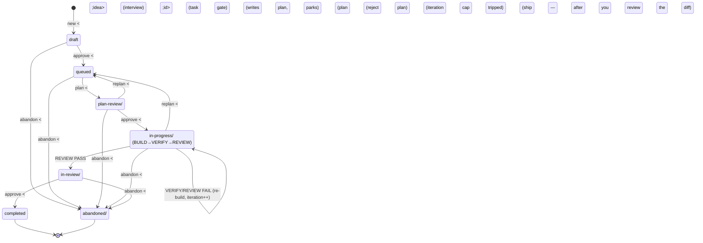
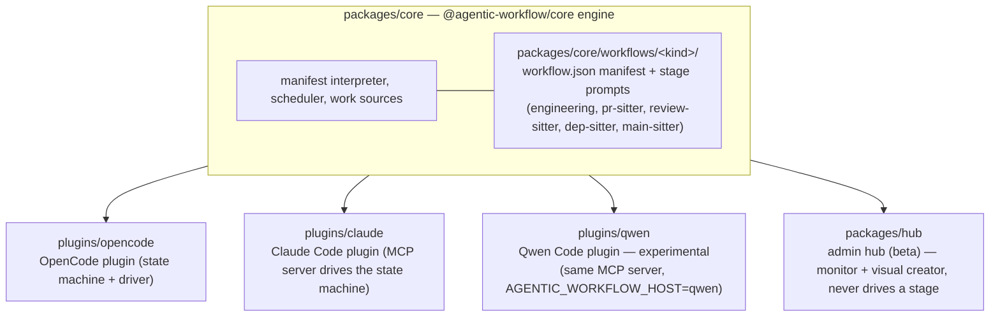

# AGENTS.md

Guidance for AI coding agents working in this repository.

## Repository Overview

`agentic-workflow` is a multi-kind agentic-workflow framework (shared engine in
`@agentic-workflow/core`, shipping OpenCode, Claude Code and Qwen Code
plugins — Qwen Code is experimental); this
guide covers the OpenCode plugin — see `plugins/claude/README.md` for the
Claude Code equivalent. It has two ways to work: an **automatic loop** that
drives a backlog task through its whole lifecycle unattended, and **ad-hoc,
skill-driven execution** for a single request that doesn't need a loop. The
sections below cover each.

1. **The automatic agentic loop** (`/agentic-workflow:engineering`) — a real plugin
   (`plugins/opencode/src/`, agents/commands under `plugins/opencode/`) that
   drives the whole lifecycle from one command. The verbs (procedures live in
   `prompts/verbs/engineering.md`; the state machine is the diagram below):
   `new <idea>` interviews you into a planless draft; `retask <id>` reshapes a
   planless task in place; `approve [id]` is the one folder-driven forward gate
   and `replan [id]` the sole rejection; `approve --all` batches the task gate
   alone over every reviewed draft at once (priority order, tracking epics
   excluded) — the plan and ship gates stay one-at-a-time; `abandon <id>` is
   the reversible cancellation (file kept in `abandoned/` — how a tracking
   epic is closed); `remove <id> --force` hard-deletes from any folder (bare
   `remove` is a dry run; both refused while a loop drives the task or a claim
   is held); `claim [id]`, or a `watch [trigger]` worker session (`unwatch`
   reverses it), drives BUILD→VERIFY→REVIEW unattended on plan-approved tasks,
   falling back to planning an approved `queued/` task (with an id, `claim`
   runs exactly that task instead of the priority walk); `plan <id>` plans one
   now — either way PLAN parks the plan in `plan-review/` for your gate and
   exits; `recover <id>` resumes a run that stopped early (crash or ESC);
   `stop`/`abort` ends a run outright; `init` scaffolds a repo on day one (the
   backlog's status folders, a safe-key `.agentic-workflow.json` when none
   exists — never overwrites, and git-excluding the backlog when
   `ignoreBacklog` is on — idempotent); `status`, `kinds`, and `doctor [fix]`
   report the loop + backlog, list enabled kinds, and audit/repair backlog
   damage (doctor also reports the allowlist deny log — refused bash commands
   with the config change that would admit each — and `doctor config` reports
   the effective configuration instead: layer file paths, the repo-layer keys
   the runtime ignores, and the config in force with secrets masked). See the
   `workflow-orchestration` skill for the pipeline, gates, and verdict
   contracts, and `task-backlog-management` for driving it from `docs/tasks/`.
   That pipeline is the **engineering workflow kind** — the default of several
   declarative kinds under `packages/core/workflows/<kind>/` (manifest + stage
   prompts) run by the shared `@agentic-workflow/core` engine. Other kinds are
   enabled via `workflows.<kind>` in `.agentic-workflow.json`; engineering is
   on unless disabled. **All four sitters are experimental** (opt-in via
   `enabled: true`; manifests, config keys, and the `ado` platform may still
   change), and none merges or pushes the watched branch: `pr-sitter`
   triages/fixes/verifies/replies on open PRs; `review-sitter` posts one
   structured review comment per head where your review is requested (never
   approves or requests changes — the human stays reviewer of record);
   `dep-sitter` opens a draft PR with the verified patch/minor dependency bump
   (never auto-fixes major bumps); `main-sitter` opens a draft remedy PR — a
   verified forward fix or revert — when the default branch's CI goes red. Each
   enabled kind has its own command, with `claim`/`watch` scoped to it.
2. **Ad-hoc, skill-driven execution** — for a single request that doesn't
   warrant starting a loop, OpenCode still has a **skill-driven execution
   model** powered by the `skill` tool and the `skills/` directory bundled
   with this plugin. The rules below govern that mode.

### Gate lifecycle

A task moves through exactly one folder at a time under `docs/tasks/`. The
same `approve` verb drives every forward move (which one depends on which
folder the task is currently in); `replan` is the sole rejection verb, always
back to `queued/` — marked plan-next, with the hosts chaining an immediate
PLAN pass where they can, so the revised plan re-parks in `plan-review/`
without idling. Full protocol: `workflow-orchestration` skill.

```mermaid
stateDiagram-v2
    [*] --> draft: new &lt;idea&gt; (interview)
    draft --> queued: approve &lt;id&gt; (task gate)
    queued --> plan_review: plan &lt;id&gt; (writes plan, parks)
    plan_review --> in_progress: approve &lt;id&gt; (plan gate)
    plan_review --> queued: replan &lt;id&gt; (reject plan)
    in_progress --> in_progress: VERIFY/REVIEW FAIL (re-build, iteration++)
    in_progress --> in_review: REVIEW PASS
    in_progress --> queued: replan &lt;id&gt; (iteration cap tripped)
    in_review --> completed: approve &lt;id&gt; (ship — after you review the diff)
    draft --> abandoned: abandon &lt;id&gt;
    queued --> abandoned: abandon &lt;id&gt;
    plan_review --> abandoned: abandon &lt;id&gt;
    in_progress --> abandoned: abandon &lt;id&gt;
    in_review --> abandoned: abandon &lt;id&gt;
    completed --> [*]
    abandoned --> [*]

    state "plan-review/" as plan_review
    state "in-progress/ (BUILD→VERIFY→REVIEW)" as in_progress
    state "in-review/" as in_review
    state "abandoned/" as abandoned
```

### Core Rules (ad-hoc mode)

- If a task matches a skill, you MUST invoke it
- Skills are located in `skills/<skill-name>/SKILL.md`
- Never implement directly if a skill applies
- Always follow the skill instructions exactly (do not partially apply them)

### Intent → Skill Mapping

- Unshaped work — vague ask, raw idea, symptom without a cause → `plan-router` (routes by who holds the missing information — codebase, human, or nobody — then dispatches)
- Feature / new functionality → `spec-driven-development`, then `incremental-implementation`, `test-driven-development`
- Planning / breakdown → `planning-and-task-breakdown`
- Bug / failure / unexpected behavior → `debugging-and-error-recovery`
- Code review → `code-review-and-quality`
- Refactoring / simplification → `code-simplification`
- API or interface design → `api-and-interface-design`
- UI work → `frontend-ui-engineering`
- Writing a document an agent consumes — a skill, an agent persona, a command or verb, a stage prompt, this file → `writing-for-agents`
- Run the whole lifecycle on a goal, largely unattended → `/agentic-workflow:engineering`: `new <idea>` → `approve` → `plan <id>` (or `claim`/`watch`) parks the plan → `approve` (or `replan <why>`) → `claim`/`watch` builds → `approve` ships — the same folder-driven `approve` at every gate (id-less, it resolves the single task waiting at a loop gate, falling back to a lone draft). See `workflow-orchestration`, not a manual skill chain

### Lifecycle Mapping

`/agentic-workflow:engineering` implements this lifecycle as real pipeline stages (see
`workflow-orchestration`). Outside the loop, follow it as an implicit sequence of
skill invocations instead:

- PLAN → `spec-driven-development` + `planning-and-task-breakdown`
- BUILD → `incremental-implementation` + `test-driven-development`
- VERIFY → `debugging-and-error-recovery`
- REVIEW → `code-review-and-quality`

### Execution Model (ad-hoc mode)

For every request that isn't handed to `/agentic-workflow:engineering`:

1. Determine if any skill applies (even 1% chance)
2. Invoke the appropriate skill using the `skill` tool
3. Follow the skill workflow strictly
4. Only proceed to implementation after required steps (spec, plan, etc.) are complete

### Anti-Rationalization

The following thoughts are incorrect and must be ignored:

- "This is too small for a skill"
- "I can just quickly implement this"
- "I'll gather context first"

Correct behavior: always check for and use skills first.

## Plugin Structure

The shared `@agentic-workflow/core` engine and its declarative workflow-kind
manifests are consumed by three different hosts — the OpenCode plugin, the
Claude Code plugin (via an MCP — Model Context Protocol — server), and the
admin hub:

```mermaid
flowchart TD
    subgraph Core["packages/core — @agentic-workflow/core engine"]
        Engine["manifest interpreter, scheduler, work sources"]
        Workflows["packages/core/workflows/&lt;kind&gt;/<br/>workflow.json manifest + stage prompts<br/>(engineering, pr-sitter, review-sitter, dep-sitter, main-sitter)"]
        Engine --- Workflows
    end

    OpenCode["plugins/opencode<br/>OpenCode plugin (state machine + driver)"]
    Claude["plugins/claude<br/>Claude Code plugin (MCP server drives the state machine)"]
    Qwen["plugins/qwen<br/>Qwen Code plugin — experimental<br/>(same MCP server, AGENTIC_WORKFLOW_HOST=qwen)"]
    Hub["packages/hub<br/>admin hub (beta) — monitor + visual creator, never drives a stage"]

    Core --> OpenCode
    Core --> Claude
    Core --> Qwen
    Core --> Hub
```

- `plugins/opencode/src/` — the OpenCode plugin implementation (state machine, driver); task backlog IO lives in `packages/core/src/task/`
- `packages/core/` — the shared `@agentic-workflow/core` engine (manifest interpreter, scheduler, work sources) used by both the OpenCode plugin and the Claude MCP (Model Context Protocol) server
- `packages/core/workflows/<kind>/` — declarative workflow-kind manifests (`workflow.json`) + stage prompt templates (one dir per kind: `engineering/`, `pr-sitter/`, `review-sitter/`, `dep-sitter/`, `main-sitter/`)
- `packages/hub/` — the admin hub (beta): a localhost web app
  (`pnpm hub --dir <repo>`) with a loop monitor and a visual loop
  creator. The monitor carries the human gate moves (approve/replan/ship), an
  in-place task editor, a plan-review view with per-line replan comments, a
  Plan button on queued cards (writes a plan-request ordering hint, never a
  claim — the next `claim`/`watch` tick honours it), the backlog doctor, a
  Config tab, and a Metrics tab (the pass, not the file, is its unit of
  analysis) — all through the same `@agentic-workflow/core` entry points the
  hosts call. It never claims work or drives a stage itself. See
  `packages/hub/README.md`
- `plugins/opencode/agents/` — the agent personas backing each loop stage
  (engineering `workflow-*`; per-sitter `workflow-pr-*`, `workflow-review-*`,
  `workflow-dep-*`, `workflow-main-*`; the shared `workflow-verify` is reused
  as the VERIFY stage across several kinds)
- `plugins/opencode/commands/` — the slash commands: one entry command per
  kind (`/agentic-workflow:<kind>`), plus per-stage commands (`/plan-task`,
  `/build`, `/verify`, `/review`, and each sitter's stage commands such as
  `/pr-triage` or `/main-remedy`)
- `.opencode/skills` — symlink to `skills/`, the skill library the stage agents invoke
- `skills/` — skill workflows (`SKILL.md` per directory) invoked by name via the `skill` tool
- `prompts/verbs/engineering.md` — the per-verb procedures of `/agentic-workflow:engineering`, each inside an `<!-- aw:verb <names> -->` block; **generated** into `plugins/claude/verbs/` and `plugins/qwen/verbs/` (the slicing rules are `docs/invariants/host-protocol.md`)
- `plugins/qwen/` — the Qwen Code host (**experimental** — interface and behavior may still change): generated `agents/`, `verbs/`, `skills/` and `hooks/`, plus hand-authored `commands/`. Reuses the Claude plugin's MCP server and hook sources; see `docs/qwen.md`
- `references/` — supplementary checklists (`security-checklist.md`, `debugging-patterns.md`, etc.) that skills pull in when needed

## Engineering invariants

Twenty-six rules the code depends on, each learned from a failure that did not
announce itself. Every line below states a **constraint**; the reasoning that
stops a future change from "fixing" it back lives in the file each group names,
and a rule you are about to change, work around, or delete is a rule whose file
you read first.

Reach for a file when you are editing what it governs — the trigger is on the
paths, not on the topic.

### Claims and liveness

**Editing `claim-marker.ts`, `liveness.ts`, a marker sweep, `recover`, `doctor
fix`, or any verb that refuses on a held claim → [`docs/invariants/claims-and-liveness.md`](docs/invariants/claims-and-liveness.md).**

- **Claim markers mean "a loop is driving this NOW".** Every way a drive ends
  releases the marker — `runStop` at any stage, every `runPark` failure arm
  (including the one where the task is gone from `queued/`), the driveChain
  stop/interrupt guard, `onIdle`'s error path — and any new exit path must too.
  Drivers restamp at every stage boundary (`refreshClaimStamp`), takeover and
  release go through `acquireOrSweepMarker` / `releaseMarkerIfStale` and never a
  bare `rm`/`mkdir`, and cross-process liveness for `recover` is
  `taskDrivenByStageMarker`, never the in-memory driving map.
- **A stale window is a proxy; the writer identity is the answer.**
  `claimWriterLiveness` fails CLOSED — every uncertainty is `"unknown"` and keeps
  the window. `pidAlive` may not conclude death and `pidGone` must prove it, each
  probe validating itself against our OWN pid; a pid is only comparable with its
  machine identity (hostname *and* boot id). `releaseMarkerIfStale(…, 0)` is not
  the age-free release — that is `releaseMarkerIfWriterDead` /
  `acquireOrSweepDeadWriter`. The stage marker is the stronger witness and is
  checked first; only human-invoked verbs opt into identity, the unattended
  sweeps keep the wall clock.

### Git isolation

**Editing `ensureIsolation`, `teardownIsolation`, `checkoutBranch`, `persist.ts`,
or anything reading `state.git` → [`docs/invariants/git-isolation.md`](docs/invariants/git-isolation.md).**

- **`state.git.base` is a ref, not always a branch.** Under `taskBranch: false`
  it holds HEAD's sha, and `git.onCurrentBranch` is the only discriminant — check
  it before treating `base` as a branch name, keep it in `GitRefSchema` (zod
  strips what it does not declare), and probe `branchExists` before checking a
  base out, because `checkoutBranch` falls through to `git checkout -b`.
- **The loop leaves the tree on the work branch; the BASE is pinned at the
  start.** `teardownIsolation` only logs — do not restore the checkout. In
  exchange, `baseOffTaskBranch` redirects a base inside `taskBranchPrefix` to the
  default branch, only that namespace is redirected, and no degradation may
  record a base the branch was not cut from.
- **This mode's machine state cannot live in the working tree** (the one-run
  marker sits under `<git-common-dir>`), and `taskBranch` is engineering-only
  (`taskBranchFor`).

### Check stages and verdicts

**Editing `verdictContractBlock`, `passFocusBlock`, `admitVerdict`,
`enforcesAxisCoverage`, `stagePasses`, or the check personas →
[`docs/invariants/checks-and-verdicts.md`](docs/invariants/checks-and-verdicts.md).**

- **A focused pass's contract must match the passes that will run.** The mode is
  the EFFECTIVE one (`stagePasses`), never the manifest's, and every pass regime
  needs its own contract branch pointing at the line `passFocusBlock` actually
  emits — a pass told to cover all axes *and* to focus on one invents verdicts it
  did no work for, and passes merge worst-wins. Coverage is enforced through
  `enforcesAxisCoverage`, never an inline `pass.mode === "axis"`.
- **`verdictContractBlock` is the SSOT for the verdict payload.** The check
  personas point at it and keep only what it cannot know; restating the payload
  there is a regression.
- **A rejected verdict is not a missing one.** Both hosts keep the refused
  `RejectedVerdict`, `rejectedFallback` records the stage as it declared once the
  retry is spent, an effective PASS is never salvaged, and the two ERROR reasons
  stay distinct (`noAdmissibleVerdictReason`).
- **A stage pass's identity is its session (OpenCode).** Concurrency comes from a
  session per pass (`stageConcurrency`), never from re-keying the per-pass tables;
  never pass a `directory` to `session.create`; a pass session is not a loop
  (`passOf`); and every per-run writer takes `withLock`.

### The bash allowlist and config authority

**Editing `workflow.json` allowlists, `allowlistFor`, `commandAllowed`,
`admissibleChecks`, `worktree.instructions`, or adding a config key →
[`docs/invariants/bash-allowlist-and-config.md`](docs/invariants/bash-allowlist-and-config.md).**

- **The two hosts match a bash command differently** — Claude/Qwen per segment,
  OpenCode against the whole string. Declare bare forms only; the `cd * && `
  twins are derived. A glob is position-anchored, so declare the shape the tool
  is actually invoked with (`mvn * test*`, `pnpm --filter*`), and enumerate flags
  rather than tolerating them generically. A command-rewriting proxy is handled by
  `bashAllowlistPrefix` + `stripCommandPrefix` (one hop), never by a blanket glob.
- **`worktree.instructions` stays shaped per command-kind** — inspection through
  `git -C <wt>`, runners through the prefix. A blanket rule there is a blanket
  denial.
- **The repo layer may not decide what runs — including indirectly.** Ask what a
  new key AUTHORISES, not whether its value is a command: anything that widens an
  allowlist, names a tool, or picks a write destination belongs in
  `droppedRepoKeys` / `ALLOWLIST_WIDENING_KEYS` with its own warning.

### The host protocol: spawns, asks, gates, models

**Editing `prompts/verbs/`, a command router, the gate hooks, the MCP gate tools,
`onIdle`, or anything that spawns a stage agent →
[`docs/invariants/host-protocol.md`](docs/invariants/host-protocol.md).**

- **Per-verb command slicing.** Every verb's prose sits inside an
  `<!-- aw:verb <names> -->` block; OpenCode slices the rendered prompt (text
  outside every marker is always kept), Claude/Qwen inject the block into a
  router that is always sent — so nothing unmarked belongs in `prompts/verbs/`.
  Adding or renaming a verb means updating its block **and** every host's
  `argument-hint`; markers own their whole line; never write a literal
  dollar-digit sequence in command prose, and never delete `$2`.
- **On the model-driven hosts, the spawn is the protocol's weakest link.** A stage
  agent may only be spawned while the live marker has armed it
  (`check-spawn-stage`), the marker carries what a hook cannot read
  (`kindAgents`, `bashAllowlist`, `stageAgentModels`), and the guard fails OPEN on
  every uncertainty. Never relax `workflow_verdict`'s stage check to compensate.
- **A blocked turn cannot ask anything.** `approve` is a conditional hybrid:
  never a blanket `continueTurn`, continue only on `ok` + a known `data.gate` + a
  string `data.id`, and among refusals only the id-less ambiguity (nothing moved).
  Gate identity comes from `GateResult.data`, never from `message`. On OpenCode
  the plugin cannot originate a question, so `planFromAgent` refuses until the ask
  was put and `onIdle` returns while a window is open — both failing OPEN on
  `questionsObservable`, both logging. The signal is the `question` tool call
  keyed by `tool.callID`, never an event name or a per-session flag; every way a
  window dies clears the token; and never `await` the drive inside the `event`
  hook.
- **The plan gate asks in a turn of its own.** `promptPlanGateAsk` fires after the
  `finally`, never awaited, only for a human-requested plan (`askOnPark` on the
  pending), and every option it offers names a tool that exists on that host.
  Claude/Qwen get it from `plan-gate-ask.mjs`, which adds context and never a
  decision — and `"plan"` never joins `ASK_GATES`.
- **A stage subagent must not be able to ask.** Three layers, because each can
  fail silently: `tools: {question: false}`, `permission: {question: deny}`, and
  the plugin's own refusal for a session `findDrivingWorkflow` attributes to a
  loop. The Claude/Qwen twin is `check-stage-ask.entry.mjs` (marker-gated, its own
  hook), and `refuseDuringStage` is the MCP-server side. Never state this as stage
  prompt prose.
- **Model selection is a mechanism, never prose.** Each host BINDS `stageModels` /
  `agentModels`; prompt text may state what was bound but never carry it.
  Normalize Claude's alias enum with `spawnAlias`, and resolve anything
  manifest-derived server-side onto the stage marker, keyed by agent.

### Task files and the audit trail

**Editing `TaskFrontmatterSchema`, `store.ts`, `plan-section.ts`, `rejectAny`,
`appendNote`, the resolvers, or any verb that writes a note →
[`docs/invariants/task-files-and-audit.md`](docs/invariants/task-files-and-audit.md).**

- **A slice set's link is `epic:`, and it has to be in the schema** — not the
  body's prose line, not "every un-approved draft", and never off-schema, because
  zod strips what it does not declare and `serializeTask` then deletes it. Every
  `epic`/`siblings` key is omitted rather than empty, and `siblings` is computed
  after the move, best-effort.
- **Every zod-mediated store strips what it does not declare — and a
  read-modify-write one rewrites history.** A field added to a round-tripped type
  is added to the SCHEMA in the same change, pinned by a round-trip test.
- **A leading token that names a real task is an ID, never a reason word.**
  `rejectAny` resolves the first token against every status folder
  (`REJECT_ID_FOLDERS`); a token resolving in a non-rejectable folder REFUSES,
  and only a token resolving nowhere falls through to "it is all reason".
- **An id's quoting is stripped at the RESOLVER, not per host**
  (`unquoteIdQuery`) — only for a MATCHED pair, and before the safety screen,
  never after it.
- **An audit note is one line, and `appendNote` is what makes it one.** The
  flatten happens at the write, so error text and model-authored reasons are
  covered too. `oneLineReason` stays for the gate reasons it also clamps.
- **Lifecycle state is parsed only from stamped audit lines.** A task body quotes
  the loop's own notes, so a bare `re.test(task.body)` reads a quotation as a
  fact; `auditNoteRecorded` is the choke point for "was this ever recorded".
- **`queued/` is not the planless folder** — `replanTask` re-queues with the plan
  intact, so `retaskTask` MAKES a task planless (`withoutPlanSections` +
  `TASK_RESHAPED_MARKER`). The strip keeps every audit note, declines over
  off-schema frontmatter, and its marker must stay the note's prefix.
- **An audit-trail counter needs an anchor on every path that resets it.** Anchor
  on the HUMAN's move (`TASK_APPROVED_MARKER`), let the two parsers disagree
  deliberately, and pin every anchor with a test on the note its writer actually
  appends.

### The driver, its hooks, and its tools

**Editing `driveChain`, `impl.ts`, a hook entry point, `hooks.json`, or a
model-callable plugin tool → [`docs/invariants/driver-hooks-and-tools.md`](docs/invariants/driver-hooks-and-tools.md).**

- **A halt needs a durable REASON, not a cleared workflow (OpenCode).**
  `haltReason` is armed synchronously ahead of the verb's first await, keeps ESC
  (pause) distinct from `stop` (end), is checked at BOTH stage boundaries, and the
  busy test is `driving.has || getWorkflow`.
- **A transition is published to the store and the snapshot together (OpenCode).**
  Nothing is awaited between `advance` and `setWorkflow`, the snapshot is written
  immediately after, and the later post-isolation write stays. A stage-drift
  refusal must be actionable and must never invite a re-file under the wrong
  stage.
- **An OpenCode hook that rejects or hangs kills the turn silently.** The whole
  hook body after the prefix match runs in ONE try whose catch writes
  `failurePrompt`; `log` is total; and every awaited `client.*` call on a hook,
  event, or DRIVE path is time-boxed or `void`ed with a `.catch` sink. A one-shot
  guard sets its flag first and owns no unguarded await after it.
- **A hook's last line is where its fail direction is CHOSEN.** A bare `main()` is
  fail-OPEN; every entry ends `main().catch(<direction>)`, the enforcement hooks
  fail open through `failOpen` (which logs, with a bounded exit), and
  `gate-command` blocks only after the dispatch.
- **A plugin TOOL that hangs is the same failure with no way out.** Every
  model-callable tool answers — the gate tools with a sentence, the verdict tools
  by throwing; a gate verb's `$` is bounded (`boundedShell`), and every new
  gate-making surface gets that bound before it ships. A `$` template may never
  contain a literal `*`.

## Maintaining these rules

Rules earn their place — every line costs context on every session.

- **When to add:** the *second time* an agent makes the same mistake. First
  time = correct it inline (could be a one-off); a repeat means it's systemic
  — write it down. Also add after a plan/ship **gate rejection** whose reason
  was a missing rule, or when VERIFY/REVIEW keeps flagging the same *class* of
  defect.
- **What to write:** the constraint **and why** it exists (so a future agent
  doesn't "fix" it back), not a narration of the bug.
- **Where:** the one-line constraint goes in the index above, and its reasoning
  in the `docs/invariants/` file that group names — a rule with no reasoning
  behind it is the one that gets "fixed" back. A task-specific instruction goes
  to the task file or the stage prompt
  (`packages/core/workflows/<kind>/stages/*.md`), never to either.
- **Both halves, or neither.** An index line with no section behind it, or a
  section no index line points at, is how a rule stops being read. The index is
  what every session loads; the file is what a change to that subsystem opens.
- **Prune:** delete a rule when the code it guards moves or the reason dies. A
  stale rule is worse than none.
