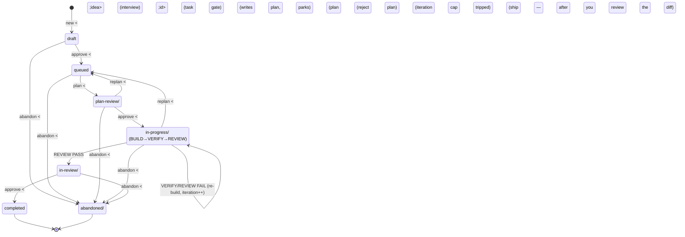
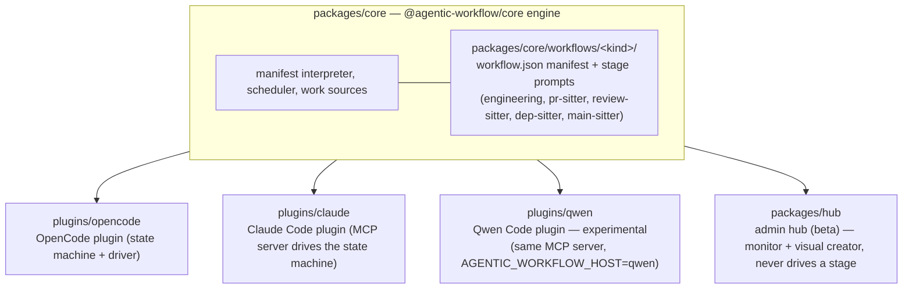

# AGENTS.md

Guidance for AI coding agents working in this repository.

## Repository Overview

`agentic-workflow` is a multi-kind agentic-workflow framework (shared engine in
`@agentic-workflow/core`, shipping OpenCode, Claude Code and Qwen Code
plugins — Qwen Code is experimental); this
guide covers the OpenCode plugin — see `plugins/claude/README.md` for the
Claude Code equivalent. It has two ways to work: an **automatic loop** that
drives a backlog task through its whole lifecycle unattended, and **ad-hoc,
skill-driven execution** for a single request that doesn't need a loop. The
sections below cover each.

1. **The automatic agentic loop** (`/agentic-workflow:engineering`) — a real plugin
   (`plugins/opencode/src/`, agents/commands under `plugins/opencode/`) that
   drives the whole lifecycle from one command. The verbs (procedures live in
   `prompts/verbs/engineering.md`; the state machine is the diagram below):
   `new <idea>` interviews you into a planless draft; `retask <id>` reshapes a
   planless task in place; `approve [id]` is the one folder-driven forward gate
   and `replan [id]` the sole rejection; `abandon <id>` is the reversible
   cancellation (file kept in `abandoned/` — how a tracking epic is closed);
   `remove <id> --force` hard-deletes from any folder (bare `remove` is a dry
   run; both refused while a loop drives the task or a claim is held);
   `claim`, or a `watch [trigger]` worker session (`unwatch` reverses it),
   drives BUILD→VERIFY→REVIEW unattended on plan-approved tasks, falling back
   to planning an approved `queued/` task; `plan <id>` plans one now — either
   way PLAN parks the plan in `plan-review/` for your gate and exits;
   `recover <id>` resumes a run that stopped early (crash or ESC); `stop`/`abort`
   ends a run outright; `status`, `kinds`, and `doctor [fix]` report the loop +
   backlog, list enabled kinds, and audit/repair backlog damage. See the
   `workflow-orchestration` skill for the pipeline, gates, and verdict
   contracts, and `task-backlog-management` for driving it from `docs/tasks/`.
   That pipeline is the **engineering workflow kind** — the default of several
   declarative kinds under `packages/core/workflows/<kind>/` (manifest + stage
   prompts) run by the shared `@agentic-workflow/core` engine. Other kinds are
   enabled via `workflows.<kind>` in `.agentic-workflow.json`; engineering is
   on unless disabled. **All four sitters are experimental** (opt-in via
   `enabled: true`; manifests, config keys, and the `ado` platform may still
   change), and none merges or pushes the watched branch: `pr-sitter`
   triages/fixes/verifies/replies on open PRs; `review-sitter` posts one
   structured review comment per head where your review is requested (never
   approves or requests changes — the human stays reviewer of record);
   `dep-sitter` opens a draft PR with the verified patch/minor dependency bump
   (never auto-fixes major bumps); `main-sitter` opens a draft remedy PR — a
   verified forward fix or revert — when the default branch's CI goes red. Each
   enabled kind has its own command, with `claim`/`watch` scoped to it.
2. **Ad-hoc, skill-driven execution** — for a single request that doesn't
   warrant starting a loop, OpenCode still has a **skill-driven execution
   model** powered by the `skill` tool and the `skills/` directory bundled
   with this plugin. The rules below govern that mode.

### Gate lifecycle

A task moves through exactly one folder at a time under `docs/tasks/`. The
same `approve` verb drives every forward move (which one depends on which
folder the task is currently in); `replan` is the sole rejection verb, always
back to `queued/` — marked plan-next, with the hosts chaining an immediate
PLAN pass where they can, so the revised plan re-parks in `plan-review/`
without idling. Full protocol: `workflow-orchestration` skill.

```mermaid
stateDiagram-v2
    [*] --> draft: new &lt;idea&gt; (interview)
    draft --> queued: approve &lt;id&gt; (task gate)
    queued --> plan_review: plan &lt;id&gt; (writes plan, parks)
    plan_review --> in_progress: approve &lt;id&gt; (plan gate)
    plan_review --> queued: replan &lt;id&gt; (reject plan)
    in_progress --> in_progress: VERIFY/REVIEW FAIL (re-build, iteration++)
    in_progress --> in_review: REVIEW PASS
    in_progress --> queued: replan &lt;id&gt; (iteration cap tripped)
    in_review --> completed: approve &lt;id&gt; (ship — after you review the diff)
    draft --> abandoned: abandon &lt;id&gt;
    queued --> abandoned: abandon &lt;id&gt;
    plan_review --> abandoned: abandon &lt;id&gt;
    in_progress --> abandoned: abandon &lt;id&gt;
    in_review --> abandoned: abandon &lt;id&gt;
    completed --> [*]
    abandoned --> [*]

    state "plan-review/" as plan_review
    state "in-progress/ (BUILD→VERIFY→REVIEW)" as in_progress
    state "in-review/" as in_review
    state "abandoned/" as abandoned
```

### Core Rules (ad-hoc mode)

- If a task matches a skill, you MUST invoke it
- Skills are located in `skills/<skill-name>/SKILL.md`
- Never implement directly if a skill applies
- Always follow the skill instructions exactly (do not partially apply them)

### Intent → Skill Mapping

- Unshaped work — vague ask, raw idea, symptom without a cause → `plan-router` (routes by who holds the missing information — codebase, human, or nobody — then dispatches)
- Feature / new functionality → `spec-driven-development`, then `incremental-implementation`, `test-driven-development`
- Planning / breakdown → `planning-and-task-breakdown`
- Bug / failure / unexpected behavior → `debugging-and-error-recovery`
- Code review → `code-review-and-quality`
- Refactoring / simplification → `code-simplification`
- API or interface design → `api-and-interface-design`
- UI work → `frontend-ui-engineering`
- Writing a document an agent consumes — a skill, an agent persona, a command or verb, a stage prompt, this file → `writing-for-agents`
- Run the whole lifecycle on a goal, largely unattended → `/agentic-workflow:engineering`: `new <idea>` → `approve` → `plan <id>` (or `claim`/`watch`) parks the plan → `approve` (or `replan <why>`) → `claim`/`watch` builds → `approve` ships — the same folder-driven `approve` at every gate (id-less, it resolves the single task waiting at a loop gate, falling back to a lone draft). See `workflow-orchestration`, not a manual skill chain

### Lifecycle Mapping

`/agentic-workflow:engineering` implements this lifecycle as real pipeline stages (see
`workflow-orchestration`). Outside the loop, follow it as an implicit sequence of
skill invocations instead:

- PLAN → `spec-driven-development` + `planning-and-task-breakdown`
- BUILD → `incremental-implementation` + `test-driven-development`
- VERIFY → `debugging-and-error-recovery`
- REVIEW → `code-review-and-quality`

### Execution Model (ad-hoc mode)

For every request that isn't handed to `/agentic-workflow:engineering`:

1. Determine if any skill applies (even 1% chance)
2. Invoke the appropriate skill using the `skill` tool
3. Follow the skill workflow strictly
4. Only proceed to implementation after required steps (spec, plan, etc.) are complete

### Anti-Rationalization

The following thoughts are incorrect and must be ignored:

- "This is too small for a skill"
- "I can just quickly implement this"
- "I'll gather context first"

Correct behavior: always check for and use skills first.

## Plugin Structure

The shared `@agentic-workflow/core` engine and its declarative workflow-kind
manifests are consumed by three different hosts — the OpenCode plugin, the
Claude Code plugin (via an MCP — Model Context Protocol — server), and the
admin hub:

```mermaid
flowchart TD
    subgraph Core["packages/core — @agentic-workflow/core engine"]
        Engine["manifest interpreter, scheduler, work sources"]
        Workflows["packages/core/workflows/&lt;kind&gt;/<br/>workflow.json manifest + stage prompts<br/>(engineering, pr-sitter, review-sitter, dep-sitter, main-sitter)"]
        Engine --- Workflows
    end

    OpenCode["plugins/opencode<br/>OpenCode plugin (state machine + driver)"]
    Claude["plugins/claude<br/>Claude Code plugin (MCP server drives the state machine)"]
    Qwen["plugins/qwen<br/>Qwen Code plugin — experimental<br/>(same MCP server, AGENTIC_WORKFLOW_HOST=qwen)"]
    Hub["packages/hub<br/>admin hub (beta) — monitor + visual creator, never drives a stage"]

    Core --> OpenCode
    Core --> Claude
    Core --> Qwen
    Core --> Hub
```

- `plugins/opencode/src/` — the OpenCode plugin implementation (state machine, driver); task backlog IO lives in `packages/core/src/task/`
- `packages/core/` — the shared `@agentic-workflow/core` engine (manifest interpreter, scheduler, work sources) used by both the OpenCode plugin and the Claude MCP (Model Context Protocol) server
- `packages/core/workflows/<kind>/` — declarative workflow-kind manifests (`workflow.json`) + stage prompt templates (one dir per kind: `engineering/`, `pr-sitter/`, `review-sitter/`, `dep-sitter/`, `main-sitter/`)
- `packages/hub/` — the admin hub (beta): a localhost web app
  (`npm run hub -- --dir <repo>`) with a loop monitor and a visual loop
  creator. The monitor carries the human gate moves (approve/replan/ship), an
  in-place task editor, a plan-review view with per-line replan comments, a
  Plan button on queued cards (writes a plan-request ordering hint, never a
  claim — the next `claim`/`watch` tick honours it), the backlog doctor, a
  Config tab, and a Metrics tab (the pass, not the file, is its unit of
  analysis) — all through the same `@agentic-workflow/core` entry points the
  hosts call. It never claims work or drives a stage itself. See
  `packages/hub/README.md`
- `plugins/opencode/agents/` — the agent personas backing each loop stage
  (engineering `workflow-*`; per-sitter `workflow-pr-*`, `workflow-review-*`,
  `workflow-dep-*`, `workflow-main-*`; the shared `workflow-verify` is reused
  as the VERIFY stage across several kinds)
- `plugins/opencode/commands/` — the slash commands: one entry command per
  kind (`/agentic-workflow:<kind>`), plus per-stage commands (`/plan-task`,
  `/build`, `/verify`, `/review`, and each sitter's stage commands such as
  `/pr-triage` or `/main-remedy`)
- `.opencode/skills` — symlink to `skills/`, the skill library the stage agents invoke
- `skills/` — skill workflows (`SKILL.md` per directory) invoked by name via the `skill` tool
- `prompts/verbs/engineering.md` — the per-verb procedures of `/agentic-workflow:engineering`, each inside an `<!-- aw:verb <names> -->` block; **generated** into `plugins/claude/verbs/` and `plugins/qwen/verbs/` (see "Per-verb command slicing" below)
- `plugins/qwen/` — the Qwen Code host (**experimental** — interface and behavior may still change): generated `agents/`, `verbs/`, `skills/` and `hooks/`, plus hand-authored `commands/`. Reuses the Claude plugin's MCP server and hook sources; see `docs/qwen.md`
- `references/` — supplementary checklists (`testing-patterns.md`, `security-checklist.md`, etc.) that skills pull in when needed

### Per-verb command slicing

The engineering command's body is **not** sent whole. A model asked for
`new <idea>` used to receive all ~230 lines — every other verb, plus
deterministic plugin work described in the imperative — which is both wasted
context and a live source of confusion about which half is its job. So each
verb's prose sits inside an `<!-- aw:verb <names> -->` … `<!-- /aw:verb <names> -->`
block (`|`-separated for aliases and shared subsets, e.g. `stop|abort`), and
only the invoked verb's blocks reach the model. The hosts differ because their capabilities do:

- **OpenCode** slices the *rendered* prompt in `command.execute.before`
  (`plugins/opencode/src/command-slice.ts`). Text **outside** every marker is
  always kept, so prose added later is shared by default and can never be
  silently dropped from a verb.
- **Claude Code and Qwen Code** cannot rewrite a prompt — a `UserPromptSubmit`
  hook may only prepend context or block the turn. So the split is physical:
  `commands/engineering.md` is a router that is always sent, and the invoked
  verb's block is injected from `verbs/engineering.md` by
  `hooks/verb-slice.mjs`. Nothing unmarked belongs in that file — it would be
  dropped, not shared. Shared prose goes in the router. Both hosts' copies are
  **generated** from `prompts/verbs/engineering.md`, so edit that, not them.

Adding or renaming a verb means updating its marker block **and** the
`argument-hint` on every host; the coverage tests
(`command-slice.test.ts`, `verb-slice.test.mjs`) fail otherwise. They have to:
a verb that loses its block does not error, it silently falls back to the whole
body (OpenCode) or to no instructions at all (Claude). Markers must own their
whole line — that is what stops a marker pasted into `$ARGUMENTS` from
truncating the prompt — and HTML comments do not nest, so never write a literal
marker inside a comment.

The OpenCode entry commands render their verb from positional placeholders,
and opencode makes the **highest-numbered** placeholder greedy — it receives
every remaining argument joined by spaces. `$2` is what pins `$1` to the verb
token, so never delete it as unused (`command-slice.test.ts` guards all five
files). `$ARGUMENTS` stays the authoritative payload for free-text verbs
because positional tokens are whitespace-collapsed and quote-stripped — and
the plugin's own dispatch (`src/verb.ts`) reads the verb token quote-aware for
the same reason: it must agree with what `$1` renders. Never write a literal
dollar-digit sequence in command prose — substitution has no escape.

### Claim markers mean "a loop is driving this NOW"

A held `.claims/<id>` marker asserts a LIVE loop, nothing weaker — every gate
verb (`replan`/`abandon`/`remove`) refuses on it with that exact rationale. So
**every way a drive ends must release the marker**: `runStop` (any stage, not
just PLAN), `runPark`'s failure arms (including the one where the task is *gone*
from `queued/` — release `fresh ?? state.task`, never nest the release inside
`if (fresh)`), the OpenCode driveChain's stop/interrupt guard, and `onIdle`'s
error path all do, and any new exit path must too. It was once "kept for
recover" on stop instead, and the combination wedged cap-stopped tasks forever:
the orphan sweep skips a CLAIMED/BUILD body, so no verb could ever free them.
Two supporting invariants: drivers **restamp** the claim at every stage
boundary (`refreshClaimStamp`) so a live multi-stage run never reads stale to a
sweep; and any stale-marker takeover or release must go through the atomic
rename-aside helpers (`acquireOrSweepMarker` / `releaseMarkerIfStale`), never a
bare `rm`/`rmdir` + `mkdir` — the blind form let two sweepers both "win" one
task. Cross-process liveness for `recover` is judged by
`taskDrivenByStageMarker` (stage-marker deadline + writer pid), never by the
in-memory per-process driving map alone.

### A stale window is a proxy; the writer identity is the answer

`STALE_CLAIM_MINUTES` (and the stage-timeout-derived window doctor uses) never
measured anything about the claimer — they bound how long a HEALTHY stage may go
without durable progress, and were then read as "the claimer must be dead by
now". That is why a run which died before its first stage marker cost a human 15
minutes behind advice no one could act on: `stop` only ever stops the loop in the
CALLING process, so "stop it first" is unactionable against a process that is
already gone. So the claim stamp records `pid` + machine identity, and
`claimWriterLiveness` answers the question directly. Four things hold it up:

- **It fails CLOSED — the opposite of the host hooks.** They fail open because a
  false allow only restores older behaviour; here a false "dead" sweeps a live
  claim and starts a SECOND drive on one `feature/<id>` branch. No stamp, no
  pid, another machine, a garbled parse: all `"unknown"`, all keep the window.
- **`kill -0` failing is not death.** EPERM (alive, another user) exits non-zero
  exactly like ESRCH. `pidAlive` may not conclude death; `pidGone` must prove it
  positively, and every probe is self-validating — it has to see our OWN pid, or
  it proves nothing. This is why the two exist rather than one.
- **A pid needs its namespace.** Hostname alone does not separate sibling
  containers from one image, so the boot id joins it and any comparison missing
  either side is refused.
- **`releaseMarkerIfStale(…, 0)` is NOT the age-free release.** A zero window
  degrades `markerOlderThan` to a bare existence test, so the rename-aside's
  re-judge always says yes and a rival's brand-new claim is deleted — the exact
  double-sweep the rename-aside exists to stop. The age-free path is judged by
  writer IDENTITY (`releaseMarkerIfWriterDead` / `acquireOrSweepDeadWriter`),
  which re-judges soundly: a rival stamped its own live pid.

The stage marker stays the STRONGER witness and is checked first — it proves a
stage is running, where the stamp only says who took the claim. Only the
human-invoked verbs (`recover`, `doctor fix`) opt in; the unattended sweeps
(`claimFirst`, the startup sweep) keep the wall-clock rule, because no one is
waiting on them.

### `state.git.base` is a ref, not always a branch

`taskBranch: false` runs the loop on the branch the tree already has checked
out. There base and branch would name the SAME ref, so `git diff <base>...<branch>`
is empty and REVIEW grades nothing — hence `base` holds HEAD's **sha** at the
first BUILD instead. That makes it polymorphic, and `git.onCurrentBranch` is the
only discriminant. The sharp edge is `checkoutBranch`, which falls through to
`git checkout -b <ref>` when the ref is not a branch: handed a sha it invents a
branch named after a commit and strands the human on it. Anything
reading `base` as a branch NAME must check the flag first — and `persist.ts`'s
`GitRefSchema` must carry it, because zod strips unknown keys and a
snapshot-resumed run would otherwise lose it and hit exactly that.

That same fall-through is why `ensureIsolation` probes `branchExists` before
checking a base out. It is not defensive noise: the base can come from
`init.defaultBranch` or a host-supplied `baseBranch`, neither of which is
guaranteed to exist locally, and creating it from a parked work branch would
produce a "base" that is a copy of the last task's tip — the stacking bug below,
wearing a respectable name.

Two more things this mode's shape forces, both learned from a real-git test:

- **Its machine state cannot live in the working tree.** This is the one mode
  whose checkpoints `git add -A` the human's own checkout, so the
  one-run-per-tree marker sits under `<git-common-dir>`; in the backlog it rode
  straight into the user's feature commits.
- **`taskBranch` is engineering-only** (`taskBranchFor`). `pr-sitter` and
  `main-sitter` get their branch from the work source, and `dep-sitter`'s publish
  stage pins `git push origin feature/*` in a manifest that ships read-only
  inside the core package — a prefix override there makes its own guard deny its
  push.

### The loop leaves the tree on the work branch; the BASE is pinned at the start

A run ends where the work is. `teardownIsolation` used to return a shared tree
(`worktreesDir: false`) to `base`, and every human act after a run — read the
diff, amend, push, open the PR — is on `feature/<id>`, so the checkout put them
one branch away from it, silently, right after the toast saying the work was
ready. It now only logs. Do not restore the checkout.

The correctness that checkout was silently providing has to be re-provided at the
OTHER end, and this is the half to keep: a tree parked on the last run's branch
made `ensureIsolation` cut the next task from it (`base` was just "whatever is
checked out"), so task N+1 contained task N — in REVIEW's `base...branch` diff and
in the PR, as commits it never wrote. So `baseOffTaskBranch` redirects a base
inside the loop's own namespace (`taskBranchPrefix`) to the repo's default branch,
and the shared arm checks that base out BEFORE `checkout -b`. Three constraints:

- **Only the loop's own namespace is redirected.** A human on `my-work` is on a
  deliberate base; hijacking it to the default branch throws that away.
- **Never record a base the branch was not cut from.** `base` is REVIEW's diff
  boundary, so a fictional one grades the wrong range. Every degradation
  (unresolvable default branch, failed checkout) reports where we actually stand
  and warns — a wider diff is recoverable, a wrong one is not.
- **Shared mode's backlog writes now land on the work branch.** Only visible with
  `ignoreBacklog: false`; that is the accepted price of not switching, not a bug
  to fix by reintroducing a checkout.

### A focused pass's contract must match the passes that will run

A check stage's prompt is composed ONCE, then each pass gets `passFocusBlock`
appended. So `verdictContractBlock`'s mode has to be the EFFECTIVE one
(`stagePasses`), never the manifest's — and every pass regime needs its own
branch. Lens passes rendered the single-pass contract for a while: each lens was
told "MUST carry an `axes` array covering all 5 axes … a call missing an axis is
REJECTED" directly above "focus exclusively on `<lens>`". The two cannot both be
satisfied, and the threat was empty (`passAxes` returns `undefined` for a lens,
so nothing rejected). Both ways out were bad: obey the contract and the pass
invents axis verdicts it did no work for — and since passes merge worst-wins, a
fabricated "correctness: PASS" becomes the STAGE's correctness verdict, which is
worse than no coverage because it manufactures the guarantee; obey the suffix and
coverage silently vanishes. When adding a pass mode, add its contract branch and
point it at the line `passFocusBlock` actually emits.

Coverage enforcement follows the same rule — enforce what the passes can
actually satisfy. `enforcesAxisCoverage` is the single seam both hosts ask:
per-axis fan-out always, lenses only when they between them name every required
axis, single passes never (per-pass admission already covers it). Do not gate it
on `pass.mode === "axis"` inline again; a lens set that spans the axes is
enforceable and a lens set that cannot is not, and only that predicate knows the
difference.

### The two hosts match a bash command differently

The Claude Code / Qwen guard splits a command on `&&`/`|`/`;` and matches each
segment (`commandAllowed`), accepting a bare `cd` as its own segment. **OpenCode
matches the WHOLE command string** against the agent frontmatter's
`permission.bash` globs. So one allowlist has to satisfy both, and only OpenCode
needs the `cd * && <glob>` twins — `gen-prompts.mjs` (`allowlistFor`) derives one
per glob for every worktree-isolated stage. Declare **bare forms only** in
`workflows/<kind>/workflow.json`; a hand-written `cd * && ` prefix there now fails
`scripts/workflow-allowlist.test.mjs`.

Hand-listing them is how this broke twice: `npm outdated*` once shipped without
its twin, and REVIEW — whose allowlist is *entirely* inspection commands — never
had one at all, so on OpenCode every command it ran hit the `"*": deny` sentinel
and the starved stage ERRORed instead of recording a verdict. The prompt half
mattered as much as the data half: `worktree.instructions` used to order "prefix
**every** shell command with `cd <wt> && `", i.e. exactly the form REVIEW's own
allowlist denied. Keep that paragraph shaped per command-kind (inspection via
`git -C <wt>`/absolute paths, runners via the prefix) — a blanket rule there is
a blanket denial here.

A glob is also **position-anchored**, so it must be declared in the shape the
tool is actually invoked with, not the shape its docs list first. `mvn test*`
matched a bare `mvn test` and nothing else: Maven and Gradle take global options
(`-B`, `-pl core -am`, `--no-daemon`) and preceding phases (`clean`) BEFORE the
goal, and Gradle qualifies tasks by module (`:core:test`), so `mvn clean test`
and `./gradlew :core:test` hit the deny sentinel and VERIFY ERRORed on a runner
the project has. Hence the second form per goal (`mvn * test*`, `gradle *:test*`).
That is not a widening of what a check stage can reach: every glob ends in `*`
compiled with dotAll, so a trailing second goal was always matched — the goal
names are a scope boundary against a confused agent (T2), never a sandbox. When
adding a runner, check where its argv puts the subcommand before copying the
`npm test*` shape.

The JS package managers are the same trap one ecosystem over, and it bit
because `npm test*` looked like proof they were covered: the WORKSPACE selector
precedes the script (`npm -w apps/web test`, `pnpm -r test`, `pnpm --filter web
test`, `yarn workspace web test`), and berry moves the subcommand outright
(`yarn workspaces foreach run test`). None of those matched, so on a monorepo —
which is what a two-stack shop has — every CI command fell to the deny sentinel.
That matters more now that VERIFY's checks are DISCOVERED: the plan names the
right command, admission refuses it, and the stage runs no checks at all behind
one warning line. The flags there are ENUMERATED (`npm -w *`, `pnpm --filter*`)
rather than tolerated generically, and that is load-bearing: `npm -* test*`
would also match `npm --tag test publish`, because the glob only needs a literal
" test" somewhere after the flag. Maven got away with `mvn * test*` only because
`-Dtest=Foo` never produces a space-delimited " test"; npm's option syntax does.

A command-REWRITING plugin is the same starvation with no manifest fix: an
rtk-style token proxy mutates the command in `tool.execute.before` BEFORE
OpenCode evaluates permissions, so every allowlisted command reaches the
matcher as `rtk <cmd>` — a shape no shipped glob matches — and the whole stage
starves. The remedy is config, never the proxy: `bashAllowlistPrefix` derives a
`<prefix> <glob>` twin of everything the stage ALREADY grants
(`withCommandPrefixes`), and those — like `bashAllowlistExtra` globs — are
appended AFTER the sentinel by the plugin's `config` hook,
the only position that wins under OpenCode's **last-match-wins** evaluation —
which is also why the generated maps' `"*": deny`-first ordering is semantic,
not stylistic (`workflow-allowlist.test.mjs` pins it; a trailing `"*": deny`
would remove the bash tool from the agent outright). Diagnostic to know:
OpenCode's DeniedError dumps EVERY bash rule, pattern-unfiltered, so a stage
transcript claiming "the deny-all rule wins over the specific allows" means "no
glob matched the final command string" — check for a rewritten prefix first.

Derived rather than blanket because a blanket `"rtk *"` accepts `rtk npm
publish` as readily as `rtk npm test`, and because **the same rewrite blinds
every write backstop**: `isGitPushViolation`, `isGithubPrMutation` and
`isFindMutation` all anchor on the BARE tool name, so `rtk git push --force
origin main` reads as no violation on either host. Narrowing the allowlist
cannot fix that half — `rtk git push origin main` matches a derived
`rtk git push origin *` glob quite legitimately, and only the classifier knows
`main` is protected — so each segment is classified raw AND with one prefix hop
stripped (`stripCommandPrefix`, twinned into `hooks/src/allowlist.mjs`). One hop
only, or `rtk rtk …` launders a second. The prefixes ride the Claude/Qwen stage
marker as `bashPrefix` for the same reason `kindAgents` does — a bundled hook
reads neither config nor manifest — and an absent field means no strip, i.e.
exactly the old behaviour. A rewrite that renames the verb (`cat x` →
`rtk read x`) is beyond any derivation and stays an extras job.

### On the model-driven hosts, the spawn is the protocol's weakest link

OpenCode has a driver, so its loop cannot get out of step with itself. Claude Code
and Qwen have none: an orchestrating MODEL calls `workflow_stage` → spawn →
`workflow_advance` for every stage AND every fan-out pass, and `workflow_stage`
and the spawn are routinely emitted as two tool_use blocks in one turn. Skip one
call and the machine sits at VERIFY while a REVIEW subagent runs — and the only
thing that noticed was `workflow_verdict` refusing the finished review ("the loop
is at verify, not review"): a whole stage paid for and discarded, then a
no-verdict retry, then an ERROR stop. `stageOrderError` cannot catch it, because
it only fires if `workflow_stage` is called at all.

So the enforcement is a PreToolUse DENY on the SPAWN
(`hooks/src/check-spawn-stage.entry.mjs`): a stage agent of the active kind may
only be spawned while the live marker has armed it. Three things it depends on:
the marker carries `kindAgents` (a hook cannot read a manifest — same reason it
carries `bashAllowlist` and `stageAgentModels`), it shares the model stamp's
matcher but never emits an `updatedInput` envelope (two PreToolUse hooks
rewriting one call is undocumented), and it fails OPEN on every uncertainty
— no marker, an expired one, an older marker without `kindAgents`, an unknown
host. That asymmetry is deliberate: a false allow only restores the old
behavior, a false deny stalls a run with no way out.

Never relax `workflow_verdict`'s stage check to "fix" this. That check is what
stops a BUILD agent grading its own work, and a verdict from an un-armed stage ran
under the previous stage's bash allowlist and evidence ledger. And never express
the rule as prose in a stage prompt — the orchestrator is precisely the thing that
is already not following prose, the same reason `stageModels` is BOUND by a hook
rather than asked for. For the same reason the SubagentStop nag names the marker's
stage: it must tell a subagent that is not that stage to record NOTHING, or a
drifted REVIEW files its findings as the VERIFY verdict.

### A blocked turn cannot ask anything

The gate hook runs `approve`'s move before the model and then blocks — which is
right for a move nothing follows, and was wrong for the task gate: the obvious
next question ("plan it now?") had nowhere to come from, so it fired in the
interactive `new` flow and silently never on the command path. `approve` is now
a CONDITIONAL hybrid: `gate-parse.mjs` declares the ASKING gates
(`continueOnGate`, sourced from `gate-ask.mjs`'s `ASK_GATES` so the two cannot
drift), and `gate-command.mjs` hands the turn back only when the CLI's
`data.gate` agrees. Three things must not be "simplified":

- **Never widen it to a blanket `continueTurn: true`.** That continues on
  refusals generally and on the terminal ship gate — the double-move the block
  exists to prevent.
- **The continue path requires `ok` + a known `data.gate` + a string
  `data.id`.** Every uncertainty (an older `mcp-server/dist` emitting no `data`)
  falls through to the block, i.e. to the old behaviour. A false block costs one
  typed command; a false continue re-opens the double-move.
- **The one refusal that may continue is the id-less AMBIGUITY, and only because
  NOTHING MOVED.** `resolveGateTask` merely lists, so a bare `approve` over
  several candidates never reached `approveTask`/`approvePlan`/`shipTask` — there
  is no move to double, and the follow-up asks for a FIRST approve on an id the
  human picks. Hence it is pinned to `continueOnAmbiguity`
  (`ASK_AMBIGUITY_VERBS`, the same one-source-of-truth arrangement as
  `ASK_GATES`) rather than expressed as "continue on a refusal": wrong-folder and
  not-found have nothing to choose between, and continuing there is the old bug
  back. Before this, a slice set made the id-less form useless — the turn blocked
  with "Multiple tasks awaiting" and no way to ask which, so the human had to
  type an id per child.
- **The follow-up is emitted by the harness, never asked for in prose** — same
  reason `stageModels` is bound by a hook. Prose may describe the ask; the
  imperative with the id and the host's `askTool` already substituted is what
  carries it. For the same reason the ask also rides on the approve tools'
  `next` (`okGate`): nothing intercepts a tool CALL, and a gate that asks on the
  typed path and stays silent on the tool path is a coin flip the human never
  made.

Which gate a folder-driven verb crossed is only knowable from `GateResult.data`
(`gate`, `id` — set on every success arm, `alreadyDone` retries included). Never
re-derive it from `message`: that is prose, and it gets reworded.

**OpenCode's plugin cannot originate a question.** The SDK's Question API
(list/reply/reject) is not on `PluginInput["client"]`, and the read-only
`tui.question(sessionID)` view belongs to the TUI plugin surface, which a normal
plugin does not get (`tui?: never`) — so the `question` TOOL CALL and the
`question.*` events are the only windows a plugin has onto one, and both only
observe. Only the
model's own `question` tool opens a window, so an ask there only exists where a
model turn does: the command-prompt override after a handled verb, not the
background `session.idle` drive where PLAN parks. And an ask whose answer the
model cannot execute is worse than no ask — that host has no MCP tools and
guards `docs/tasks/**`, which is why `workflow_gate`/`workflow_plan` exist.
Both refuse a call from a session a loop is driving (`findDrivingWorkflow`,
failing CLOSED): a plugin tool is offered to EVERY session, stage subagents
included, and without that a BUILD agent can approve its own task.

That left the ask itself as the one thing on this host carried by prose — a
`NEXT STEP` line in `workflow_gate`'s result — and prose is what the
orchestrator does not follow. Skipping it is not cosmetic: `workflow_plan` is
the point of no return, because the drive it queues runs its stages as
`session.command` calls on the DRIVING session (concurrency 1), after which
`refuseIfDriven` and the absence of a free model turn mean **nothing can ask
the human anything** until the chain unwinds. Straight to `workflow_plan` and
the window is gone for good. So the prose has a mechanism behind it, and both
halves are load-bearing:

- **`planFromAgent` refuses until the question was actually put** (`askUnanswered`,
  against the one-shot `askArmed` a task gate sets).
- **`onIdle` returns while a question is open**, before `pending.delete`, so the
  work stays queued for the idle after the answer instead of the drive burying
  the window.

Both fail **OPEN**, gated on `questionsObservable` — a session where no question
has ever been seen is never refused. Against a host that shows us no window at
all the rules go inert rather than stranding an approved task no verb can plan.
That is the opposite asymmetry to `refuseIfDriven` two paragraphs up, and
deliberately so: there a false allow ships unreviewed work, here a false refusal
wedges the backlog and a false allow only restores the old behaviour. Both exits
now **log** — "the human said yes" and "we could not tell" produced the same
outcome and the same empty transcript, which is how this shipped broken twice.

**The signal is the `question` TOOL CALL, not the event name.** Both rules were
fed only by the `question.asked`/`replied`/`rejected` events, and that is a
host-named input the plugin has to keep guessing right: the SDK's event union
carries the same window under two families (`question.*` and `question.v2.*`), so
one wrong guess makes every rule above silently inert — fail-open, invisible,
indistinguishable from working. So the PRIMARY source is
`tool.execute.before`/`.after` (`noteQuestionToolCall`/`noteQuestionToolSettled`),
a seam this plugin owns; `noteQuestionEvent` stays as an additive second source
and now normalises `question.v2.*` down to the legacy names. The two converge
rather than double-count because the asked event carries `tool.callID` — the same
id the tool hooks carry — so windows are keyed by that token, never by a
per-session flag. The flag also lost a real window: one message can open two, and
the first settlement cleared it while the second was still up.

The deny (next section) runs **before** the recorder. A refused stage ask never
reached the human, so recording it would both satisfy an armed gate ask nobody
saw and hold `onIdle` off a session with no window in it.

**A token nobody removes is worse than no token at all**, because `onIdle`
returns on it for the life of the process — stranding the session's queued drive
*and* the on-disk claim it already placed, after which every gate verb refuses
the task as "a loop is driving this NOW". There is deliberately **no timeout** (a
window the human has not got to yet is legitimately open for hours); what bounds
it is that every way a window dies without a settlement clears it: ESC
(`onInterrupt`, for the interrupted id *and* the resolved driving one), the
`stop`/`abort` verb, and any other tool starting in that session — a question
blocks the turn, so a different tool call proves the window is down
(`noteOtherToolCall`, the valve against a `tool.execute.after` that never fires).

One more silent seam, and it is the one that cost the most: **`armTaskGateAsk`
returning `""`**. `data.gate`/`data.id` live in core, which resolves to
`packages/core/dist` — gitignored, rebuilt only by `npm install`, while the
installed plugin points at the working tree. A new plugin against an old core
dist lands there with `r.ok` true and no gate on it, and the result is BOTH halves
of the bug at once: no `NEXT STEP` for the model to follow, and nothing armed for
`askUnanswered` to enforce. It warns now, naming `npm install`.

And **never `await` the drive inside the `event` hook.** `onIdle` is the entry to
the whole build → verify → review chain, so awaiting it parks that handler for
hours — including the ESC path, which lives in the same hook and is the one event
that must get through while a loop runs. `void` it with an error sink. This is
safe only because `onIdle` reaches `driving.add` with no intervening `await`;
anything added to that prologue must keep it synchronous, or two idle events will
both start a drive.

### The plan gate asks in a turn of its own

The park is the gate with no turn to ask in. On OpenCode `plan <id>` returns
*before* its drive starts (the stage runs on a later `session.idle`), so when the
plan finally lands in `plan-review/` the turn that asked for it is long over — the
host announced it with a toast and left the human to type `approve`. The plugin
still cannot originate a QUESTION, but it can originate the TURN a model asks one
in: `onIdle` fires `promptPlanGateAsk` (a bare `session.prompt`) after a park.
Three constraints hold it up, and none is cosmetic:

- **It fires AFTER the `finally`, not from the park arm.** The session has to be
  free of the drive first (`clearWorkflow` at the terminal, `driving` released in
  the `finally`), or `refuseIfDriven` and the stage-agent `question` deny refuse
  the plugin's own ask. And it is never `await`ed — the turn contains a question
  that blocks for as long as the human takes, and `onIdle` runs from the event
  hook (previous section).
- **Only a human-requested plan asks**, and the flag rides the `start-plan`
  `Pending` (`askOnPark`, set in `claimForPlan`) rather than a module map: a map
  would need clearing on every path a drive can die on — ESC, stop, error, a
  dropped pending — and the one forgotten would open a dialog in a `watch` worker
  session with nobody at the terminal. `drive()`'s own outcome answers "did it
  park?", so no bookkeeping is needed at all.
- **Every option names a tool that exists here.** `workflow_gate` crossed the
  gate; Replan had nothing, which is why `workflow_replan` was added — an ask
  whose answer the model cannot execute is worse than no ask, and this host has no
  MCP server and guards `docs/tasks/**`.

Claude Code and Qwen park inside a `workflow_advance` result that already carries
the same ask as its `next` string — prose inside DATA, which is the thing the
orchestrator skips. So `plan-gate-ask.mjs` (PostToolUse, matched on
`workflow_advance`) re-emits it as harness context, sharing one writer with the
task gate's follow-up (`gate-ask.mjs`). It fails OPEN on every uncertainty and
adds only context — never a `decision` — because a false silence costs the
reminder while a false reminder gates a task that never parked. **Never reach it
by adding `"plan"` to `ASK_GATES`**: that list is `continueOnGate`, i.e. which
gate VERB crossings hand the turn back, and the park is not a verb.

### A slice set's link is `epic:`, and it has to be in the schema

`new` splits a heavy idea into sibling child drafts plus a `type: epic` tracker,
so the gates routinely face N tasks where they were designed for one. Two things
they need from a set — which slices to offer when a bare `approve` is ambiguous,
and which slice to name next once one is queued — are answerable only from a
STRUCTURED link, so each child carries `epic: <epic-id>`.

- **Not the body's `Part of epic:` line.** That is LLM-authored prose that drifts
  with the prompt writing it; deriving the walk from it is `message`-derivation
  by another name, the thing `taskGateId` exists to refuse. The line stays as the
  human-readable half, and nothing reads it.
- **Not "every un-approved draft" either.** A stranger's draft named as "the next
  slice of this set" is a guess, and the gates do not guess. `epicSiblings`
  returns `[]` for a task with no epic; a caller with nothing to go on renders no
  next-slice line at all — which is exactly the pre-slice-set behaviour, and why
  every `epic`/`siblings` key is OMITTED rather than empty.
- **A frontmatter key outside `TaskFrontmatterSchema` is destructive, not
  merely ignored.** zod strips what it does not know, so `serializeTask` deletes
  it; `unknownFrontmatterKeys` is what the hub screens an in-place edit with, and
  `rewriteTask` refuses over it. Off-schema, every child would report as data an
  edit is about to lose, and a `retask` would lose it. There is no "just add the
  key" middle path — it is schema-or-nothing.

`siblings` is computed AFTER the move (so the approved slice is not its own
successor) and is best-effort: the approval is already committed, so a failed
listing costs the walk's next line and never the move.

### A leading token that names a real task is an ID, never a reason word

`rejectAny` takes `<id?> <reason…>` as one string, so the id is recovered by
RESOLVING the first token — and it must be resolved against every status folder
(`REJECT_ID_FOLDERS`), not only the ones `replan` acts on. Twice now the narrow
scan has produced the same silent wrong-target: a short-hash handle resolved by
exact filename only, then an id whose task had already moved to `queued/` (the
`replanQueued` retry arm, which is where a rejected task LIVES). Both fell
through to the id-less pick, which rejects the single `plan-review/` task — a
different task, its id folded into the reason, every message naming the task the
human did not ask about, and on OpenCode an immediate re-plan of it.

- **A token resolving in a NON-rejectable folder must refuse**, not fall through.
  `replanTask`'s wrong-folder message names the task it matched, so the failure is
  legible; falling through is what makes it invisible.
- **Fall through only when the token resolves NOWHERE** — that is the real
  "the whole argument is the reason" case.
- The cost is that a reason word prefixing a real id is claimed as an id. That
  trade was already made; it fails loudly, and the id-less form still exists.
- Both hosts route the typed `replan` verb through `rejectAny`, and OpenCode's
  `workflow_replan` too — so a folder unreachable here is unreachable from the
  verb entirely, however well core implements it.

### Every gate reason goes through `oneLineReason`

An audit note is ONE `> …` line closed by a bracketed stamp. A reason with a
newline in it puts line 2 in the file with no `> ` prefix and the stamp detached,
so `AUDIT_NOTE_LINE_RE` stops matching: the orphaned lines then read as PROSE
(`auditTailIndex` loses the boundary, and they ride into every later `{{goal}}`)
and the last-note parsers — `extractReplanReason`, `extractRunBranch`,
`extractStopContext` — go blind. `replan` flattened; `retask` and `abandon`
interpolated raw, and the hub's `<textarea>` reaches them directly
(`z.string().trim()` does not touch interior newlines). The hazard is the SHAPE
OF THE NOTE, not the identity of the verb, so a new reason-writing verb belongs
in that choke point too.

### `queued/` is not the planless folder

`replanTask` re-queues a rejected task **with its plan intact**, so anything
reasoning "a queued task is planless" is wrong on the retry path — which is the
common path. `retaskTask` therefore MAKES it planless (`withoutPlanSections` +
`TASK_RESHAPED_MARKER`) rather than assuming it: a plan written against the goal
an interview is about to rewrite would otherwise ride into the next PLAN pass as
`priorPlan`, and its rejection would still be pending, handing that pass a
critique of a plan that no longer exists.

- **`withoutPlanSections` is not `stripPlanAndAuditTail`.** The persisted strip
  must KEEP every audit note; `appendPlan` appends at end of file, so plans and
  notes interleave and a first-heading-to-EOF cut deletes the trail.
- **The strip declines over off-schema frontmatter.** `rewriteTask` serializes
  through the schema and zod strips unknown keys, so the rewrite would delete
  them; a stale plan is recoverable, that is not. It warns and moves anyway — the
  MOVE is what the human asked for.
- **`TASK_RESHAPED_MARKER` must stay the note's prefix.** The strip removes the
  `PLAN_HEADING` anchor, so without that marker in `pendingPlanRejection`'s
  `addressed` set the rejection would go from retired back to pending purely as a
  side effect of the strip.

### A stage subagent must not be able to ask

The mirror of the section above: the plugin cannot originate a question, and no
stage may either. A drive is unattended between the plan gate and the ship gate,
so a question dialog opened mid-VERIFY stalls the run on someone who may not be
at the terminal — on a `watch` worker, on nobody at all. A stage's uncertainty
has channels that keep the loop's control flow: a FAIL/ERROR verdict, a
criterion marked not met, `workflow_blocked`.

The hole is a HOST ASYMMETRY, invisible from any single file. Claude Code and
Qwen agents declare an explicit `tools:` enumeration, so they exclude the ask
tool by construction; **OpenCode agents declare only `permission:`, and inherit
every tool the host ships unless they say otherwise** — which is how `question`
(`@opencode-ai/plugin` 1.18.5) reached all 18 stage agents at once, unannounced,
with nothing failing. A new agent added under `prompts/agents/` inherits it the
same way, so the guard is a test over the GENERATED files
(`scripts/agent-ask-deny.test.mjs`), not a convention.

Three layers, and each one exists because the layer above it can fail silently:
`tools: {question: false}` removes the tool, `permission: {question: deny}`
refuses it if that map is bypassed or the key renamed, and the plugin's
`tool.execute.before` refuses any `question` from a session `findDrivingWorkflow`
attributes to a loop — the only layer that does not depend on a host config key
behaving as documented, and the only one covering a user-added kind's agent.
Never write this as stage-prompt prose: the refusal message names the
alternative at the moment the model errs, which is worth more than a line
carried in every stage's context forever.

This does not starve the gate mechanism above, and the reason is timing: every
gate ask happens in a model turn where no loop owns the session — the task gate
before any drive exists, the plan and ship gates after `clearWorkflow` ran on
the park or the done. `askArmed`/`questionsObservable` therefore still see the
question they are waiting on. A gate ask that ever needed to fire *during* a
drive would be the thing to rethink, not this guard: mid-drive there is no free
model turn to put it in.

### A rejected verdict is not a missing one

`admitVerdict` refusing a call means the channel WORKED and the shape was wrong.
Treating the two as one thing cost a whole class of run: a REVIEW that failed but
phrased its FAIL unadmittably (no critical/important finding, an axis short) left
`pending`/`recordedVerdicts` empty, so the host re-fired the same review — and the
second refusal became ERROR, which `review.onError` turns into a stop. The visible
symptom is "another REVIEW ran and we never went back to BUILD": a review with
real findings ends the run instead of feeding the rebuild its `onFail` arm exists
for.

So both hosts keep the refused RECORD (`RejectedVerdict`), not a boolean, and once
the one retry is spent `rejectedFallback` records the stage **as it declared** —
FAIL stays FAIL, so `onFail` fires BUILD with the findings and the rejection
message rides in `reason` so the next BUILD knows both. Two halves of that are
load-bearing and must not be "simplified":

- **An effective PASS is never salvaged.** Every rejection a PASS can draw exists
  because the PASS was not earned; laundering it ships unreviewed work, which is
  worse than the ERROR stop. `rejectedFallback` returns null there, and the caller
  keeps its ERROR.
- **The two ERROR reasons stay distinct** (`noAdmissibleVerdictReason`). "The
  verdict channel is unreachable — fix the plugin wiring" was reported for
  refusals too, sending operators after an MCP channel that had just answered
  twice.

### A stage pass's identity is its session (OpenCode)

Every per-pass table in the OpenCode driver — `recordedVerdicts`,
`axisRequirement`, `observedEvidence`, `recordedBlocked`, `driftNoted` — is keyed
by **session id alone**, and check stages run as `subtask: true` commands whose
verdict walks *up* the parent chain to whatever session is registered. That is
why passes were serial: sharing one id, being "the pass that fired last" is the
only identity a verdict has, so two in flight would cross-admit each other's
verdicts, wipe each other's evidence, and `takeVerdictRecord` (which deletes on
read) would let the first finisher steal a merged blob.

So concurrency is bought by giving each pass its own session
(`workflows.<kind>.stageConcurrency` — unset, a per-axis fan-out runs all its
passes at once and everything else runs one at a time), NOT by re-keying those
maps.
Two consequences any change here must preserve:

- **Never pass a `directory` to `session.create`.** That is what plan 01 ruled
  out: it boots a second app instance with no plugin, so `workflow_verdict` does
  not exist there. A sibling session in the same directory is fine, and is the
  whole mechanism.
- **A pass session is not a loop.** It is registered in the workflow store so the
  pass's verdict resolves to it, which means every "is a loop live / which
  session drives this task" query must skip it — that is what `passOf` marks, and
  why `findSessionDriving` and `onInterrupt` both consult it. `halted` is always
  tested against the DRIVING session; a user's ESC never lands on a pass.

Anything shared by the whole run rather than by one pass needs a lock now that
passes overlap: `appendRunLog` (append) and `flushMetrics` (read-modify-write)
both go through `withLock(runLocks, …)`. Adding another per-run writer means
adding it there too.

### A halt needs a durable REASON, not a cleared workflow (OpenCode)

`clearWorkflow` cannot halt a drive, because the chain re-registers the session
with `setWorkflow` at **every** transition — so a `stop` landing between the
post-stage halt check and that call (a window spanning a checkpoint commit and
two audit notes) was undone: "Loop stopped." to the user, next stage fired
anyway. The halt is `haltReason`, armed **synchronously ahead of the verb's first
await** — the pass aborts the verb itself issues are only swallowed by
`runStagePasses` once `halted` says so, and arming after them turned a stop into
a "Loop error" with the crash snapshot left for `recover` to resurrect.

Three things it has to keep:

- **A reason map, not a flag.** ESC is a PAUSE (snapshot kept, `recover <id>`
  resumes at that stage); `stop` is an END (snapshot dropped). `armHalt` never
  lets `"interrupted"` overwrite `"stopped"`, because the stop's own aborts come
  back through `onInterrupt` on that very session.
- **Both boundaries, not one.** `haltIfAsked` runs before a fire as well as after
  one. The post-stage check alone still burns a whole stage, and only the
  pre-fire one covers the pre-`setWorkflow` window where `ensureIsolation` can
  run for minutes.
- **`driving.has || getWorkflow` is the busy test**, matching claim/plan/recover.
  `getWorkflow` alone made `stop` report "No active loop to stop." for a drive
  that was very much in flight.

### A transition is published to the store and the snapshot together (OpenCode)

`driveChain` publishes a transition to the session store the moment `advance`
returns, because `recordVerdict` judges a verdict against
`getWorkflow(sessionID).stage`. The **snapshot is the same fact on disk** and has
to travel with it: it is `recover`'s only oracle (`loadState` resumes at
`snap.stage`, and an ESC deliberately KEEPS it), and its only write used to be
the one at the TOP of the next iteration — behind `ensureIsolation` and
`runStageChecks`, minutes of shelling out. Through that window the file still
named the stage the loop had already left, so a resume re-entered at it: a run
that had reached REVIEW came back at VERIFY, the live REVIEW subagent's verdict
was refused as stage drift ("the loop is at verify, not review"), and the whole
stage was retried and thrown away.

Both writes stay. The one at the transition publishes the STAGE promptly; the one
at the top of the iteration is the only one carrying the POST-isolation
`git`/worktree fields. The source lint in `driver.test.ts` pins the order:
nothing awaited between `advance` and `setWorkflow`, the snapshot immediately
after.

The refusal this produced has to be ACTIONABLE too — `stageDriftRefusal`, beside
`stageDriftNote` (the audit trail) and `stageDriftAdvice` (the orchestrator).
Its reader is the refused agent, which can move the machine on neither host, so
it retried a call that can never succeed until the stage's budget was gone. It
must never invite a re-file under the stage the loop IS at: the SubagentStop nag
names that stage, and a drifted REVIEW re-filing as VERIFY turns lost coverage
into a fabricated verdict. And never relax the stage check itself to make the
retry succeed.

### An OpenCode hook that rejects or hangs kills the turn silently

opencode's `Plugin.trigger` awaits `command.execute.before` / `event` hooks
with NO try/catch of its own, and the SDK's fetch back into the server sets
`req.timeout = false` — so an await that rejects or never settles kills the
command BEFORE `Session.prompt`, with zero log output. The user's command just
vanishes and the retry "works", because the one-shot guards it died inside
(`reconciled`, `reportedAgentModels`) are now set. This class shipped twice:
first as reconcile-before-gate-move (the `gateFirst` reordering), then as the
unguarded ~60-line prologue before the dispatch try (plan 20). The closures in
`plugins/opencode/src/impl.ts`, all load-bearing:

- The ENTIRE hook body after the prefix match runs inside ONE try; the catch
  writes `failurePrompt` into the prompt — the only channel a dead command
  has — and never awaits a TUI call on the way out (the hook must still
  RESOLVE for the override to matter).
- `log` is total (never rejects, time-boxed) — it is also `deps.log`, so the
  driver inherits the guarantee. Toasts are fire-and-forget everywhere:
  `.catch()` guards a rejection, not a hang.
- Client calls on a hook path are `withTimeout`-boxed (config read,
  reconcile). NOT `handleCommand` — interrupting a real gate move is worse
  than waiting.
- A one-shot guard sets its flag FIRST and owns no unguarded await after it.

### A plugin TOOL that hangs is the same failure with no way out

The rule above is about hooks; the tools are worse, because a hook at least dies
with the turn. OpenCode imposes NO deadline on a tool's `execute`, so one that
never settles leaves the call `running` forever with the model's turn behind it
— the only exit is ESC or killing opencode. `workflow_gate` did exactly that on
an approved draft: the task file had already moved, so the visible state was a
spinner over work that was DONE. Hence three standing rules.

- **Every model-callable tool answers.** The gate tools return a sentence the
  model can act on (`withinDeadline` → a message); the verdict tools THROW,
  because a string reads as success and an unrecorded verdict must retry. The
  gate message may invite a retry only because `approveTask`'s `alreadyDone` arm
  makes a repeat approve a no-op — never invite one where the call claims a task
  (`workflow_plan` starts a drive on the human's own session).
- **A gate verb's `$` is bounded** (`boundedShell`, wired in `gateCtx` only).
  Exit 124 is the contract `host.ts` already specifies, and core reads it as an
  ordinary failed command, so the move still reports and only its best-effort
  bookkeeping is skipped — a timeout that THREW would turn a skipped `git add`
  into a failed approval. Not `deps.$`: checkpoint commits, worktree setup and
  `runChecks` legitimately run long and carry their own regime.
- **A `$` template may never contain a literal `*`.** Interpolations are escaped
  by both hosts (Bun's `$` by construction, the Claude shim via `esc()`), so a
  `*` in the template's own text is the ONLY way a real glob — the only
  unbounded primitive a shell call has — reaches a command. One shipped
  (`rm -f <stamp> <stamp>.tmp-*`, `claim-marker.ts`) and it is what stalled the
  gate above on a WSL `/mnt/c` tree. A pattern that genuinely needs one is passed
  as an escaped interpolation and matched by the tool
  (`find … -maxdepth 1 -name ${pat} -delete`).
  `scripts/shell-glob.test.mjs` parses every shipped source and fails on a
  literal one.

### Model selection is a mechanism, never prose

Never express `stageModels` / `agentModels` as an instruction for a model to
follow ("spawn it with `model` set to …"). It was written that way once, and the
setting was quietly ignored: every stage ran the host default while the config
said otherwise, and nothing failed. Each host now BINDS it — Claude Code rewrites
the spawn call's `model` from a `PreToolUse` hook
(`plugins/claude/hooks/src/stamp-spawn-model.entry.mjs`), OpenCode sets
`agent.<name>.model` from its `config` hook, Qwen bakes `model:` into the
installed agent file. Prompt text may **state** which model was bound (that is
the only way a hook regression shows up in a transcript), but must never be the
thing that carries it.

Two traps behind that, both load-bearing:

- **Claude Code's spawn tool takes an alias enum** (`sonnet|opus|haiku|fable`), and
  a value outside it errors the whole spawn rather than falling back. Normalize
  with `spawnAlias`, never `bareModel`, and leave an unmappable value unbound.
- **A bundled hook cannot read the manifests** — `manifest/dir.ts` resolves from
  `import.meta.url` and `build-hooks.mjs` inlines core, so that walk lands in the
  hook's own directory. Anything manifest-derived must be resolved server-side and
  parked on the stage marker, keyed by AGENT (a stage-keyed field goes stale the
  moment `workflow_advance` fires the next stage without rewriting the marker).

## Maintaining these rules

Rules earn their place — every line costs context on every session.

- **When to add:** the *second time* an agent makes the same mistake. First
  time = correct it inline (could be a one-off); a repeat means it's systemic
  — write it down. Also add after a plan/ship **gate rejection** whose reason
  was a missing rule, or when VERIFY/REVIEW keeps flagging the same *class* of
  defect.
- **What to write:** the constraint **and why** it exists (so a future agent
  doesn't "fix" it back), not a narration of the bug.
- **Where:** a durable, cross-task fact → here. A task-specific instruction →
  the task file or the stage prompt (`packages/core/workflows/<kind>/stages/*.md`), not here.
- **Prune:** delete a rule when the code it guards moves or the reason dies. A
  stale rule is worse than none.
