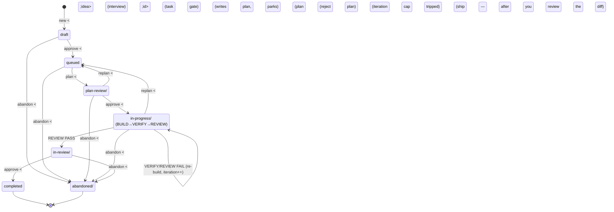
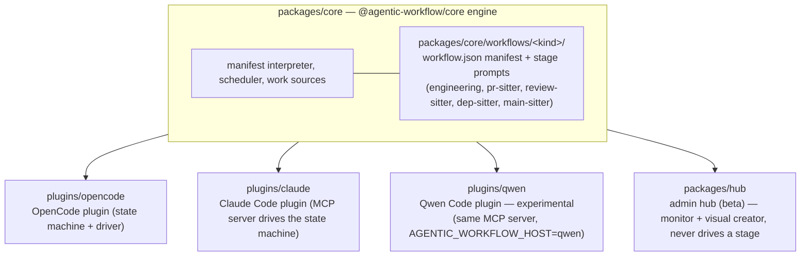

# AGENTS.md

Guidance for AI coding agents working in this repository.

## Repository Overview

`agentic-workflow` is a multi-kind agentic-workflow framework (shared engine in
`@agentic-workflow/core`, shipping OpenCode, Claude Code and Qwen Code
plugins — Qwen Code is experimental); this
guide covers the OpenCode plugin — see `plugins/claude/README.md` for the
Claude Code equivalent. It has two ways to work: an **automatic loop** that
drives a backlog task through its whole lifecycle unattended, and **ad-hoc,
skill-driven execution** for a single request that doesn't need a loop. The
sections below cover each.

1. **The automatic agentic loop** (`/agentic-workflow:engineering`) — a real plugin
   (`plugins/opencode/src/`, agents/commands under `plugins/opencode/`) that
   drives the whole lifecycle from one command. The verbs (procedures live in
   `prompts/verbs/engineering.md`; the state machine is the diagram below):
   `new <idea>` interviews you into a planless draft; `retask <id>` reshapes a
   planless task in place; `approve [id]` is the one folder-driven forward gate
   and `replan [id]` the sole rejection; `abandon <id>` is the reversible
   cancellation (file kept in `abandoned/` — how a tracking epic is closed);
   `remove <id> --force` hard-deletes from any folder (bare `remove` is a dry
   run; both refused while a loop drives the task or a claim is held);
   `claim`, or a `watch [trigger]` worker session (`unwatch` reverses it),
   drives BUILD→VERIFY→REVIEW unattended on plan-approved tasks, falling back
   to planning an approved `queued/` task; `plan <id>` plans one now — either
   way PLAN parks the plan in `plan-review/` for your gate and exits;
   `recover <id>` resumes a run that stopped early (crash or ESC); `stop`/`abort`
   ends a run outright; `status`, `kinds`, and `doctor [fix]` report the loop +
   backlog, list enabled kinds, and audit/repair backlog damage. See the
   `workflow-orchestration` skill for the pipeline, gates, and verdict
   contracts, and `task-backlog-management` for driving it from `docs/tasks/`.
   That pipeline is the **engineering workflow kind** — the default of several
   declarative kinds under `packages/core/workflows/<kind>/` (manifest + stage
   prompts) run by the shared `@agentic-workflow/core` engine. Other kinds are
   enabled via `workflows.<kind>` in `.agentic-workflow.json`; engineering is
   on unless disabled. **All four sitters are experimental** (opt-in via
   `enabled: true`; manifests, config keys, and the `ado` platform may still
   change), and none merges or pushes the watched branch: `pr-sitter`
   triages/fixes/verifies/replies on open PRs; `review-sitter` posts one
   structured review comment per head where your review is requested (never
   approves or requests changes — the human stays reviewer of record);
   `dep-sitter` opens a draft PR with the verified patch/minor dependency bump
   (never auto-fixes major bumps); `main-sitter` opens a draft remedy PR — a
   verified forward fix or revert — when the default branch's CI goes red. Each
   enabled kind has its own command, with `claim`/`watch` scoped to it.
2. **Ad-hoc, skill-driven execution** — for a single request that doesn't
   warrant starting a loop, OpenCode still has a **skill-driven execution
   model** powered by the `skill` tool and the `skills/` directory bundled
   with this plugin. The rules below govern that mode.

### Gate lifecycle

A task moves through exactly one folder at a time under `docs/tasks/`. The
same `approve` verb drives every forward move (which one depends on which
folder the task is currently in); `replan` is the sole rejection verb, always
back to `queued/`. Full protocol: `workflow-orchestration` skill.

```mermaid
stateDiagram-v2
    [*] --> draft: new &lt;idea&gt; (interview)
    draft --> queued: approve &lt;id&gt; (task gate)
    queued --> plan_review: plan &lt;id&gt; (writes plan, parks)
    plan_review --> in_progress: approve &lt;id&gt; (plan gate)
    plan_review --> queued: replan &lt;id&gt; (reject plan)
    in_progress --> in_progress: VERIFY/REVIEW FAIL (re-build, iteration++)
    in_progress --> in_review: REVIEW PASS
    in_progress --> queued: replan &lt;id&gt; (iteration cap tripped)
    in_review --> completed: approve &lt;id&gt; (ship — after you review the diff)
    draft --> abandoned: abandon &lt;id&gt;
    queued --> abandoned: abandon &lt;id&gt;
    plan_review --> abandoned: abandon &lt;id&gt;
    in_progress --> abandoned: abandon &lt;id&gt;
    in_review --> abandoned: abandon &lt;id&gt;
    completed --> [*]
    abandoned --> [*]

    state "plan-review/" as plan_review
    state "in-progress/ (BUILD→VERIFY→REVIEW)" as in_progress
    state "in-review/" as in_review
    state "abandoned/" as abandoned
```

### Core Rules (ad-hoc mode)

- If a task matches a skill, you MUST invoke it
- Skills are located in `skills/<skill-name>/SKILL.md`
- Never implement directly if a skill applies
- Always follow the skill instructions exactly (do not partially apply them)

### Intent → Skill Mapping

- Unshaped work — vague ask, raw idea, symptom without a cause → `plan-router` (routes by who holds the missing information — codebase, human, or nobody — then dispatches)
- Feature / new functionality → `spec-driven-development`, then `incremental-implementation`, `test-driven-development`
- Planning / breakdown → `planning-and-task-breakdown`
- Bug / failure / unexpected behavior → `debugging-and-error-recovery`
- Code review → `code-review-and-quality`
- Refactoring / simplification → `code-simplification`
- API or interface design → `api-and-interface-design`
- UI work → `frontend-ui-engineering`
- Writing a document an agent consumes — a skill under `skills/`, a stage prompt, this file → `writing-for-agents`
- Run the whole lifecycle on a goal, largely unattended → `/agentic-workflow:engineering`: `new <idea>` → `approve` → `plan <id>` (or `claim`/`watch`) parks the plan → `approve` (or `replan <why>`) → `claim`/`watch` builds → `approve` ships — the same folder-driven `approve` at every gate (id-less, it resolves the single task waiting at a loop gate, falling back to a lone draft). See `workflow-orchestration`, not a manual skill chain

### Lifecycle Mapping

`/agentic-workflow:engineering` implements this lifecycle as real pipeline stages (see
`workflow-orchestration`). Outside the loop, follow it as an implicit sequence of
skill invocations instead:

- PLAN → `spec-driven-development` + `planning-and-task-breakdown`
- BUILD → `incremental-implementation` + `test-driven-development`
- VERIFY → `debugging-and-error-recovery`
- REVIEW → `code-review-and-quality`

### Execution Model (ad-hoc mode)

For every request that isn't handed to `/agentic-workflow:engineering`:

1. Determine if any skill applies (even 1% chance)
2. Invoke the appropriate skill using the `skill` tool
3. Follow the skill workflow strictly
4. Only proceed to implementation after required steps (spec, plan, etc.) are complete

### Anti-Rationalization

The following thoughts are incorrect and must be ignored:

- "This is too small for a skill"
- "I can just quickly implement this"
- "I'll gather context first"

Correct behavior: always check for and use skills first.

## Plugin Structure

The shared `@agentic-workflow/core` engine and its declarative workflow-kind
manifests are consumed by three different hosts — the OpenCode plugin, the
Claude Code plugin (via an MCP — Model Context Protocol — server), and the
admin hub:

```mermaid
flowchart TD
    subgraph Core["packages/core — @agentic-workflow/core engine"]
        Engine["manifest interpreter, scheduler, work sources"]
        Workflows["packages/core/workflows/&lt;kind&gt;/<br/>workflow.json manifest + stage prompts<br/>(engineering, pr-sitter, review-sitter, dep-sitter, main-sitter)"]
        Engine --- Workflows
    end

    OpenCode["plugins/opencode<br/>OpenCode plugin (state machine + driver)"]
    Claude["plugins/claude<br/>Claude Code plugin (MCP server drives the state machine)"]
    Qwen["plugins/qwen<br/>Qwen Code plugin — experimental<br/>(same MCP server, AGENTIC_WORKFLOW_HOST=qwen)"]
    Hub["packages/hub<br/>admin hub (beta) — monitor + visual creator, never drives a stage"]

    Core --> OpenCode
    Core --> Claude
    Core --> Qwen
    Core --> Hub
```

- `plugins/opencode/src/` — the OpenCode plugin implementation (state machine, driver); task backlog IO lives in `packages/core/src/task/`
- `packages/core/` — the shared `@agentic-workflow/core` engine (manifest interpreter, scheduler, work sources) used by both the OpenCode plugin and the Claude MCP (Model Context Protocol) server
- `packages/core/workflows/<kind>/` — declarative workflow-kind manifests (`workflow.json`) + stage prompt templates (one dir per kind: `engineering/`, `pr-sitter/`, `review-sitter/`, `dep-sitter/`, `main-sitter/`)
- `packages/hub/` — the admin hub (beta): a localhost web app
  (`npm run hub -- --dir <repo>`) with a loop monitor and a visual loop
  creator. The monitor carries the human gate moves (approve/replan/ship), an
  in-place task editor, a plan-review view with per-line replan comments, a
  Plan button on queued cards (writes a plan-request ordering hint, never a
  claim — the next `claim`/`watch` tick honours it), the backlog doctor, a
  Config tab, and a Metrics tab (the pass, not the file, is its unit of
  analysis) — all through the same `@agentic-workflow/core` entry points the
  hosts call. It never claims work or drives a stage itself. See
  `packages/hub/README.md`
- `plugins/opencode/agents/` — the agent personas backing each loop stage
  (engineering `workflow-*`; per-sitter `workflow-pr-*`, `workflow-review-*`,
  `workflow-dep-*`, `workflow-main-*`; the shared `workflow-verify` is reused
  as the VERIFY stage across several kinds)
- `plugins/opencode/commands/` — the slash commands: one entry command per
  kind (`/agentic-workflow:<kind>`), plus per-stage commands (`/plan-task`,
  `/build`, `/verify`, `/review`, and each sitter's stage commands such as
  `/pr-triage` or `/main-remedy`)
- `.opencode/skills` — symlink to `skills/`, the skill library the stage agents invoke
- `skills/` — skill workflows (`SKILL.md` per directory) invoked by name via the `skill` tool
- `prompts/verbs/engineering.md` — the per-verb procedures of `/agentic-workflow:engineering`, each inside an `<!-- aw:verb <names> -->` block; **generated** into `plugins/claude/verbs/` and `plugins/qwen/verbs/` (see "Per-verb command slicing" below)
- `plugins/qwen/` — the Qwen Code host (**experimental** — interface and behavior may still change): generated `agents/`, `verbs/`, `skills/` and `hooks/`, plus hand-authored `commands/`. Reuses the Claude plugin's MCP server and hook sources; see `docs/qwen.md`
- `references/` — supplementary checklists (`testing-patterns.md`, `security-checklist.md`, etc.) that skills pull in when needed

### Per-verb command slicing

The engineering command's body is **not** sent whole. A model asked for
`new <idea>` used to receive all ~230 lines — every other verb, plus
deterministic plugin work described in the imperative — which is both wasted
context and a live source of confusion about which half is its job. So each
verb's prose sits inside an `<!-- aw:verb <names> -->` … `<!-- /aw:verb <names> -->`
block (`|`-separated for aliases and shared subsets, e.g. `stop|abort`), and
only the invoked verb's blocks reach the model. The hosts differ because their capabilities do:

- **OpenCode** slices the *rendered* prompt in `command.execute.before`
  (`plugins/opencode/src/command-slice.ts`). Text **outside** every marker is
  always kept, so prose added later is shared by default and can never be
  silently dropped from a verb.
- **Claude Code and Qwen Code** cannot rewrite a prompt — a `UserPromptSubmit`
  hook may only prepend context or block the turn. So the split is physical:
  `commands/engineering.md` is a router that is always sent, and the invoked
  verb's block is injected from `verbs/engineering.md` by
  `hooks/verb-slice.mjs`. Nothing unmarked belongs in that file — it would be
  dropped, not shared. Shared prose goes in the router. Both hosts' copies are
  **generated** from `prompts/verbs/engineering.md`, so edit that, not them.

Adding or renaming a verb means updating its marker block **and** the
`argument-hint` on every host; the coverage tests
(`command-slice.test.ts`, `verb-slice.test.mjs`) fail otherwise. They have to:
a verb that loses its block does not error, it silently falls back to the whole
body (OpenCode) or to no instructions at all (Claude). Markers must own their
whole line — that is what stops a marker pasted into `$ARGUMENTS` from
truncating the prompt — and HTML comments do not nest, so never write a literal
marker inside a comment.

The OpenCode entry commands render their verb from positional placeholders,
and opencode makes the **highest-numbered** placeholder greedy — it receives
every remaining argument joined by spaces. `$2` is what pins `$1` to the verb
token, so never delete it as unused (`command-slice.test.ts` guards all five
files). `$ARGUMENTS` stays the authoritative payload for free-text verbs
because positional tokens are whitespace-collapsed and quote-stripped — and
the plugin's own dispatch (`src/verb.ts`) reads the verb token quote-aware for
the same reason: it must agree with what `$1` renders. Never write a literal
dollar-digit sequence in command prose — substitution has no escape.

### Claim markers mean "a loop is driving this NOW"

A held `.claims/<id>` marker asserts a LIVE loop, nothing weaker — every gate
verb (`replan`/`abandon`/`remove`) refuses on it with that exact rationale. So
**every way a drive ends must release the marker**: `runStop` (any stage, not
just PLAN), `runPark`'s failure arms (including the one where the task is *gone*
from `queued/` — release `fresh ?? state.task`, never nest the release inside
`if (fresh)`), the OpenCode driveChain's stop/interrupt guard, and `onIdle`'s
error path all do, and any new exit path must too. It was once "kept for
recover" on stop instead, and the combination wedged cap-stopped tasks forever:
the orphan sweep skips a CLAIMED/BUILD body, so no verb could ever free them.
Two supporting invariants: drivers **restamp** the claim at every stage
boundary (`refreshClaimStamp`) so a live multi-stage run never reads stale to a
sweep; and any stale-marker takeover or release must go through the atomic
rename-aside helpers (`acquireOrSweepMarker` / `releaseMarkerIfStale`), never a
bare `rm`/`rmdir` + `mkdir` — the blind form let two sweepers both "win" one
task. Cross-process liveness for `recover` is judged by
`taskDrivenByStageMarker` (stage-marker deadline + writer pid), never by the
in-memory per-process driving map alone.

### A focused pass's contract must match the passes that will run

A check stage's prompt is composed ONCE, then each pass gets `passFocusBlock`
appended. So `verdictContractBlock`'s mode has to be the EFFECTIVE one
(`stagePasses`), never the manifest's — and every pass regime needs its own
branch. Lens passes rendered the single-pass contract for a while: each lens was
told "MUST carry an `axes` array covering all 5 axes … a call missing an axis is
REJECTED" directly above "focus exclusively on `<lens>`". The two cannot both be
satisfied, and the threat was empty (`passAxes` returns `undefined` for a lens,
so nothing rejected). Both ways out were bad: obey the contract and the pass
invents axis verdicts it did no work for — and since passes merge worst-wins, a
fabricated "correctness: PASS" becomes the STAGE's correctness verdict, which is
worse than no coverage because it manufactures the guarantee; obey the suffix and
coverage silently vanishes. When adding a pass mode, add its contract branch and
point it at the line `passFocusBlock` actually emits.

Coverage enforcement follows the same rule — enforce what the passes can
actually satisfy. `enforcesAxisCoverage` is the single seam both hosts ask:
per-axis fan-out always, lenses only when they between them name every required
axis, single passes never (per-pass admission already covers it). Do not gate it
on `pass.mode === "axis"` inline again; a lens set that spans the axes is
enforceable and a lens set that cannot is not, and only that predicate knows the
difference.

### The two hosts match a bash command differently

The Claude Code / Qwen guard splits a command on `&&`/`|`/`;` and matches each
segment (`commandAllowed`), accepting a bare `cd` as its own segment. **OpenCode
matches the WHOLE command string** against the agent frontmatter's
`permission.bash` globs. So one allowlist has to satisfy both, and only OpenCode
needs the `cd * && <glob>` twins — `gen-prompts.mjs` (`allowlistFor`) derives one
per glob for every worktree-isolated stage. Declare **bare forms only** in
`workflows/<kind>/workflow.json`; a hand-written `cd * && ` prefix there now fails
`scripts/workflow-allowlist.test.mjs`.

Hand-listing them is how this broke twice: `npm outdated*` once shipped without
its twin, and REVIEW — whose allowlist is *entirely* inspection commands — never
had one at all, so on OpenCode every command it ran hit the `"*": deny` sentinel
and the starved stage ERRORed instead of recording a verdict. The prompt half
mattered as much as the data half: `worktree.instructions` used to order "prefix
**every** shell command with `cd <wt> && `", i.e. exactly the form REVIEW's own
allowlist denied. Keep that paragraph shaped per command-kind (inspection via
`git -C <wt>`/absolute paths, runners via the prefix) — a blanket rule there is
a blanket denial here.

### On the model-driven hosts, the spawn is the protocol's weakest link

OpenCode has a driver, so its loop cannot get out of step with itself. Claude Code
and Qwen have none: an orchestrating MODEL calls `workflow_stage` → spawn →
`workflow_advance` for every stage AND every fan-out pass, and `workflow_stage`
and the spawn are routinely emitted as two tool_use blocks in one turn. Skip one
call and the machine sits at VERIFY while a REVIEW subagent runs — and the only
thing that noticed was `workflow_verdict` refusing the finished review ("the loop
is at verify, not review"): a whole stage paid for and discarded, then a
no-verdict retry, then an ERROR stop. `stageOrderError` cannot catch it, because
it only fires if `workflow_stage` is called at all.

So the enforcement is a PreToolUse DENY on the SPAWN
(`hooks/src/check-spawn-stage.entry.mjs`): a stage agent of the active kind may
only be spawned while the live marker has armed it. Three things it depends on:
the marker carries `kindAgents` (a hook cannot read a manifest — same reason it
carries `bashAllowlist` and `stageAgentModels`), it shares the model stamp's
matcher but never emits an `updatedInput` envelope (two PreToolUse hooks
rewriting one call is undocumented), and it fails OPEN on every uncertainty
— no marker, an expired one, an older marker without `kindAgents`, an unknown
host. That asymmetry is deliberate: a false allow only restores the old
behavior, a false deny stalls a run with no way out.

Never relax `workflow_verdict`'s stage check to "fix" this. That check is what
stops a BUILD agent grading its own work, and a verdict from an un-armed stage ran
under the previous stage's bash allowlist and evidence ledger. And never express
the rule as prose in a stage prompt — the orchestrator is precisely the thing that
is already not following prose, the same reason `stageModels` is BOUND by a hook
rather than asked for. For the same reason the SubagentStop nag names the marker's
stage: it must tell a subagent that is not that stage to record NOTHING, or a
drifted REVIEW files its findings as the VERIFY verdict.

### A rejected verdict is not a missing one

`admitVerdict` refusing a call means the channel WORKED and the shape was wrong.
Treating the two as one thing cost a whole class of run: a REVIEW that failed but
phrased its FAIL unadmittably (no critical/important finding, an axis short) left
`pending`/`recordedVerdicts` empty, so the host re-fired the same review — and the
second refusal became ERROR, which `review.onError` turns into a stop. The visible
symptom is "another REVIEW ran and we never went back to BUILD": a review with
real findings ends the run instead of feeding the rebuild its `onFail` arm exists
for.

So both hosts keep the refused RECORD (`RejectedVerdict`), not a boolean, and once
the one retry is spent `rejectedFallback` records the stage **as it declared** —
FAIL stays FAIL, so `onFail` fires BUILD with the findings and the rejection
message rides in `reason` so the next BUILD knows both. Two halves of that are
load-bearing and must not be "simplified":

- **An effective PASS is never salvaged.** Every rejection a PASS can draw exists
  because the PASS was not earned; laundering it ships unreviewed work, which is
  worse than the ERROR stop. `rejectedFallback` returns null there, and the caller
  keeps its ERROR.
- **The two ERROR reasons stay distinct** (`noAdmissibleVerdictReason`). "The
  verdict channel is unreachable — fix the plugin wiring" was reported for
  refusals too, sending operators after an MCP channel that had just answered
  twice.

### A stage pass's identity is its session (OpenCode)

Every per-pass table in the OpenCode driver — `recordedVerdicts`,
`axisRequirement`, `observedEvidence`, `recordedBlocked`, `driftNoted` — is keyed
by **session id alone**, and check stages run as `subtask: true` commands whose
verdict walks *up* the parent chain to whatever session is registered. That is
why passes were serial: sharing one id, being "the pass that fired last" is the
only identity a verdict has, so two in flight would cross-admit each other's
verdicts, wipe each other's evidence, and `takeVerdictRecord` (which deletes on
read) would let the first finisher steal a merged blob.

So concurrency is bought by giving each pass its own session
(`workflows.<kind>.stageConcurrency` — unset, a per-axis fan-out runs all its
passes at once and everything else runs one at a time), NOT by re-keying those
maps.
Two consequences any change here must preserve:

- **Never pass a `directory` to `session.create`.** That is what plan 01 ruled
  out: it boots a second app instance with no plugin, so `workflow_verdict` does
  not exist there. A sibling session in the same directory is fine, and is the
  whole mechanism.
- **A pass session is not a loop.** It is registered in the workflow store so the
  pass's verdict resolves to it, which means every "is a loop live / which
  session drives this task" query must skip it — that is what `passOf` marks, and
  why `findSessionDriving` and `onInterrupt` both consult it. `halted` is always
  tested against the DRIVING session; a user's ESC never lands on a pass.

Anything shared by the whole run rather than by one pass needs a lock now that
passes overlap: `appendRunLog` (append) and `flushMetrics` (read-modify-write)
both go through `withLock(runLocks, …)`. Adding another per-run writer means
adding it there too.

### Model selection is a mechanism, never prose

Never express `stageModels` / `agentModels` as an instruction for a model to
follow ("spawn it with `model` set to …"). It was written that way once, and the
setting was quietly ignored: every stage ran the host default while the config
said otherwise, and nothing failed. Each host now BINDS it — Claude Code rewrites
the spawn call's `model` from a `PreToolUse` hook
(`plugins/claude/hooks/src/stamp-spawn-model.entry.mjs`), OpenCode sets
`agent.<name>.model` from its `config` hook, Qwen bakes `model:` into the
installed agent file. Prompt text may **state** which model was bound (that is
the only way a hook regression shows up in a transcript), but must never be the
thing that carries it.

Two traps behind that, both load-bearing:

- **Claude Code's spawn tool takes an alias enum** (`sonnet|opus|haiku|fable`), and
  a value outside it errors the whole spawn rather than falling back. Normalize
  with `spawnAlias`, never `bareModel`, and leave an unmappable value unbound.
- **A bundled hook cannot read the manifests** — `manifest/dir.ts` resolves from
  `import.meta.url` and `build-hooks.mjs` inlines core, so that walk lands in the
  hook's own directory. Anything manifest-derived must be resolved server-side and
  parked on the stage marker, keyed by AGENT (a stage-keyed field goes stale the
  moment `workflow_advance` fires the next stage without rewriting the marker).

## Maintaining these rules

Rules earn their place — every line costs context on every session.

- **When to add:** the *second time* an agent makes the same mistake. First
  time = correct it inline (could be a one-off); a repeat means it's systemic
  — write it down. Also add after a plan/ship **gate rejection** whose reason
  was a missing rule, or when VERIFY/REVIEW keeps flagging the same *class* of
  defect.
- **What to write:** the constraint **and why** it exists (so a future agent
  doesn't "fix" it back), not a narration of the bug.
- **Where:** a durable, cross-task fact → here. A task-specific instruction →
  the task file or the stage prompt (`packages/core/workflows/<kind>/stages/*.md`), not here.
- **Prune:** delete a rule when the code it guards moves or the reason dies. A
  stale rule is worse than none.
