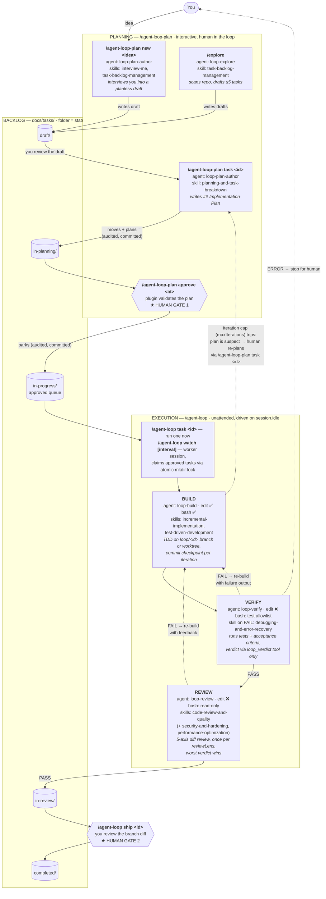
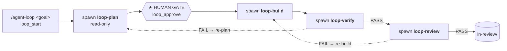

# agentic-loop

OpenCode plugin. Runs a goal through a full engineering lifecycle as one
supervised state machine instead of a chat back-and-forth.

> **Using Claude Code instead of OpenCode?** A parallel Claude Code plugin lives
> in [`claude-plugin/`](claude-plugin/README.md) — same PLAN → BUILD → VERIFY →
> REVIEW pipeline, human plan gate, git isolation, trusted verdicts, backlog, and
> audit trail, re-expressed as a main-agent-driven loop backed by a bundled MCP
> server (Claude Code has no autonomous background driver). Install:
> `cd claude-plugin && ./install.sh`.

## What it does

Planning and execution are two commands. **`/agent-loop-plan`** interviews you into
a draft task (`new <idea>` — always, so the goal and testable acceptance
criteria come from you, not a guess), plans it as a separate step after you
review the draft (`task <id>`), and `approve <id>` is the explicit human gate
that parks it in the approved queue. **`/agent-loop`** is a pure executor over that
queue:

| Stage | Does | Pauses? |
|-------|------|---------|
| *(plan — in `/agent-loop-plan`, before the loop)* | Interviews → draft; plans on request; `approve` parks it | **yes — draft review and the approval are the gates** |
| BUILD | Implements the approved plan test-first, on its own `loop/<id>` branch | no |
| VERIFY | Runs tests; FAIL re-builds with the failure | no |
| REVIEW | Checks the branch diff; FAIL re-builds with feedback | no |

Execution runs either on demand (`/agent-loop task <id>`) or in a `/agent-loop watch
[interval]` worker session, which claims approved tasks on every idle tick
plus a polling timer (default 5m, e.g. `/agent-loop watch 30s`). Execution is
isolated on a `loop/<id>` git branch with a commit checkpoint per build
iteration; VERIFY/REVIEW record their verdicts through a `loop_verdict`
plugin tool (free-text verdicts are ignored), and every approval, verdict,
and build run is appended to the task file as a timestamped, attributed
audit note. Re-build loops are capped by `maxIterations` — if the cap trips,
the plan itself is suspect and a human re-plans with `/agent-loop-plan task <id>`.
A stage that outlives `stageTimeoutMinutes` fails the loop instead of
hanging it. On a REVIEW PASS the task parks in `in-review/` — the loop never
pushes or opens a PR itself; you review the branch diff, then run
`/agent-loop ship <id>` to move it to `completed/`. A run that dies mid-build is
resumed with `/agent-loop recover <id>` — loop state is snapshotted after every
stage, so recovery resumes at the exact stage it reached. See
`docs/design/threat-model.md` for the security posture,
`docs/design/improvements/` for the design record of the hardening features
below, and `docs/design/enterprise-adoption.md` for the enterprise gap
analysis and forward roadmap.

### Optional hardening (config in `.agentic-loop.json`)

- **`worktreesDir`** — run each loop in its own `git worktree` instead of
  switching branches in the shared checkout. The human's tree is never
  touched and multiple `/agent-loop watch` sessions can build concurrently in one
  instance. Off by default (a fresh worktree has no installed deps — pair it
  with `worktreeSetup`, e.g. `"npm ci"`). Audit notes and task moves stay in
  the main tree and are committed there per terminal event.
- **`reviewLenses`** — run REVIEW once per lens (e.g.
  `["correctness", "security", "test-adequacy"]`) and take the worst verdict,
  so a single prompt-injected reviewer can't wave a change through. Costs ~N×
  review time; off by default.
- Secrets echoed into audit notes, plans, or run logs are **shape-redacted**
  (`AKIA…`, `sk-…`, tokens, PEM blocks, `key/secret/token: …` assignments)
  before they are written and committed.
- On a terminal event the run log gets a **`## Run summary`** table — per-stage
  wall-clock, verdict history, and iterations used.

## Architecture

The full picture: two human gates bracket an unattended BUILD → VERIFY →
REVIEW loop, and the `docs/tasks/` backlog folders *are* the state — a task's
folder is its status.



Dotted edges are failure paths. VERIFY/REVIEW FAIL both re-enter BUILD and
share one iteration budget (`maxIterations`, default 3); an ERROR verdict
stops the loop for a human without burning an iteration. The loop never
pushes or opens a PR — REVIEW PASS parks the task in `in-review/` for you.

### Who does what

| Command | Handled by | Subagent | Write access | Skills loaded | Produces |
|---------|-----------|----------|--------------|---------------|----------|
| `/agent-loop-plan new <idea>` | plugin → agent | `loop-plan-author` | task files only (bash ❌) | `interview-me`, `task-backlog-management`, `planning-and-task-breakdown` | planless draft in `draft/` |
| `/agent-loop-plan task <id>` | plugin (move) → agent | `loop-plan-author` | task files only | `planning-and-task-breakdown` | `## Implementation Plan` in `in-planning/` |
| `/agent-loop-plan approve <id>` | plugin only (agent writes nothing) | — | — | — | task parked in `in-progress/` |
| `/agent-loop task\|watch\|ship\|recover\|stop\|status` | plugin driver (`src/loop/driver.ts`) | spawns the three stage agents below | — | `loop-orchestration` protocol | stage sequencing, claims, snapshots, run log |
| BUILD (also `/build`) | driver → agent | `loop-build` | edit ✅ bash ✅ | `incremental-implementation`, `test-driven-development` | code + one commit checkpoint per iteration |
| VERIFY (also `/verify`) | driver → agent | `loop-verify` | edit ❌ bash: test-runner allowlist | `debugging-and-error-recovery` (on FAIL) | trusted `loop_verdict` PASS/FAIL/ERROR |
| REVIEW (also `/review`) | driver → agent | `loop-review` | edit ❌ bash: read-only git/fs | `code-review-and-quality` (+ `security-and-hardening`, `performance-optimization`) | trusted `loop_verdict` per lens, worst wins |
| `/plan` (ad hoc) | agent | `loop-plan` | none (read-only) | `spec-driven-development`, `planning-and-task-breakdown` | a plan in chat — writes no file |
| `/explore` | agent | `loop-explore` | task files only | `task-backlog-management` | ≤5 schema-valid drafts in `draft/` |

Verdicts are only trusted through the `loop_verdict` plugin tool — a stage
agent claiming "PASS" in prose is ignored. Stage agents can't approve tasks,
move backlog folders, or ship; the plugin and the human own every transition
between folders.

### Claude Code variant (`claude-plugin/`)

Same pipeline, different driver: Claude Code has no background `session.idle`
driver, so the main agent drives the loop through a bundled MCP server
(`mcp__agentic-loop__loop_*` tools), and PLAN runs *inside* the loop with a
conversational gate instead of the separate `/agent-loop-plan` command:



Two behavioral differences worth knowing in a demo: on VERIFY FAIL the Claude
Code loop goes back to **PLAN** (OpenCode re-builds), and stage guardrails
(verify/review bash allowlists, worktree pinning) are enforced by a
`PreToolUse` hook reading `runs/.stage.json` rather than by agent
permissions. One supervised loop per session — no `/agent-loop watch`.

## Commands

Planning (`/agent-loop-plan`):

- `/agent-loop-plan new <idea>` — interview you (always — at minimum a
  restate-and-confirm) into a **planless draft** in `docs/tasks/draft/`
- `/agent-loop-plan task <id>` — plan a draft (the plugin moves it to
  `docs/tasks/in-planning/`, audited + committed) or re-plan an
  `in-planning/` task in place (also how you re-plan one whose loop hit the
  iteration cap)
- `/agent-loop-plan approve <id>` — validate the plan and park the task in
  `docs/tasks/in-progress/` (the approved queue), audited + committed

Execution (`/agent-loop`):

- `/agent-loop task <id>` — execute one approved task now, entering at BUILD
- `/agent-loop watch [interval]` — turn this session into an execution worker:
  claims and builds approved tasks on idle events plus a polling timer
  (`30s`, `5m`, `2h`, bare number = minutes; default `watchIntervalMinutes`)
- `/agent-loop unwatch` — stop this session from claiming new work (timer included)
- `/agent-loop recover <id>` — resume an in-progress task whose run died mid-build
  (crash, restart), from its state snapshot (or its persisted plan)
- `/agent-loop ship <id>` — move a reviewed `in-review/` task to `completed/`, audited
- `/agent-loop stop` — abort, clear state, and exit watch mode
- `/agent-loop status` — print the current loop (stage, iteration, watch cadence)
  plus a whole-backlog roll-up (counts, awaiting-approval/claimable/
  interrupted/in-review)

The old `/agent-loop <goal>` free-text mode, `/agent-loop next`, and `/agent-loop go` are gone —
planning always goes through `/agent-loop-plan`.

Outside the loop, one-off requests are handled ad hoc: see [AGENTS.md](AGENTS.md)
for the intent-to-skill mapping — the plugin bundles a `skills/` library
(spec-driven-development, test-driven-development, code-review-and-quality,
and 20+ others) that both the loop's stage agents and ad-hoc requests invoke
by name via the `skill` tool.

## Install

```bash
git clone <this-repo>
cd agentic-loop
npm install
./install.sh
```

`install.sh` symlinks the agents, commands, skills, and references into
`~/.config/opencode/` (or `$OPENCODE_CONFIG_DIR`) and registers the plugin as
a local plugin file, so `/agent-loop` and the bundled skills work in every OpenCode
session. It's idempotent — re-run after `git pull` for updates. Use
`--copy` instead of symlinks, or pass a directory to install somewhere other
than the default OpenCode config dir.

### Migrating from the PLAN-stage versions

- Re-run `./install.sh` after updating — the `/task` command was renamed to
  `/agent-loop-plan` (and its agent to `loop-plan-author`), so a previously
  installed `commands/task.md` symlink now dangles; delete it if it lingers.
- Tasks already in `in-planning/` without a plan: run `/agent-loop-plan task <id>`.
- Old `*.state.json` snapshots taken at the removed PLAN stage are invalidated
  by design — `/agent-loop recover <id>` falls back to the plan persisted on the
  task file.
- `gateBeforeBuild` and `interviewBeforePlan` in `.agentic-loop.json` are
  ignored now (the gate is `/agent-loop-plan approve`; interviewing lives in
  `/agent-loop-plan new`).
- `/agent-loop-plan new` no longer writes a plan — it interviews you into a
  planless draft in `draft/`; run `/agent-loop-plan task <id>` after reviewing
  the draft.

## Layout

- `src/index.ts`, `src/loop/`, `src/task/`, `src/config.ts` — the state
  machine, driver, verdict handling, and task-backlog IO
- `.opencode/agents/`, `.opencode/commands/` — the agent + command definitions
  behind each stage and slash command; `.opencode/skills` symlinks to `skills/`
- `skills/`, `references/` — the workflow library the stage agents and ad-hoc
  requests pull from
- `docs/tasks/` — the filesystem task backlog `/agent-loop-plan` and `/agent-loop task`
  read from
- `install.sh` — installs this plugin into an OpenCode config directory
  (global by default)

## Develop

```bash
npm install && npm run typecheck && npm test
```

`typecheck` is `tsc --noEmit`; `test` runs the `src/**/*.test.ts` suite
covering the loop state machine and task store.

## License

MIT
