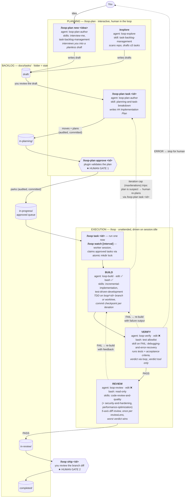
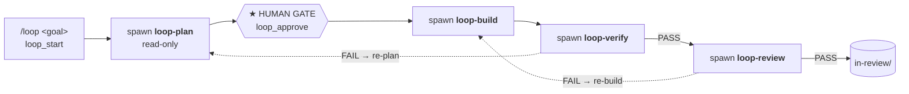

# Architecture

The full picture: two human gates bracket an unattended BUILD → VERIFY →
REVIEW loop, and the `docs/tasks/` backlog folders *are* the state — a task's
folder is its status.

Dotted edges are failure paths. VERIFY/REVIEW FAIL both re-enter BUILD and
share one iteration budget (`maxIterations`, default 3); an ERROR verdict
stops the loop for a human without burning an iteration. The loop never
pushes or opens a PR — REVIEW PASS parks the task in `in-review/` for you.

## Who does what

| Command | Handled by | Subagent | Write access | Skills loaded | Produces |
|---------|-----------|----------|--------------|---------------|----------|
| `/loop-plan new <idea>` | plugin → agent | `loop-plan-author` | task files only (bash ❌) | `interview-me`, `task-backlog-management`, `planning-and-task-breakdown` | planless draft in `draft/` |
| `/loop-plan task <id>` | plugin (move) → agent | `loop-plan-author` | task files only | `planning-and-task-breakdown` | `## Implementation Plan` in `in-planning/` |
| `/loop-plan approve <id>` | plugin only (agent writes nothing) | — | — | — | task parked in `in-progress/` |
| `/loop task\|watch\|ship\|recover\|stop\|status` | plugin driver (`src/loop/driver.ts`) | spawns the three stage agents below | — | `loop-orchestration` protocol | stage sequencing, claims, snapshots, run log |
| BUILD (also `/build`) | driver → agent | `loop-build` | edit ✅ bash ✅ | `incremental-implementation`, `test-driven-development` | code + one commit checkpoint per iteration |
| VERIFY (also `/verify`) | driver → agent | `loop-verify` | edit ❌ bash: test-runner allowlist | `debugging-and-error-recovery` (on FAIL) | trusted `loop_verdict` PASS/FAIL/ERROR |
| REVIEW (also `/review`) | driver → agent | `loop-review` | edit ❌ bash: read-only git/fs | `code-review-and-quality` (+ `security-and-hardening`, `performance-optimization`) | trusted `loop_verdict` per lens, worst wins |
| `/plan` (ad hoc) | agent | `loop-plan` | none (read-only) | `spec-driven-development`, `planning-and-task-breakdown` | a plan in chat — writes no file |
| `/explore` | agent | `loop-explore` | task files only | `task-backlog-management` | ≤5 schema-valid drafts in `draft/` |

Verdicts are only trusted through the `loop_verdict` plugin tool — a stage
agent claiming "PASS" in prose is ignored. Stage agents can't approve tasks,
move backlog folders, or ship; the plugin and the human own every transition
between folders.

## Claude Code variant (`claude-plugin/`)

Same pipeline, different driver: Claude Code has no background `session.idle`
driver, so the main agent drives the loop through a bundled MCP server
(`mcp__agentic-loop__loop_*` tools), and PLAN runs *inside* the loop with a
conversational gate instead of the separate `/loop-plan` command:

Two behavioral differences worth knowing in a demo: on VERIFY FAIL the Claude
Code loop goes back to **PLAN** (OpenCode re-builds), and stage guardrails
(verify/review bash allowlists, worktree pinning) are enforced by a
`PreToolUse` hook reading `runs/.stage.json` rather than by agent
permissions. One supervised loop per session — no `/loop watch`. Install and
command details live in [`claude-plugin/README.md`](../claude-plugin/README.md).
