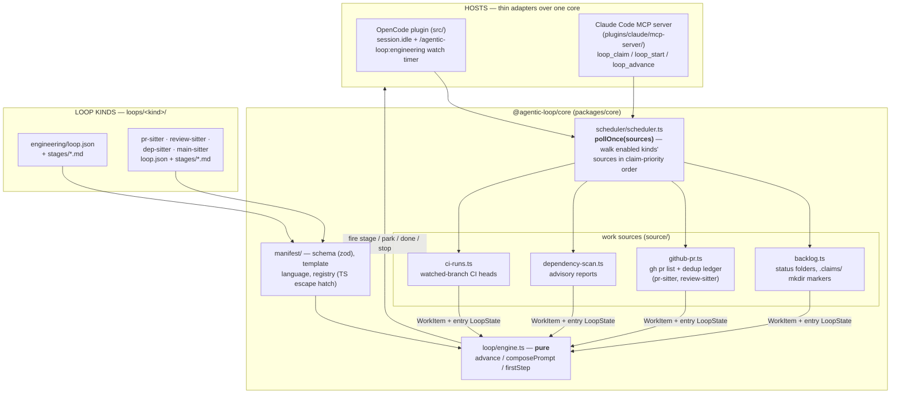
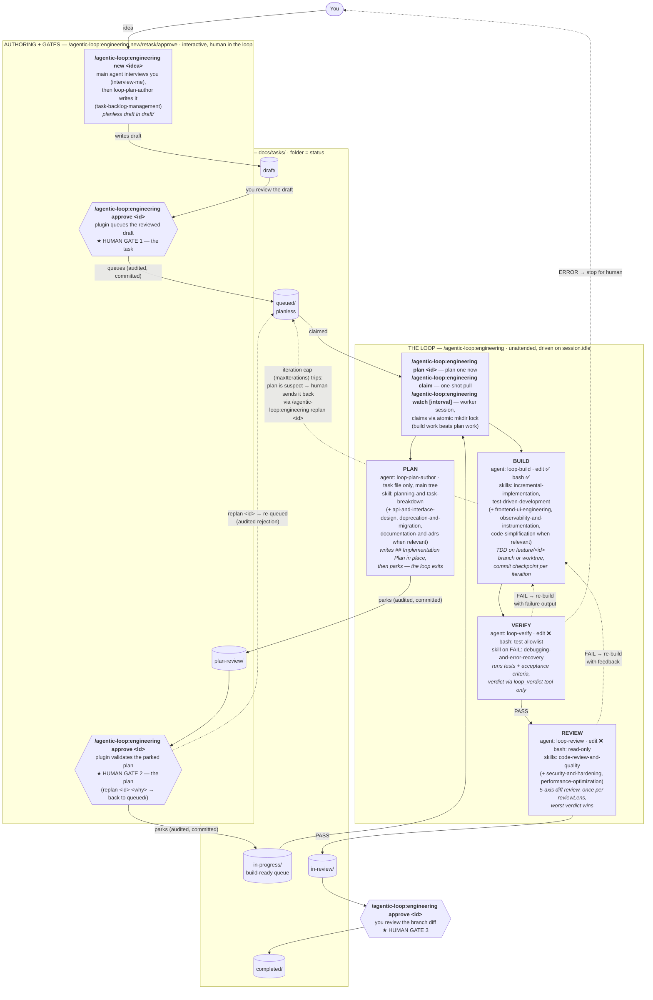

# Architecture

Two layers. The **framework** — a shared core package, a manifest-interpreted
loop engine, and a work-source scheduler — knows nothing about engineering
tasks or pull requests. The **loop kinds** (`packages/core/loops/<kind>/`) are declarative
manifests plus stage prompts that the framework interprets. Five ship today:
`engineering` is the reference kind (the original PLAN / BUILD → VERIFY →
REVIEW workflow, behavior-identical to when it was hardcoded), and four opt-in
**sitters** watch a hosted surface and drive a fix — `pr-sitter` (your open
PRs), `review-sitter` (PRs awaiting your review), `dep-sitter` (vulnerable or
outdated dependencies), and `main-sitter` (the default branch's CI). Each
sitter keeps the terminal call — merge, approve, close — human. **The four
sitters are experimental** — their manifests, config keys, and defaults may
still change; `engineering` is the stable, default-on kind.

## The framework — one engine, many kinds

- **Core package** — `@agentic-loop/core` (npm workspace) holds everything
  both plugins share: the pure engine and state, the manifest layer, work
  sources + scheduler, the task store, git helpers + worktree isolation,
  snapshots, verdict handling, metrics, and config (resolved by layering an
  optional user-scope `~/.agentic-loop.json` under the repo's
  `.agentic-loop.json` — see
  [configuration.md](configuration.md#layers--precedence)). Core never imports a host
  SDK; the entire host surface is the interfaces in
  `packages/core/src/host.ts` (Shell, Client, Log, …). The OpenCode plugin
  satisfies them with Bun's `$` and the opencode SDK client; the Claude Code
  MCP server with Node shims (`plugins/claude/mcp-server/src/shim.ts`) — its
  former `src/lib/` fork of the loop logic is gone.
- **Manifest engine** — a loop kind is `packages/core/loops/<kind>/loop.json`
  (zod-validated: stages with `work|check` kind, agent, prompt path,
  isolation, bash allowlist; a transitions table mapping
  onDone/onPass/onFail/onError to fire/park/done/stop effects with iteration
  counting; a work-source binding) plus `stages/*.md` prompt templates
  (`---`-separated sections, `{{var}}` interpolation, `{{#path}}…{{/path}}`
  conditional blocks). `loop/engine.ts` interprets it as a pure state machine:
  `advance(manifest, state, output, verdict)` returns the next state and
  action. Logic a manifest can't express hangs off named hooks resolved
  through `manifest/registry.ts` — compose hooks (prompt-context augmenters),
  pre-transition validators, claim predicates.
- **Work sources + scheduler** — a `WorkSource`
  (`packages/core/src/source/types.ts`) knows how to find, atomically claim,
  and release units of work for one kind; a claimed `WorkItem` carries a
  fully-constructed entry `LoopState`, so drivers stay source-agnostic.
  `pollOnce(sources)` walks the given sources in claim-priority order
  (engineering first unless disabled, then opted-in kinds in config order —
  `enabledLoopKinds` in core config); the first successful claim wins, and
  each kind's command scopes the poll to its own kind's source. Both
  hosts' triggers delegate to it: OpenCode's `session.idle` + the per-kind
  `watch` timer, and the Claude Code MCP server's `loop_claim`. A source may
  implement `onTerminal` for end-of-drive bookkeeping (the PR sitter's dedup
  ledger); the backlog source doesn't need it.
- **Per-kind status semantics** — the `docs/tasks/` status folders are the
  *engineering* kind's state model, not the framework's: its manifest binds a
  `backlog` work source with named statuses and claim pools. The PR sitter has
  no folders at all — GitHub itself is the status (checks, review decision,
  comments, mergeability) and a local per-PR ledger
  (`<tasksDir>/runs/pr-sitter/pr-<n>.json`) records what has already been
  handled. Other kinds pick whichever source fits.

## The engineering kind (`packages/core/loops/engineering/`)

The full picture: three human gates thread an unattended PLAN / BUILD →
VERIFY → REVIEW loop, and the `docs/tasks/` backlog folders *are* the state —
a task's folder is its status. The loop plans a task right before execution
(so plans don't rot while tasks sit parked) and **parks** the plan for human
review instead of blocking on it. The pipeline shape below — stage order,
retry budget, park/done statuses, stop messages — comes from
`packages/core/loops/engineering/loop.json`; the engine just interprets it.

Dotted edges are failure paths. VERIFY/REVIEW FAIL both re-enter BUILD and
share one iteration budget (`maxIterations`, default 3); an ERROR verdict
stops the loop for a human without burning an iteration. PLAN never blocks:
its only exit is the park into `plan-review/` — a watcher can plan a whole
queue overnight and you batch-review the plans. The engineering loop never
pushes or opens a PR on its own — REVIEW PASS just parks the task in
`in-review/` for you. Ship (`in-review/` → `completed/`) is still a
human-invoked gate, but it now pushes the task's `feature/<id>` branch and
opens (or reuses) a **draft** PR — GitHub or Azure DevOps per `codePlatform`
— so the merge decision stays yours while the "now go push and open a PR"
step doesn't.

## Who does what (engineering)

| Command | Handled by | Subagent | Write access | Skills loaded | Produces |
|---------|-----------|----------|--------------|---------------|----------|
| `/agentic-loop:engineering new <idea>` | plugin → agent | `loop-plan-author` | task files only (bash ❌) | `interview-me`, `task-backlog-management` | planless draft in `draft/` |
| `/agentic-loop:engineering retask <id> [note]` | plugin → agent | `loop-plan-author` (retask mode) | task files only (bash ❌) | `interview-me`, `task-backlog-management` | draft rewritten **in place** in `draft/` (same id, no folder move) |
| `/agentic-loop:engineering approve [id]` | plugin only (agent writes nothing) | — | — | — | the folder-driven gate: draft → `queued/`, plan-review → `in-progress/`, in-review → `completed/` |
| `/agentic-loop:engineering replan [id] [why]` | plugin only (agent writes nothing) | — | — | — | task re-queued in `queued/`, rejection audited |
| PLAN (in the loop, on a `queued/` task) | driver → agent | `loop-plan-author` (task mode) | task files only | `planning-and-task-breakdown` (+ `api-and-interface-design`, `deprecation-and-migration`, `documentation-and-adrs` when relevant) | `## Implementation Plan` in place → task parked in `plan-review/` |
| `/agentic-loop:engineering plan\|claim\|watch\|recover\|stop\|status` | plugin driver (`plugins/opencode/src/loop/driver.ts`) | spawns the three stage agents below | — | `loop-orchestration` protocol | stage sequencing, claims, snapshots, run log |
| BUILD (also `/build`) | driver → agent | `loop-build` | edit ✅ bash ✅ | `incremental-implementation`, `test-driven-development` (+ `frontend-ui-engineering`, `observability-and-instrumentation`, `code-simplification` when relevant) | code + one commit checkpoint per iteration |
| VERIFY (also `/verify`) | driver → agent | `loop-verify` | edit ❌ bash: test-runner allowlist | `debugging-and-error-recovery` (on FAIL) | trusted `loop_verdict` PASS/FAIL/ERROR |
| REVIEW (also `/review`) | driver → agent | `loop-review` | edit ❌ bash: read-only git/fs | `code-review-and-quality` (+ `security-and-hardening`, `performance-optimization`) | trusted `loop_verdict` per lens, worst wins |
| `/plan` (ad hoc) | agent | `loop-plan` | none (read-only) | `spec-driven-development`, `planning-and-task-breakdown` | a plan in chat — writes no file |

Verdicts are only trusted through the `loop_verdict` plugin tool — a stage
agent claiming "PASS" in prose is ignored. `loop_verdict` accepts any check
stage the active loop's manifest declares (engineering: `verify`/`review`;
pr-sitter: `triage`/`verify`; review-sitter: `fetch`; dep-sitter:
`scan`/`verify`; main-sitter: `diagnose`/`verify`) and validates the recording
against it. Stage
agents can't approve tasks, move backlog folders, or ship; the plugin and the
human own every transition between statuses.

## The sitter kinds — experimental

Four opt-in sitters (`pr-sitter`, `review-sitter`, `dep-sitter`,
`main-sitter`) watch a hosted surface (open PRs, review requests,
dependency advisories, CI) and drive a fix behind git worktree isolation,
always leaving the terminal call — merge, approve, close — to a human. Each
binds its own work source and follows the same check → work → publish
shape. **[`docs/sitters.md`](sitters.md) is the canonical reference** for
what each one does, its stage pipeline, its authority limits, and its
`loops.<kind>` config keys; the security posture for all four is in the
[threat model](design/threat-model.md).

## Claude Code variant (`plugins/claude/`)

Same loop kinds and lifecycles, different driver: Claude Code has no
background `session.idle` driver, so the main agent drives the loop through a
bundled MCP server (`mcp__agentic-loop__loop_*` tools) rather than agent
frontmatter permissions, and human gates are **interactive** — a park or a
done returns a `gate` field and the driving agent asks inline via
AskUserQuestion instead of only waiting for a command. Full install and
command details live in
[`plugins/claude/README.md`](../plugins/claude/README.md).

## Admin hub — beta (`packages/hub/`)

A third, host-independent surface: a localhost web app (`npm run hub`) that
**observes** the same filesystem substrate the hosts write — status folders,
run logs, snapshots, the stage marker, the watch lease — and **performs the
human gate moves on it**: approve, replan, ship.

It does so by calling the *same* shared entry points both hosts call
(`loop/gate.ts`), never its own copy of the moves — so an approval from a
browser and an approval from a slash command are the same audited,
committed transition. The line it does not cross is **driving**: the hub never
claims work and never runs a stage. It is a fourth caller of the gate, not a
fourth driver.

Two consequences worth stating, because they are what keep that line honest:

- A gate move on a task some loop is **already driving** is refused. The hub
  answers `GateCtx.isDriving` from the filesystem — a claim marker (a loop
  claims before it drives, so driving implies claimed) or the stage marker —
  rather than from an in-memory session map it doesn't have.
- **Ship opens a pull request**, which is visible outside the machine. Every
  hub write is behind a confirm that names its real effect.

Its write surface is bounded by the localhost bind, a Host-header check, and an
`X-Hub-Client` header on every mutating route — see
[`design/threat-model.md`](./design/threat-model.md). Beta: the API shape may
still change. See [`packages/hub/README.md`](../packages/hub/README.md).

## Backlog integrity rails

Three layers keep a confused agent from corrupting the folder-is-status
backlog (threat model T3/T3b):

- **Backlog-mutation guard** (`task/guard.ts`, always on): agent tool calls
  that would mutate `<tasksDir>/` are default-denied on both substrates —
  Claude Code via the PreToolUse hook (inline copy, kept in sync), OpenCode
  via `tool.execute.before`. Read-only commands pass; direct writes are
  limited to authoring `draft/*.md` and the live PLAN stage's own `queued/`
  task (the stage marker's `taskId` / the driving loop's state names it). The
  deterministic movers stay authoritative: `moveTask` + `canTransition`
  enforce one-stage-at-a-time, and `statusOf` rejects unknown folders.
- **Reconciliation sweep** (`task/audit.ts`): detects stray folders (a
  `run/` an agent invented), task files outside every status folder, and one
  id duplicated across status folders. Surfaced at session start (both
  substrates), in `loop_status`, and as warnings on claims.
- **Doctor** (`loop_doctor` / `/agentic-loop:engineering doctor [fix]`): reports the sweep's
  findings plus held claim markers; with `fix` it applies only the
  unambiguous repairs — rescue strays back to `draft/` (audited + committed),
  remove emptied stray folders, release stale orphaned claim markers.
  Duplicates are always a human call.

**Watch lease** (`scheduler/lease.ts`): at most one watch-mode process per
clone. `/agentic-loop:engineering watch` atomically creates
`<tasksDir>/runs/.watch-lease/` (gitignored) with a heartbeat JSON refreshed
every tick; a second process is refused with the live owner's identity, and
a dead watcher's lease is taken over once the heartbeat exceeds
`max(3×interval, 2min)`. One-shot claims (`loop_claim`/`loop_start`) warn —
not block — when a foreign live lease exists.
