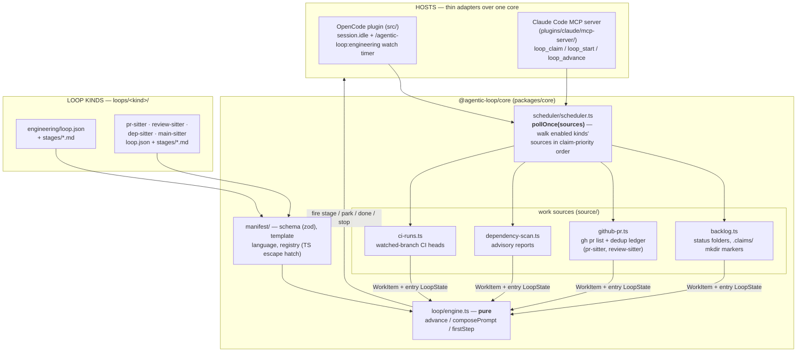

# Architecture

Two layers. The **framework** — a shared core package, a manifest-interpreted
loop engine, and a work-source scheduler — knows nothing about engineering
tasks or pull requests. The **loop kinds** (`packages/core/loops/<kind>/`) are declarative
manifests plus stage prompts that the framework interprets. Five ship today:
`engineering` is the reference kind (the original PLAN / BUILD → VERIFY →
REVIEW workflow, behavior-identical to when it was hardcoded), and four opt-in
**sitters** watch a hosted surface and drive a fix — `pr-sitter` (your open
PRs), `review-sitter` (PRs awaiting your review), `dep-sitter` (vulnerable or
outdated dependencies), and `main-sitter` (the default branch's CI). Each
sitter keeps the terminal call — merge, approve, close — human. **The four
sitters are experimental** — their manifests, config keys, and defaults may
still change; `engineering` is the stable, default-on kind.

## The framework — one engine, many kinds

- **Core package** — `@agentic-loop/core` (npm workspace) holds everything
  both plugins share: the pure engine and state, the manifest layer, work
  sources + scheduler, the task store, git helpers + worktree isolation,
  snapshots, verdict handling, metrics, and config (resolved by layering an
  optional user-scope `~/.agentic-loop.json` under the repo's
  `.agentic-loop.json` — see
  [configuration.md](configuration.md#layers--precedence)). Core never imports a host
  SDK; the entire host surface is the interfaces in
  `packages/core/src/host.ts` (Shell, Client, Log, …). The OpenCode plugin
  satisfies them with Bun's `$` and the opencode SDK client; the Claude Code
  MCP server with Node shims (`plugins/claude/mcp-server/src/shim.ts`) — its
  former `src/lib/` fork of the loop logic is gone.
- **Manifest engine** — a loop kind is `packages/core/loops/<kind>/loop.json`
  (zod-validated: stages with `work|check` kind, agent, prompt path,
  isolation, bash allowlist; a transitions table mapping
  onDone/onPass/onFail/onError to fire/park/done/stop effects with iteration
  counting; a work-source binding) plus `stages/*.md` prompt templates
  (`---`-separated sections, `{{var}}` interpolation, `{{#path}}…{{/path}}`
  conditional blocks). `loop/engine.ts` interprets it as a pure state machine:
  `advance(manifest, state, output, verdict)` returns the next state and
  action. Logic a manifest can't express hangs off named hooks resolved
  through `manifest/registry.ts` — compose hooks (prompt-context augmenters),
  pre-transition validators, claim predicates.
- **Work sources + scheduler** — a `WorkSource`
  (`packages/core/src/source/types.ts`) knows how to find, atomically claim,
  and release units of work for one kind; a claimed `WorkItem` carries a
  fully-constructed entry `LoopState`, so drivers stay source-agnostic.
  `pollOnce(sources)` walks the given sources in claim-priority order
  (engineering first unless disabled, then opted-in kinds in config order —
  `enabledLoopKinds` in core config); the first successful claim wins, and
  each kind's command scopes the poll to its own kind's source. Both
  hosts' triggers delegate to it: OpenCode's `session.idle` + the per-kind
  `watch` timer, and the Claude Code MCP server's `loop_claim`. A source may
  implement `onTerminal` for end-of-drive bookkeeping (the PR sitter's dedup
  ledger); the backlog source doesn't need it.
- **Per-kind status semantics** — the `docs/tasks/` status folders are the
  *engineering* kind's state model, not the framework's: its manifest binds a
  `backlog` work source with named statuses and claim pools. The PR sitter has
  no folders at all — GitHub itself is the status (checks, review decision,
  comments, mergeability) and a local per-PR ledger
  (`<tasksDir>/runs/pr-sitter/pr-<n>.json`) records what has already been
  handled. Other kinds pick whichever source fits.

## The engineering kind (`packages/core/loops/engineering/`)

The reference kind — the original PLAN / BUILD → VERIFY → REVIEW workflow,
behavior-identical to when it was hardcoded. Its full pipeline diagram, the
who-does-what breakdown, and the backlog integrity rails that protect
`docs/tasks/` now live in their own file:
**[`docs/loops/engineering.md`](loops/engineering.md)**.

Verdicts across every kind are only trusted through the `loop_verdict` plugin
tool — a stage agent claiming "PASS" in prose is ignored. `loop_verdict`
accepts any check stage the active loop's manifest declares (engineering:
`verify`/`review`; pr-sitter: `triage`/`verify`; review-sitter: `fetch`;
dep-sitter: `scan`/`verify`; main-sitter: `diagnose`/`verify`) and validates
the recording against it. Stage agents can't approve tasks, move backlog
folders, or ship; the plugin and the human own every transition between
statuses.

## Watch lease

At most one watch-mode process per clone, across every kind
(`scheduler/lease.ts`): `/agentic-loop:<kind> watch` atomically creates
`<tasksDir>/runs/.watch-lease/` (gitignored) with a heartbeat JSON refreshed
every tick; a second watch-mode process — for any kind — is refused with the
live owner's identity, and a dead watcher's lease is taken over once the
heartbeat exceeds `max(3×interval, 2min)`. One-shot claims
(`loop_claim`/`loop_start`) warn — not block — when a foreign live lease
exists.

## The sitter kinds — experimental

Four opt-in sitters (`pr-sitter`, `review-sitter`, `dep-sitter`,
`main-sitter`) watch a hosted surface (open PRs, review requests,
dependency advisories, CI) and drive a fix behind git worktree isolation,
always leaving the terminal call — merge, approve, close — to a human. Each
binds its own work source and follows the same check → work → publish
shape. **[`docs/sitters.md`](sitters.md) is the canonical reference** for
what each one does, its stage pipeline, its authority limits, and its
`loops.<kind>` config keys; the security posture for all four is in the
[threat model](design/threat-model.md).

## Claude Code variant (`plugins/claude/`)

Same loop kinds and lifecycles, different driver: Claude Code has no
background `session.idle` driver, so the main agent drives the loop through a
bundled MCP server (`mcp__agentic-loop__loop_*` tools) rather than agent
frontmatter permissions, and human gates are **interactive** — a park or a
done returns a `gate` field and the driving agent asks inline via
AskUserQuestion instead of only waiting for a command. Full install and
command details live in
[`plugins/claude/README.md`](../plugins/claude/README.md).

## Admin hub — beta (`packages/hub/`)

A third, host-independent surface: a localhost web app (`npm run hub`) that
**observes** the same filesystem substrate the hosts write — status folders,
run logs, snapshots, the stage marker, the watch lease — and **performs the
human gate moves on it**: approve, replan, ship.

It does so by calling the *same* shared entry points both hosts call
(`loop/gate.ts`), never its own copy of the moves — so an approval from a
browser and an approval from a slash command are the same audited,
committed transition. The line it does not cross is **driving**: the hub never
claims work and never runs a stage. It is a fourth caller of the gate, not a
fourth driver.

Two consequences worth stating, because they are what keep that line honest:

- A gate move on a task some loop is **already driving** is refused. The hub
  answers `GateCtx.isDriving` from the filesystem — a claim marker (a loop
  claims before it drives, so driving implies claimed) or the stage marker —
  rather than from an in-memory session map it doesn't have.
- **Ship opens a pull request**, which is visible outside the machine. Every
  hub write is behind a confirm that names its real effect.

It also **edits `.agentic-loop.json`**, one named layer at a time — never the
merged view, which would flatten the user-scope layer (and its `ado.pat`) into
the repo's file. It writes raw JSON, so keys core's schema doesn't know survive
a save instead of being stripped. And it exposes the **backlog doctor**
(`loop_doctor`) — rescuing strays, removing invented folders, and releasing the
stale, undriven claim markers that would otherwise keep refusing a gate move.

Its write surface is bounded by the localhost bind, a Host-header check, and an
`X-Hub-Client` header on every mutating route — see
[`design/threat-model.md`](./design/threat-model.md) (T14–T16). Beta: the API
shape may still change. See [`packages/hub/README.md`](../packages/hub/README.md).
