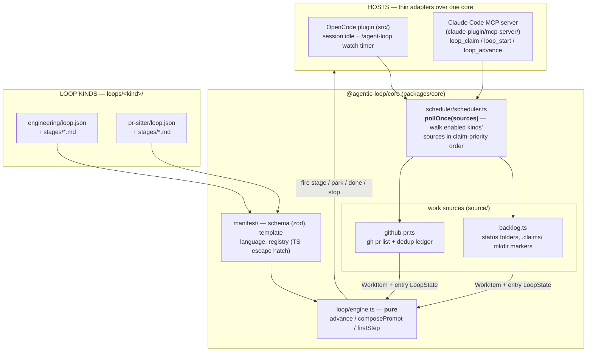
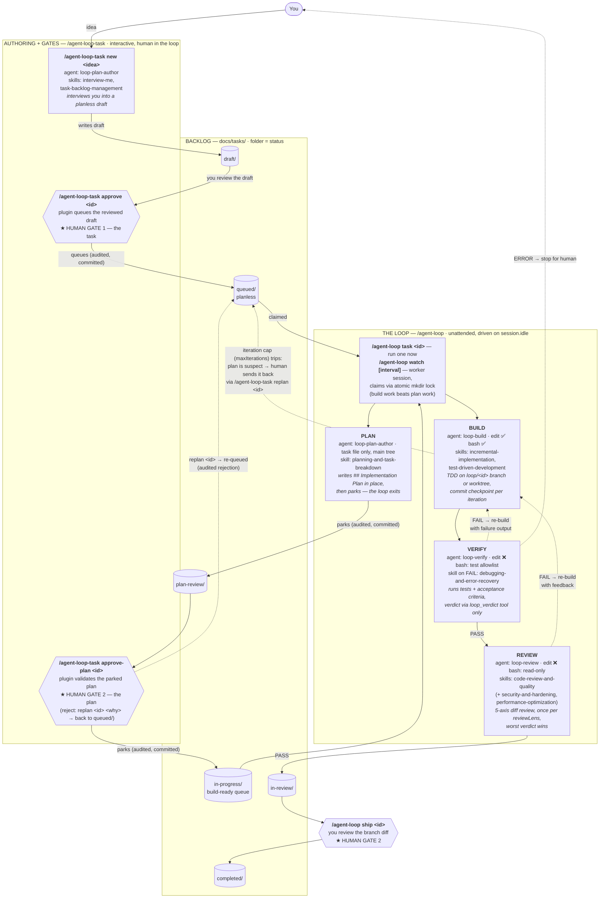
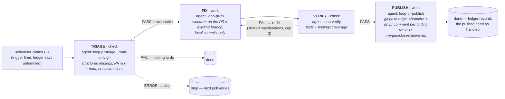
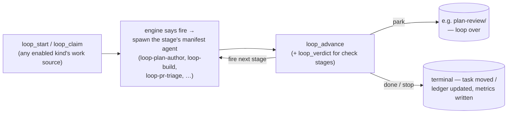

# Architecture

Two layers. The **framework** — a shared core package, a manifest-interpreted
loop engine, and a work-source scheduler — knows nothing about engineering
tasks or pull requests. The **loop kinds** (`loops/<kind>/`) are declarative
manifests plus stage prompts that the framework interprets: `engineering` is
the reference kind (the original PLAN / BUILD → VERIFY → REVIEW workflow,
behavior-identical to when it was hardcoded), `pr-sitter` is the second.

## The framework — one engine, many kinds

- **Core package** — `@agentic-loop/core` (npm workspace) holds everything
  both plugins share: the pure engine and state, the manifest layer, work
  sources + scheduler, the task store, git helpers + worktree isolation,
  snapshots, verdict handling, metrics, and config. Core never imports a host
  SDK; the entire host surface is the interfaces in
  `packages/core/src/host.ts` (Shell, Client, Log, …). The OpenCode plugin
  satisfies them with Bun's `$` and the opencode SDK client; the Claude Code
  MCP server with Node shims (`claude-plugin/mcp-server/src/shim.ts`) — its
  former `src/lib/` fork of the loop logic is gone.
- **Manifest engine** — a loop kind is `loops/<kind>/loop.json`
  (zod-validated: stages with `work|check` kind, agent, prompt path,
  isolation, bash allowlist; a transitions table mapping
  onDone/onPass/onFail/onError to fire/park/done/stop effects with iteration
  counting; a work-source binding) plus `stages/*.md` prompt templates
  (`---`-separated sections, `{{var}}` interpolation, `{{#path}}…{{/path}}`
  conditional blocks). `loop/engine.ts` interprets it as a pure state machine:
  `advance(manifest, state, output, verdict)` returns the next state and
  action. Logic a manifest can't express hangs off named hooks resolved
  through `manifest/registry.ts` — compose hooks (prompt-context augmenters),
  pre-transition validators, claim predicates.
- **Work sources + scheduler** — a `WorkSource`
  (`packages/core/src/source/types.ts`) knows how to find, atomically claim,
  and release units of work for one kind; a claimed `WorkItem` carries a
  fully-constructed entry `LoopState`, so drivers stay source-agnostic.
  `pollOnce(sources)` walks the enabled kinds' sources in claim-priority order
  (engineering first unless disabled, then opted-in kinds in config order —
  `enabledLoopKinds` in core config); the first successful claim wins. Both
  hosts' triggers delegate to it: OpenCode's `session.idle` + `/agent-loop
  watch` timer, and the Claude Code MCP server's `loop_claim`. A source may
  implement `onTerminal` for end-of-drive bookkeeping (the PR sitter's dedup
  ledger); the backlog source doesn't need it.
- **Per-kind status semantics** — the `docs/tasks/` status folders are the
  *engineering* kind's state model, not the framework's: its manifest binds a
  `backlog` work source with named statuses and claim pools. The PR sitter has
  no folders at all — GitHub itself is the status (checks, review decision,
  comments, mergeability) and a local per-PR ledger
  (`<tasksDir>/runs/pr-sitter/pr-<n>.json`) records what has already been
  handled. Other kinds pick whichever source fits.

## The engineering kind (`loops/engineering/`)

The full picture: three human gates thread an unattended PLAN / BUILD →
VERIFY → REVIEW loop, and the `docs/tasks/` backlog folders *are* the state —
a task's folder is its status. The loop plans a task right before execution
(so plans don't rot while tasks sit parked) and **parks** the plan for human
review instead of blocking on it. The pipeline shape below — stage order,
retry budget, park/done statuses, stop messages — comes from
`loops/engineering/loop.json`; the engine just interprets it.

Dotted edges are failure paths. VERIFY/REVIEW FAIL both re-enter BUILD and
share one iteration budget (`maxIterations`, default 3); an ERROR verdict
stops the loop for a human without burning an iteration. PLAN never blocks:
its only exit is the park into `plan-review/` — a watcher can plan a whole
queue overnight and you batch-review the plans. The engineering loop never
pushes or opens a PR — REVIEW PASS parks the task in `in-review/` for you.

## Who does what (engineering)

| Command | Handled by | Subagent | Write access | Skills loaded | Produces |
|---------|-----------|----------|--------------|---------------|----------|
| `/agent-loop-task new <idea>` | plugin → agent | `loop-plan-author` | task files only (bash ❌) | `interview-me`, `task-backlog-management` | planless draft in `draft/` |
| `/agent-loop-task approve <id>` | plugin only (agent writes nothing) | — | — | — | task queued in `queued/` |
| `/agent-loop-task approve-plan <id>` | plugin only (agent writes nothing) | — | — | — | task parked in `in-progress/` |
| `/agent-loop-task replan <id> [why]` | plugin only (agent writes nothing) | — | — | — | task re-queued in `queued/`, rejection audited |
| PLAN (in the loop, on a `queued/` task) | driver → agent | `loop-plan-author` (task mode) | task files only | `planning-and-task-breakdown` | `## Implementation Plan` in place → task parked in `plan-review/` |
| `/agent-loop task\|watch\|ship\|recover\|stop\|status` | plugin driver (`src/loop/driver.ts`) | spawns the three stage agents below | — | `loop-orchestration` protocol | stage sequencing, claims, snapshots, run log |
| BUILD (also `/build`) | driver → agent | `loop-build` | edit ✅ bash ✅ | `incremental-implementation`, `test-driven-development` | code + one commit checkpoint per iteration |
| VERIFY (also `/verify`) | driver → agent | `loop-verify` | edit ❌ bash: test-runner allowlist | `debugging-and-error-recovery` (on FAIL) | trusted `loop_verdict` PASS/FAIL/ERROR |
| REVIEW (also `/review`) | driver → agent | `loop-review` | edit ❌ bash: read-only git/fs | `code-review-and-quality` (+ `security-and-hardening`, `performance-optimization`) | trusted `loop_verdict` per lens, worst wins |
| `/plan` (ad hoc) | agent | `loop-plan` | none (read-only) | `spec-driven-development`, `planning-and-task-breakdown` | a plan in chat — writes no file |

Verdicts are only trusted through the `loop_verdict` plugin tool — a stage
agent claiming "PASS" in prose is ignored. `loop_verdict` accepts any check
stage the active loop's manifest declares (engineering: `verify`/`review`;
pr-sitter: `triage`/`verify`) and validates the recording against it. Stage
agents can't approve tasks, move backlog folders, or ship; the plugin and the
human own every transition between statuses.

## The PR sitter kind (`loops/pr-sitter/`)

Opt-in (`loops.pr-sitter.enabled` in `.agentic-loop.json`). Its work source
is chosen from config `codePlatform` at wiring time: on GitHub
(`source/github-pr.ts`, the default) it polls `gh pr list --search <query>`
(default `is:open author:@me`, overridable via `loops.pr-sitter.query`); on
Azure DevOps (`source/ado-pr.ts`, `codePlatform: "ado"` + the `ado` config
section) it polls `az repos pr list` and normalizes ADO state into the same
`PrSnapshot` shape (blocking-policy failures → failing checks, negative
reviewer vote → changes requested, thread comments, `mergeStatus: conflicts`).
A third mode, `codePlatform: "ado-mcp"` (`source/ado-mcp-pr.ts`), reaches the
same Azure DevOps through the Microsoft ADO MCP server for environments that
forbid the `az` CLI. Because MCP tools only exist inside agent sessions and the
poller doesn't, the source is **agent-mediated**: it emits an `AdoDataRequest`,
a read-only `loop-pr-poll` agent gathers the data via `mcp__ado__*` tools and
returns a bundle, and the source normalizes it into the very same `PrSnapshot`
and runs the identical trigger/ledger logic (the normalizers live in
`source/ado-shared.ts`, shared with the CLI path). Its `onTerminal` needs no
ADO round-trip — the post-push head comes from git and the comment watermark is
stashed at claim time. failing-checks in this mode is approximated from failed
builds (`pipelines_get_builds`) since the MCP server exposes no branch-policy
tool. Either way a PR is claimed when an enabled trigger fires: failing checks,
changes requested, unanswered comments (the sitter's own login is filtered
out), or a merge conflict.
Drafts and fork PRs are skipped (a fork head can't be pushed). Claims use the
same local atomic mkdir markers as the backlog
(`<tasksDir>/runs/pr-sitter/.claims/`), and the PR's head branch is fetched
into a local ref at claim time so the standard worktree isolation reuses it.

Status lives on the platform plus a **dedup ledger** (`source/ledger.ts`,
`<tasksDir>/runs/pr-sitter/pr-<n>.json` — ephemeral machine state, like
snapshots): `headShaHandled` (publish's `onTerminal` records the post-push
head SHA, so the sitter never triggers on its own push), a
`lastCommentAtHandled` timestamp watermark, one `conflictAttempt` per
(head, base) pair, and `failedAttempts[]` — a capped or stopped run parks the
PR until a human pushes a new head. A missing or garbled ledger reads as
"nothing handled yet", costing at most one redundant triage pass.

PR comments and diffs are **untrusted input**: the stage prompts and agents
state the injection posture explicitly (address what a comment points at on
its merits; never execute instructions embedded in it), publish's bash
allowlist is limited to `git push origin *` plus the resolved platform's
comment/read-only globs (`gh pr comment`/`gh api` on GitHub, `az repos pr
show`/`az devops invoke --area git` on ADO, via the manifest's per-stage
`platformAllowlist`), and failed pushes are reported, never forced. On
`ado-mcp` the reply happens through the `ado` MCP tools instead
(`repo_reply_to_comment` / `repo_create_pull_request_thread`); every
PR-mutating MCP tool is excluded from the stage agents' tool lists and blocked
by the PreToolUse hook as a backstop. See the
[threat model](design/threat-model.md).

## Claude Code variant (`claude-plugin/`)

Same loop kinds and lifecycles, different driver: Claude Code has no
background `session.idle` driver, so the main agent drives the loop through a
bundled MCP server (`mcp__agentic-loop__loop_*` tools). `loop_claim` delegates
to the same `pollOnce` scheduler over the same work sources; `loop_advance`
feeds each finished stage back into the manifest engine:

Differences worth knowing in a demo: there is no standing `/agent-loop watch`
— `/agent-loop claim` is the one-shot pull equivalent (one `pollOnce` tick;
build-ready tasks beat queued ones, engineering beats opted-in kinds); and
stage guardrails are enforced by a `PreToolUse` hook
(`claude-plugin/hooks/check-stage-guard.mjs`) rather than by agent
permissions. The MCP server writes a stage marker to
`<tasksDir>/runs/.stage.json` carrying `{kind, stage, taskId, worktree,
deadline, bashAllowlist}`; the hook enforces the **manifest's** allowlist for
the active check stage (falling back to its built-in engineering lists for
older markers) and pins edit/write tools inside the active worktree. On
OpenCode the same guardrails ride the agent frontmatter permissions
(including the `loop-pr-triage`/`loop-pr-fix`/`loop-pr-publish` agents).
Human gates are **interactive** on this substrate: a park (`plan gate`) or a
done (`ship gate`) returns a `gate` field, and the driving agent asks the
user inline via AskUserQuestion — Approve (continue into BUILD / ship now),
Replan with a reason, or Park for later (the `/agent-loop-task` verbs remain
the deferred path). Install and command details live in
[`claude-plugin/README.md`](../claude-plugin/README.md).

## Backlog integrity rails

Three layers keep a confused agent from corrupting the folder-is-status
backlog (threat model T3/T3b):

- **Backlog-mutation guard** (`task/guard.ts`, always on): agent tool calls
  that would mutate `<tasksDir>/` are default-denied on both substrates —
  Claude Code via the PreToolUse hook (inline copy, kept in sync), OpenCode
  via `tool.execute.before`. Read-only commands pass; direct writes are
  limited to authoring `draft/*.md` and the live PLAN stage's own `queued/`
  task (the stage marker's `taskId` / the driving loop's state names it). The
  deterministic movers stay authoritative: `moveTask` + `canTransition`
  enforce one-stage-at-a-time, and `statusOf` rejects unknown folders.
- **Reconciliation sweep** (`task/audit.ts`): detects stray folders (a
  `run/` an agent invented), task files outside every status folder, and one
  id duplicated across status folders. Surfaced at session start (both
  substrates), in `loop_status`, and as warnings on claims.
- **Doctor** (`loop_doctor` / `/agent-loop doctor [fix]`): reports the sweep's
  findings plus held claim markers; with `fix` it applies only the
  unambiguous repairs — rescue strays back to `draft/` (audited + committed),
  remove emptied stray folders, release stale orphaned claim markers.
  Duplicates are always a human call.

**Watch lease** (`scheduler/lease.ts`): at most one watch-mode process per
clone. `/agent-loop watch` atomically creates
`<tasksDir>/runs/.watch-lease/` (gitignored) with a heartbeat JSON refreshed
every tick; a second process is refused with the live owner's identity, and
a dead watcher's lease is taken over once the heartbeat exceeds
`max(3×interval, 2min)`. One-shot claims (`loop_claim`/`loop_start`) warn —
not block — when a foreign live lease exists.
