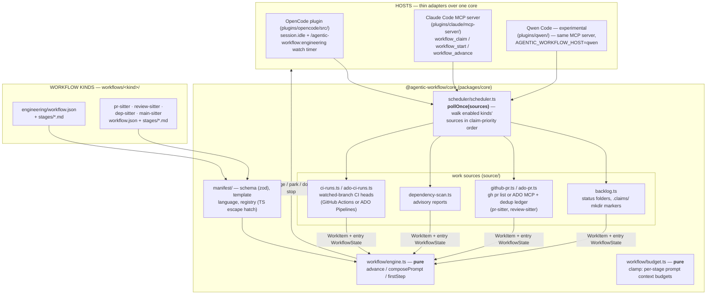

English | [繁體中文](architecture.zh-TW.md)

# Architecture

Two layers. The **framework** — a shared core package, a manifest-interpreted
workflow engine, and a work-source scheduler — knows nothing about engineering
tasks or pull requests. The **workflow kinds** (`packages/core/workflows/<kind>/`) are declarative
manifests plus stage prompts that the framework interprets. Five ship today:
`engineering` is the reference kind (the original PLAN / BUILD → VERIFY →
REVIEW workflow, behavior-identical to when it was hardcoded), and four
**sitters** watch a hosted surface and drive a fix — `pr-sitter` (your open
PRs), `review-sitter` (PRs awaiting your review), `dep-sitter` (vulnerable or
outdated dependencies), and `main-sitter` (the default branch's CI). Each
sitter keeps the terminal call — merge, approve, close — human. **All four
sitters are experimental** — their manifests, config keys, and defaults may
still change, so each is opt-in via `workflows.<kind>.enabled: true`.
`engineering` is the one default-on kind.

## The framework — one engine, many kinds

```mermaid
flowchart TB
    subgraph hosts["HOSTS — thin adapters over one core"]
        oc["OpenCode plugin (plugins/opencode/src/)<br/>session.idle + /agentic-workflow:engineering watch timer"]
        cc["Claude Code MCP server<br/>(plugins/claude/mcp-server/)<br/>workflow_claim / workflow_start / workflow_advance"]
        qw["Qwen Code — experimental<br/>(plugins/qwen/) — same MCP server,<br/>AGENTIC_WORKFLOW_HOST=qwen"]
    end

    subgraph core["@agentic-workflow/core (packages/core)"]
        sched["scheduler/scheduler.ts<br/><b>pollOnce(sources)</b> — walk enabled kinds'<br/>sources in claim-priority order"]
        subgraph sources["work sources (source/)"]
            backlog["backlog.ts<br/>status folders, .claims/ mkdir markers"]
            ghpr["github-pr.ts / ado-pr.ts<br/>gh pr list or ADO MCP + dedup ledger<br/>(pr-sitter, review-sitter)"]
            depscan["dependency-scan.ts<br/>advisory reports"]
            ciruns["ci-runs.ts / ado-ci-runs.ts<br/>watched-branch CI heads<br/>(GitHub Actions or ADO Pipelines)"]
        end
        engine["workflow/engine.ts — <b>pure</b><br/>advance / composePrompt / firstStep"]
        budget["workflow/budget.ts — <b>pure</b><br/>clamp: per-stage prompt context budgets"]
        manifest["manifest/ — schema (zod), template<br/>language, registry (TS escape hatch)"]
    end

    subgraph kinds["WORKFLOW KINDS — workflows/&lt;kind&gt;/"]
        eng["engineering/workflow.json<br/>+ stages/*.md"]
        sitter["pr-sitter · review-sitter ·<br/>dep-sitter · main-sitter<br/>workflow.json + stages/*.md"]
    end

    oc --> sched
    cc --> sched
    qw --> sched
    sched --> backlog
    sched --> ghpr
    sched --> depscan
    sched --> ciruns
    backlog -->|"WorkItem + entry WorkflowState"| engine
    ghpr -->|"WorkItem + entry WorkflowState"| engine
    depscan -->|"WorkItem + entry WorkflowState"| engine
    ciruns -->|"WorkItem + entry WorkflowState"| engine
    manifest --> engine
    eng --> manifest
    sitter --> manifest
    engine -->|"fire stage / park / done / stop"| hosts
```

- **Core package** — `@agentic-workflow/core` (npm workspace) holds everything
  every host shares: the pure engine and state, the manifest layer, work
  sources + scheduler, the task store, git helpers + worktree isolation,
  snapshots, verdict handling, metrics, and config (resolved by layering an
  optional user-scope `~/.config/agentic-workflow/agentic-workflow.json`
  (honoring `$XDG_CONFIG_HOME`, with the legacy `~/.agentic-workflow.json` still
  read as a fallback) under the repo's `.agentic-workflow.json` — see
  [configuration.md](configuration.md#layers--precedence)). Core never imports a host
  SDK; the entire host surface is the interfaces in
  `packages/core/src/host.ts` (Shell, Client, Log, …). The OpenCode plugin
  satisfies them with Bun's `$` and the opencode SDK client; the Claude Code
  MCP server with Node shims (`plugins/claude/mcp-server/src/shim.ts`) — its
  former `src/lib/` fork of the loop logic is gone. The Qwen Code host reuses
  that same MCP server binary, switched by `AGENTIC_WORKFLOW_HOST=qwen`.
- **Manifest engine** — a workflow kind is `packages/core/workflows/<kind>/workflow.json`
  (zod-validated: stages with `work|check` kind, agent, prompt path,
  isolation, bash allowlist; a transitions table mapping
  onDone/onPass/onFail/onError to fire/park/done/stop effects with iteration
  counting; a work-source binding) plus `stages/*.md` prompt templates
  (`---`-separated sections, `{{var}}` interpolation, `{{#path}}…{{/path}}`
  conditional blocks). `workflow/engine.ts` interprets it as a pure state machine:
  `advance(manifest, state, output, verdict)` returns the next state and
  action. It also fuses each check stage's structured verdict block onto the head
  of that stage's artifact and records the seam, so `workflow/budget.ts` can hold
  a stage's prompt to a configured character ceiling
  (`workflows.<kind>.stageContext`) by trimming only the prose — the structured
  findings and the stage contract are never trimmed, and the run log keeps the
  full text regardless. Logic a manifest can't express hangs off named hooks resolved
  through `manifest/registry.ts` — compose hooks (prompt-context augmenters),
  pre-transition validators, claim predicates.
- **Work sources + scheduler** — a `WorkSource`
  (`packages/core/src/source/types.ts`) knows how to find, atomically claim,
  and release units of work for one kind; a claimed `WorkItem` carries a
  fully-constructed entry `WorkflowState`, so drivers stay source-agnostic.
  The PR and CI sources have Azure DevOps twins (`ado-pr.ts`,
  `ado-ci-runs.ts`) swapped in at wiring time when `codePlatform` is
  `"ado"`. They reach ADO only through the Azure DevOps MCP server, via the
  `AdoGateway` port (`packages/core/src/source/ado-gateway.ts`) — types only,
  because `host.ts` forbids core importing a host SDK. The client that
  satisfies it lives in **`packages/ado-mcp`**, the one place in the repo that
  imports `@modelcontextprotocol/sdk` as a *client*; it keeps a single
  long-lived server per process, and the tool names it calls are pinned in
  `packages/core/src/source/ado-tools.ts` against the dump in
  `docs/design/ado-mcp-toolsurface.md`.
  `pollOnce(sources)` walks the given sources in claim-priority order
  (`engineering` unless disabled, then the opted-in kinds — every sitter — in
  config order; `enabledWorkflowKinds` in core config); the first successful claim wins, and
  each kind's command scopes the poll to its own kind's source. Both
  hosts' triggers delegate to it: OpenCode's `session.idle` + the per-kind
  `watch` timer, and the Claude Code MCP server's `workflow_claim`. A source may
  implement `onTerminal` for end-of-drive bookkeeping (the PR sitter's dedup
  ledger); the backlog source doesn't need it.
- **Per-kind status semantics** — the `docs/tasks/` status folders are the
  *engineering* kind's state model, not the framework's: its manifest binds a
  `backlog` work source with named statuses and claim pools. The PR sitter has
  no folders at all — the platform (GitHub or ADO) itself is the status (checks, review decision,
  comments, mergeability) and a local per-PR ledger
  (`<tasksDir>/runs/pr-sitter/pr-<n>.json`) records what has already been
  handled. Other kinds pick whichever source fits.

## The engineering kind (`packages/core/workflows/engineering/`)

The reference kind — the original PLAN / BUILD → VERIFY → REVIEW workflow,
behavior-identical to when it was hardcoded. Its full pipeline diagram, the
who-does-what breakdown, and the backlog integrity rails that protect
`docs/tasks/` now live in their own file:
**[`docs/workflows/engineering.md`](workflows/engineering.md)**.

Verdicts across every kind are only trusted through the `workflow_verdict` plugin
tool — a stage agent claiming "PASS" in prose is ignored. `workflow_verdict`
accepts any check stage the active loop's manifest declares (engineering:
`verify`/`review`; pr-sitter: `triage`/`verify`; review-sitter: `fetch`;
dep-sitter: `scan`/`verify`; main-sitter: `diagnose`/`verify`) and validates
the recording against it. Stage agents can't approve tasks, move backlog
folders, or ship; the plugin and the human own every transition between
statuses.

A **work** stage is refused that channel on purpose — a build agent that could
record a verdict could pre-empt its own verification. It gets a separate,
narrower signal instead: `workflow_blocked` says "I cannot do this work at all"
(the approved plan is impossible as written), never "the work is good". A stage
that reports itself blocked takes its manifest's `onError` arm if it declares
one — engineering's `build` stops the loop and asks a human to `replan` — and
kinds that declare none are unaffected. The two tools' guards are exact
mirrors: `workflow_verdict` rejects work stages, `workflow_blocked` rejects
check stages, so neither can stand in for the other. Unlike a check stage's
transient ERROR, a blocked stop is **not** retryable: no amount of re-polling
makes an impossible plan possible, so the task waits for a human rather than
being re-claimed.

## Watch lease

At most one watch-mode process per clone, across every kind
(`scheduler/lease.ts`): `/agentic-workflow:<kind> watch` atomically creates
`<tasksDir>/runs/.watch-lease/` (gitignored) with a heartbeat JSON refreshed
every tick; a second watch-mode process — for any kind — is refused with the
live owner's identity, and a dead watcher's lease is taken over once the
heartbeat exceeds `max(3×interval, 2min)`. One-shot claims
(`workflow_claim`/`workflow_start`) warn — not block — when a foreign live lease
exists.

## The sitter kinds

Four sitters — `pr-sitter`, `review-sitter`, `dep-sitter`, and `main-sitter`,
all experimental and all opt-in — watch a hosted surface
(open PRs, review requests, dependency advisories, CI) and drive a fix behind
git worktree isolation, always leaving the terminal call — merge, approve,
close — to a human. Each
binds its own work source and follows the same check → work → publish
shape. **[`docs/sitters.md`](sitters.md) is the canonical reference** for
what each one does, its stage pipeline, its authority limits, and its
`workflows.<kind>` config keys; the security posture for all four is in the
[threat model](design/threat-model.md).

## The two MCP-driven variants (`plugins/claude/`, `plugins/qwen/`)

The Qwen Code host is **experimental** — its interface and behavior may still
change. Same workflow kinds and lifecycles, different driver: neither Claude Code nor
Qwen Code has a background `session.idle` driver, so the main agent drives the
loop through a bundled MCP server (`mcp__agentic-workflow__workflow_*` tools)
rather than agent frontmatter permissions, and human gates are **interactive** —
a park or a done returns a `gate` field and the driving agent asks inline
(AskUserQuestion / `ask_user_question`) instead of only waiting for a command.

**One binary, one dialect table.** The two hosts run the identical protocol and
differ only in how a subagent is named, which stage-marker file their hooks
read, whether their spawn tool takes a per-call model, and the prose that
instructs the spawn. Those four live in `HOST_DIALECT` in the MCP server and
nowhere else; the guards' tool-name dialect lives in
`plugins/claude/hooks/src/dialect.mjs`. Both are selected by
`AGENTIC_WORKFLOW_HOST`, so the marker the server *writes* and the marker the
guard *reads* can never disagree.

The one behavioral difference is that Qwen's `agent` tool has no model
parameter, so `workflows.<kind>.stageModels` is baked into each installed agent
file at install time rather than passed at spawn time — a change takes effect on
the next install, not the next claim.

Full install and command details:
[`plugins/claude/README.md`](../plugins/claude/README.md) and
[`docs/qwen.md`](qwen.md).

## Admin hub — beta (`packages/hub/`)

A third, host-independent surface: a localhost web app (`npm run hub`) that
**observes** the same filesystem substrate the hosts write — status folders,
run logs, snapshots, the stage marker, the watch lease — and **performs the
human gate moves on it**: approve, replan, ship.

It does so by calling the *same* shared entry points both hosts call
(`workflow/gate.ts`), never its own copy of the moves — so an approval from a
browser and an approval from a slash command are the same audited,
committed transition. The line it does not cross is **driving**: the hub never
claims work and never runs a stage. It is a fourth caller of the gate, not a
fourth driver.

Its one non-gate write stays on the right side of that line. A **plan request**
— the Plan button on a `queued/` card — writes a marker under
`tasksDir/queued/.requests/` saying "plan this one next", moves no file and
commits nothing. The next `claim`/`watch` tick honours it by reordering that
pool and spends it. The hub writes an ordering hint; a driver, in its own
process, decides what to do with it.

Two consequences worth stating, because they are what keep that line honest:

- A gate move on a task some loop is **already driving** is refused. The hub
  answers `GateCtx.isDriving` from the filesystem — a claim marker (a loop
  claims before it drives, so driving implies claimed) or the stage marker —
  rather than from an in-memory session map it doesn't have.
- **Ship can push a branch and open a pull request**, which is visible outside
  the machine — its dialog carries the publish choice (`pr` / `push` / `local`,
  defaulting to the repo's `shipPublish`) and the PR's base branch (blank ⇒ the
  branch the run was cut from, recorded on the task when it parked) so the human
  decides how far it goes and where it lands.
  Every hub write is behind a confirm that names its real effect.

It also **edits `.agentic-workflow.json`**, one named layer at a time — never the
merged view, which would flatten the user-scope layer (and its `ado.pat`) into
the repo's file. It writes raw JSON, so keys core's schema doesn't know survive
a save instead of being stripped. And it exposes the **backlog doctor**
(`workflow_doctor`) — rescuing strays, removing invented folders, and releasing the
stale, undriven claim markers that would otherwise keep refusing a gate move.

Its write surface is bounded by the localhost bind, a Host-header check, and an
`X-Hub-Client` header on every mutating route — see
[`design/threat-model.md`](./design/threat-model.md) (T14–T16). Beta: the API
shape may still change. See [`packages/hub/README.md`](../packages/hub/README.md).
