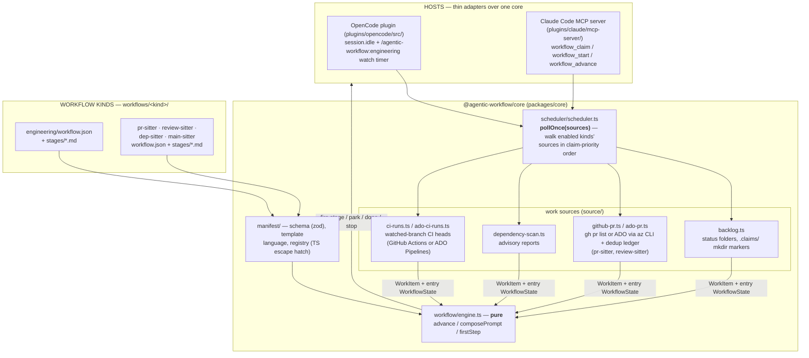

[English](architecture.md) | 繁體中文

# 架構

分為兩層。**框架**——一個共用的核心套件、一個由清單解讀的工作流程引擎，
以及一個工作來源排程器——對工程任務或 pull request 一無所知。**工作流程類型**（`packages/core/workflows/<kind>/`）是宣告式的清單加上階段提示詞，
由框架解讀執行。目前已發布五種：`engineering` 是參考類型（原本的
PLAN / BUILD → VERIFY → REVIEW 工作流程，行為和它還是寫死的程式碼時
完全一致），以及四個可選啟用的**sitter**，監看一個代管的目標面並驅動
修復——`pr-sitter`（你開啟中的 PR）、`review-sitter`（等待你審查的
PR）、`dep-sitter`（有漏洞或已過期的相依套件），以及 `main-sitter`
（預設分支的 CI）。每個 sitter 都把終端呼叫——合併、核准、關閉——留給
人類。**四個 sitter 都是實驗性的**——它們的清單、設定項和預設值都可能
還會變動；`engineering` 才是穩定的、預設開啟的類型。

## 框架——一個引擎，多種類型

- **核心套件**——`@agentic-workflow/core`（npm workspace）承載兩個外掛共用
  的一切：純粹的引擎與狀態、清單層、工作來源 + 排程器、任務儲存、git
  輔助工具 + worktree 隔離、快照、裁定處理、指標，以及設定（透過把可選
  的使用者層級 `~/.config/agentic-workflow/agentic-workflow.json`（遵循
  `$XDG_CONFIG_HOME`，且當此檔案不存在時仍會讀取舊有的
  `~/.agentic-workflow.json` 作為後備）疊放在儲存庫的
  `.agentic-workflow.json` 之下解析出來——見
  [configuration.md](configuration.md#layers--precedence)）。核心套件
  從不匯入 host 的 SDK；整個 host 介面就是 `packages/core/src/host.ts`
  裡的那些介面（Shell、Client、Log……）。OpenCode 外掛用 Bun 的 `$`
  和 opencode SDK client 來滿足這些介面；Claude Code MCP 伺服器則用
  Node 墊片（`plugins/claude/mcp-server/src/shim.ts`）——它先前那份
  `src/lib/` 迴圈邏輯分支已經不存在了。
- **清單引擎**——一種工作流程類型就是
  `packages/core/workflows/<kind>/workflow.json`（經 zod 驗證：帶有
  `work|check` 種類的階段、agent、提示詞路徑、隔離方式、bash 白名單；
  一張把 onDone/onPass/onFail/onError 對應到 fire/park/done/stop 效果
  並附帶疊代計數的狀態轉換表；一個工作來源綁定）加上 `stages/*.md`
  提示詞範本（以 `---` 分隔的區段、`{{var}}` 插值、
  `{{#path}}…{{/path}}` 條件區塊）。`workflow/engine.ts` 把它解讀成一個
  純粹的狀態機：`advance(manifest, state, output, verdict)` 回傳下一個
  狀態和動作。清單無法表達的邏輯，則掛在透過 `manifest/registry.ts`
  解析的具名 hook 上——組合 hook（提示詞上下文擴增器）、狀態轉換前的
  驗證器、認領判斷式。
- **工作來源 + 排程器**——一個 `WorkSource`
  （`packages/core/src/source/types.ts`）知道如何為某一種類型尋找、
  原子性地認領，以及釋放工作單元；一個已認領的 `WorkItem` 帶著一份
  完整建構好的入口 `WorkflowState`，因此驅動程式不需要知道工作來源的細節。
  PR 與 CI 工作來源各有 Azure DevOps 對應版本（`ado-pr.ts`、
  `ado-ci-runs.ts`），當 `codePlatform` 為 `"ado"` 時在接線階段換入；
  它們透過 `az` CLI 與 ADO 溝通（`az devops invoke` 是 REST 直通，
  所以回應解析與原生呼叫共用）。
  `pollOnce(sources)` 依認領優先順序走訪指定的工作來源（除非停用，
  否則 engineering 優先，接著是設定中依序排列的已啟用類型——核心設定
  中的 `enabledWorkflowKinds`）；第一次成功的認領勝出，且每種類型的指令
  都把輪詢範圍限定在自己的工作來源上。兩個 host 的觸發器都委派給它：
  OpenCode 的 `session.idle` + 各類型的 `watch` 計時器，以及 Claude
  Code MCP 伺服器的 `workflow_claim`。一個工作來源可以實作 `onTerminal`
  來做驅動結束時的收尾記帳（PR sitter 的去重帳本）；backlog 工作來源
  不需要它。
- **各類型的狀態語意**——`docs/tasks/` 的狀態資料夾是*engineering*
  這個類型的狀態模型，不是框架本身的：它的清單綁定了一個帶有具名狀態
  和認領池的 `backlog` 工作來源。PR sitter 完全沒有資料夾——平台
  （GitHub 或 ADO）本身就是狀態（檢查、審查裁定、留言、可合併性），外加一份本機的
  逐 PR 帳本（`<tasksDir>/runs/pr-sitter/pr-<n>.json`）記錄已經處理
  過什麼。其他類型則挑選最適合的來源。

## engineering 類型（`packages/core/workflows/engineering/`）

參考類型——原本的 PLAN / BUILD → VERIFY → REVIEW 工作流程，行為和它
還是寫死的程式碼時完全一致。它完整的流水線圖、誰做什麼的拆解，以及
保護 `docs/tasks/` 的待辦完整性防護欄，現在都收在自己的檔案裡：
**[`docs/workflows/engineering.md`](workflows/engineering.md)**。

跨所有類型的裁定，只透過 `workflow_verdict` 這個外掛工具取信——一個階段
agent 在文字裡宣稱「PASS」會被忽略。`workflow_verdict` 接受目前作用中
迴圈的清單所宣告的任何 check 階段（engineering：`verify`/`review`；
pr-sitter：`triage`/`verify`；review-sitter：`fetch`；dep-sitter：
`scan`/`verify`；main-sitter：`diagnose`/`verify`），並依此驗證所
記錄的內容。階段 agent 無法核准任務、移動待辦資料夾或發布；每一次
狀態轉換的所有權都屬於外掛和人類。

## watch 租約

每個複本（clone）、跨所有類型，同時最多只能有一個 watch 模式的行程
（`scheduler/lease.ts`）：`/agentic-workflow:<kind> watch` 會原子性地建立
`<tasksDir>/runs/.watch-lease/`（已加入 gitignore），內含一份每個
tick 都會刷新的心跳 JSON；第二個 watch 模式行程——不論哪種類型——都
會被拒絕，並附上目前存活擁有者的身分；一旦心跳超過
`max(3×interval, 2min)`，一個已死亡 watcher 的租約就會被接管。一次性
的認領（`workflow_claim`/`workflow_start`）在有外部存活租約時只會警告——而
不會阻擋。

## sitter 類型——實驗性

四個可選啟用的 sitter（`pr-sitter`、`review-sitter`、`dep-sitter`、
`main-sitter`）監看一個代管的目標面（開啟中的 PR、審查請求、相依套件
的安全公告、CI），並在 git worktree 隔離之下驅動修復，永遠把終端
呼叫——合併、核准、關閉——留給人類。每一個都綁定自己的工作來源，並
遵循相同的 check → work → publish 形狀。**[`docs/sitters.md`](sitters.md)
是權威參考**，說明每一個各自做什麼、它的階段流水線、它的授權界線，
以及它的 `workflows.<kind>` 設定項；四者的安全態勢都在
[威脅模型](design/threat-model.md)中。

## Claude Code 版本（`plugins/claude/`）

相同的工作流程類型和生命週期，不同的驅動方式：Claude Code 沒有背景的
`session.idle` 驅動程式，所以主 agent 是透過一個內建的 MCP 伺服器
（`mcp__agentic-workflow__workflow_*` 工具）而不是 agent frontmatter 權限來
驅動迴圈，而且人工把關點是**互動式**的——一次 park 或 done 會回傳
一個 `gate` 欄位，驅動中的 agent 會透過 AskUserQuestion 就地詢問，
而不是只等待一個指令。完整的安裝和指令細節見
[`plugins/claude/README.md`](../plugins/claude/README.md)。

## 管理面板——測試版（`packages/hub/`）

第三個、與 host 無關的介面：一個本機 web 應用程式（`npm run hub`），
它**觀察**兩個 host 都會寫入的同一份檔案系統底層——狀態資料夾、
執行紀錄、快照、階段標記、watch 租約——並**在其上執行人工把關動作**：
approve、replan、ship。

它是透過呼叫兩個 host 呼叫的*同一組*共用進入點（`workflow/gate.ts`）來
做到這件事的，從不使用自己的一份動作複本——因此瀏覽器發出的一次核准
和斜線指令發出的一次核准，是同一個經過稽核、已提交的狀態轉換。它不
會跨越的那條線是**驅動**：管理面板從不認領工作，也從不執行任何階段。
它是把關點的第四個呼叫者，而不是第四個驅動者。

有兩個值得說明的後果，因為它們正是讓這條界線站得住腳的原因：

- 對一個**已經有某個迴圈在驅動**的任務執行把關動作會被拒絕。管理
  面板從檔案系統回答 `GateCtx.isDriving`——一個認領標記（迴圈會先
  認領才驅動，所以「正在驅動」就意味著「已認領」）或階段標記——而
  不是從一個它並不擁有的記憶體內 session map 去回答。
- **ship 會開啟一個 pull request**，這在機器之外是可見的。每一次
  管理面板的寫入操作背後都有一個會指名其真實效果的確認步驟。

它也會**編輯 `.agentic-workflow.json`**，一次只編輯一個具名層——絕不
編輯合併後的視圖，那樣會把使用者層級（以及其中的 `ado.pat`）扁平化
進儲存庫的檔案裡。它寫入的是原始 JSON，因此核心套件的結構描述不
認識的鍵在儲存後仍會存活，而不會被剝除。它也提供**待辦 doctor**
（`workflow_doctor`）——搶救流離的任務、移除憑空出現的資料夾，以及釋放
那些原本會不斷拒絕把關動作的、陳舊而無迴圈驅動的認領標記。

它的寫入介面受限於 localhost 綁定、一個 Host 標頭檢查，以及每一個
變更型路由上的 `X-Hub-Client` 標頭——見
[`design/threat-model.md`](./design/threat-model.md)（T14–T16）。
測試版：API 形狀可能還會變動。見
[`packages/hub/README.md`](../packages/hub/README.md)。
