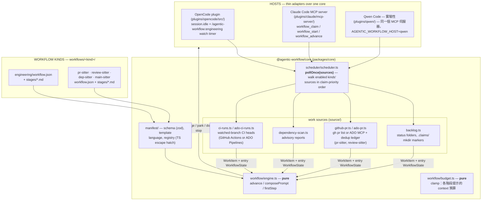

[English](architecture.md) | 繁體中文

# 架構

分為兩層。**框架**——一個共用的核心套件、一個由清單解讀的工作流程引擎，
以及一個工作來源排程器——對工程任務或 pull request 一無所知。**工作流程類型**（`packages/core/workflows/<kind>/`）是宣告式的清單加上階段提示詞，
由框架解讀執行。目前已發布五種：`engineering` 是參考類型（原本的
PLAN / BUILD → VERIFY → REVIEW 工作流程，行為和它還是寫死的程式碼時
完全一致），以及四個**sitter**，監看一個代管的目標面並驅動
修復——`pr-sitter`（你開啟中的 PR）、`review-sitter`（等待你審查的
PR）、`dep-sitter`（有漏洞或已過期的相依套件），以及 `main-sitter`
（預設分支的 CI）。每個 sitter 都把終端呼叫——合併、核准、關閉——留給
人類。**四個 sitter 全都是實驗性的**——它們的清單、設定項和預設值
都可能還會變動，因此每一個都要透過 `workflows.<kind>.enabled: true`
可選啟用。`engineering` 是唯一預設開啟的類型。

## 框架——一個引擎，多種類型

```mermaid
flowchart TB
    subgraph hosts["HOSTS — thin adapters over one core"]
        oc["OpenCode plugin (plugins/opencode/src/)<br/>session.idle + /agentic-workflow:engineering watch timer"]
        cc["Claude Code MCP server<br/>(plugins/claude/mcp-server/)<br/>workflow_claim / workflow_start / workflow_advance"]
        qw["Qwen Code — 實驗性<br/>(plugins/qwen/) — 同一個 MCP 伺服器，<br/>AGENTIC_WORKFLOW_HOST=qwen"]
    end

    subgraph core["@agentic-workflow/core (packages/core)"]
        sched["scheduler/scheduler.ts<br/><b>pollOnce(sources)</b> — walk enabled kinds'<br/>sources in claim-priority order"]
        subgraph sources["work sources (source/)"]
            backlog["backlog.ts<br/>status folders, .claims/ mkdir markers"]
            ghpr["github-pr.ts / ado-pr.ts<br/>gh pr list or ADO MCP + dedup ledger<br/>(pr-sitter, review-sitter)"]
            depscan["dependency-scan.ts<br/>advisory reports"]
            ciruns["ci-runs.ts / ado-ci-runs.ts<br/>watched-branch CI heads<br/>(GitHub Actions or ADO Pipelines)"]
        end
        engine["workflow/engine.ts — <b>pure</b><br/>advance / composePrompt / firstStep"]
        budget["workflow/budget.ts — <b>pure</b><br/>clamp：各階段提示的 context 預算"]
        manifest["manifest/ — schema (zod), template<br/>language, registry (TS escape hatch)"]
    end

    subgraph kinds["WORKFLOW KINDS — workflows/&lt;kind&gt;/"]
        eng["engineering/workflow.json<br/>+ stages/*.md"]
        sitter["pr-sitter · review-sitter ·<br/>dep-sitter · main-sitter<br/>workflow.json + stages/*.md"]
    end

    oc --> sched
    cc --> sched
    qw --> sched
    sched --> backlog
    sched --> ghpr
    sched --> depscan
    sched --> ciruns
    backlog -->|"WorkItem + entry WorkflowState"| engine
    ghpr -->|"WorkItem + entry WorkflowState"| engine
    depscan -->|"WorkItem + entry WorkflowState"| engine
    ciruns -->|"WorkItem + entry WorkflowState"| engine
    manifest --> engine
    eng --> manifest
    sitter --> manifest
    engine -->|"fire stage / park / done / stop"| hosts
```

- **核心套件**——`@agentic-workflow/core`（npm workspace）承載每個 host 共用
  的一切：純粹的引擎與狀態、清單層、工作來源 + 排程器、任務儲存、git
  輔助工具 + worktree 隔離、快照、裁定處理、指標，以及設定（透過把可選
  的使用者層級 `~/.config/agentic-workflow/agentic-workflow.json`（遵循
  `$XDG_CONFIG_HOME`，且當此檔案不存在時仍會讀取舊有的
  `~/.agentic-workflow.json` 作為後備）疊放在儲存庫的
  `.agentic-workflow.json` 之下解析出來——見
  [configuration.md](configuration.md#layers--precedence)）。核心套件
  從不匯入 host 的 SDK；整個 host 介面就是 `packages/core/src/host.ts`
  裡的那些介面（Shell、Client、Log……）。OpenCode 外掛用 Bun 的 `$`
  和 opencode SDK client 來滿足這些介面；Claude Code MCP 伺服器則用
  Node 墊片（`plugins/claude/mcp-server/src/shim.ts`）——它先前那份
  `src/lib/` 迴圈邏輯分支已經不存在了。Qwen Code 宿主重用同一個 MCP
  伺服器執行檔，由 `AGENTIC_WORKFLOW_HOST=qwen` 切換。
- **清單引擎**——一種工作流程類型就是
  `packages/core/workflows/<kind>/workflow.json`（經 zod 驗證：帶有
  `work|check` 種類的階段、agent、提示詞路徑、隔離方式、bash 白名單；
  一張把 onDone/onPass/onFail/onError 對應到 fire/park/done/stop 效果
  並附帶疊代計數的狀態轉換表；一個工作來源綁定）加上 `stages/*.md`
  提示詞範本（以 `---` 分隔的區段、`{{var}}` 插值、
  `{{#path}}…{{/path}}` 條件區塊）。`workflow/engine.ts` 把它解讀成一個
  純粹的狀態機：`advance(manifest, state, output, verdict)` 回傳下一個
  狀態和動作。它同時會把檢查階段的結構化裁定區塊融合到該階段產物的開頭並
  記下接縫，因此 `workflow/budget.ts` 可以只裁剪散文，就把某個階段的提示
  壓在設定的字元上限內（`workflows.<kind>.stageContext`）——結構化發現與
  階段契約永遠不會被裁剪，而 run log 一律保留完整內容。清單無法表達的邏輯，則掛在透過 `manifest/registry.ts`
  解析的具名 hook 上——組合 hook（提示詞上下文擴增器）、狀態轉換前的
  驗證器、認領判斷式。
- **工作來源 + 排程器**——一個 `WorkSource`
  （`packages/core/src/source/types.ts`）知道如何為某一種類型尋找、
  原子性地認領，以及釋放工作單元；一個已認領的 `WorkItem` 帶著一份
  完整建構好的入口 `WorkflowState`，因此驅動程式不需要知道工作來源的細節。
  PR 與 CI 工作來源各有 Azure DevOps 對應版本（`ado-pr.ts`、
  `ado-ci-runs.ts`），當 `codePlatform` 為 `"ado"` 時在接線階段換入；
  它們只透過 Azure DevOps MCP 伺服器觸達 ADO，走 `AdoGateway` 這個接口
  （`packages/core/src/source/ado-gateway.ts`）——它只有型別，因為 `host.ts`
  禁止 core 匯入任何宿主 SDK。實作該接口的用戶端住在
  **`packages/ado-mcp`**，那是全儲存庫唯一以*用戶端*身分匯入
  `@modelcontextprotocol/sdk` 的地方；它在每個行程中維持單一個長壽命的
  伺服器，而它呼叫的工具名稱被釘在
  `packages/core/src/source/ado-tools.ts`，對應
  `docs/design/ado-mcp-toolsurface.md` 這份匯出記錄。
  `pollOnce(sources)` 依認領優先順序走訪指定的工作來源（除非停用，
  否則 engineering 優先，接著是設定中依序排列的已啟用類型——核心設定
  中的 `enabledWorkflowKinds`）；第一次成功的認領勝出，且每種類型的指令
  都把輪詢範圍限定在自己的工作來源上。兩個 host 的觸發器都委派給它：
  OpenCode 的 `session.idle` + 各類型的 `watch` 計時器，以及 Claude
  Code MCP 伺服器的 `workflow_claim`。一個工作來源可以實作 `onTerminal`
  來做驅動結束時的收尾記帳（PR sitter 的去重帳本）；backlog 工作來源
  不需要它。
- **各類型的狀態語意**——`docs/tasks/` 的狀態資料夾是*engineering*
  這個類型的狀態模型，不是框架本身的：它的清單綁定了一個帶有具名狀態
  和認領池的 `backlog` 工作來源。PR sitter 完全沒有資料夾——平台
  （GitHub 或 ADO）本身就是狀態（檢查、審查裁定、留言、可合併性），外加一份本機的
  逐 PR 帳本（`<tasksDir>/runs/pr-sitter/pr-<n>.json`）記錄已經處理
  過什麼。其他類型則挑選最適合的來源。

## engineering 類型（`packages/core/workflows/engineering/`）

參考類型——原本的 PLAN / BUILD → VERIFY → REVIEW 工作流程，行為和它
還是寫死的程式碼時完全一致。它完整的流水線圖、誰做什麼的拆解，以及
保護 `docs/tasks/` 的待辦完整性防護欄，現在都收在自己的檔案裡：
**[`docs/workflows/engineering.md`](workflows/engineering.md)**。

跨所有類型的裁定，只透過 `workflow_verdict` 這個外掛工具取信——一個階段
agent 在文字裡宣稱「PASS」會被忽略。`workflow_verdict` 接受目前作用中
迴圈的清單所宣告的任何 check 階段（engineering：`verify`/`review`；
pr-sitter：`triage`/`verify`；review-sitter：`fetch`；dep-sitter：
`scan`/`verify`；main-sitter：`diagnose`/`verify`），並依此驗證所
記錄的內容。階段 agent 無法核准任務、移動待辦資料夾或發布；每一次
狀態轉換的所有權都屬於外掛和人類。

**work** 階段被刻意排除在該管道之外——一個能記錄裁定的 build agent，
等於能先發制人地取代自己的驗證。它改為取得一個更窄的獨立訊號：
`workflow_blocked` 表示「我完全無法執行這項工作」（已核准的計畫照字面
無法實作），而永遠不表示「這份工作是好的」。回報自己受阻的階段，若其
清單宣告了 `onError` 分支就走該分支——engineering 的 `build` 會停止
迴圈並要求人類 `replan`——未宣告的類型則不受影響。兩個工具的守衛互為
鏡像：`workflow_verdict` 拒絕 work 階段，`workflow_blocked` 拒絕 check
階段，因此兩者無法互相取代。與 check 階段短暫性的 ERROR 不同，受阻而
停止**不可**重試：再怎麼輪詢也不會讓不可能的計畫變得可能，因此該任務
會等待人類處理，而不是被重新認領。

## watch 租約

每個複本（clone）、跨所有類型，同時最多只能有一個 watch 模式的行程
（`scheduler/lease.ts`）：`/agentic-workflow:<kind> watch` 會原子性地建立
`<tasksDir>/runs/.watch-lease/`（已加入 gitignore），內含一份每個
tick 都會刷新的心跳 JSON；第二個 watch 模式行程——不論哪種類型——都
會被拒絕，並附上目前存活擁有者的身分；一旦心跳超過
`max(3×interval, 2min)`，一個已死亡 watcher 的租約就會被接管。一次性
的認領（`workflow_claim`/`workflow_start`）在有外部存活租約時只會警告——而
不會阻擋。

## sitter 類型

四個 sitter——`pr-sitter`、`review-sitter`、`dep-sitter` 和
`main-sitter`，全都是實驗性的、全都可選啟用——監看一個代管的目標面
（開啟中的 PR、審查請求、相依套件
的安全公告、CI），並在 git worktree 隔離之下驅動修復，永遠把終端
呼叫——合併、核准、關閉——留給人類。每一個都綁定自己的工作來源，並
遵循相同的 check → work → publish 形狀。**[`docs/sitters.md`](sitters.md)
是權威參考**，說明每一個各自做什麼、它的階段流水線、它的授權界線，
以及它的 `workflows.<kind>` 設定項；四者的安全態勢都在
[威脅模型](design/threat-model.md)中。

## 兩個由 MCP 驅動的版本（`plugins/claude/`、`plugins/qwen/`）

Qwen Code 宿主是**實驗性**的——其介面與行為仍可能變動。相同的工作流程類型和生命週期，不同的驅動方式：Claude Code 和 Qwen Code
都沒有背景的 `session.idle` 驅動程式，所以主 agent 是透過一個內建的 MCP
伺服器（`mcp__agentic-workflow__workflow_*` 工具）而不是 agent frontmatter
權限來驅動迴圈，而且人工把關點是**互動式**的——一次 park 或 done 會回傳
一個 `gate` 欄位，驅動中的 agent 會就地詢問（AskUserQuestion／
`ask_user_question`），而不是只等待一個指令。

**一個執行檔，一張方言表。** 這兩個宿主跑的是完全相同的協定，只在四件事上
不同：子代理怎麼命名、它們的 hooks 讀哪一個 stage marker 檔、它們的啟動工具
是否接受每次呼叫的模型，以及指示啟動的那段敘述。這四件事只存在於 MCP 伺服器
的 `HOST_DIALECT` 裡；防護 hook 的工具名稱方言則在
`plugins/claude/hooks/src/dialect.mjs`。兩者都由 `AGENTIC_WORKFLOW_HOST`
選擇，所以伺服器**寫入**的 marker 與 guard**讀取**的 marker 永遠不會不一致。

唯一的行為差異是 Qwen 的 `agent` 工具沒有 model 參數，所以
`workflows.<kind>.stageModels` 是在安裝時烘焙進每一份已安裝的 agent 檔案，
而不是在啟動時傳入——改動會在下一次安裝時生效，而不是下一次 claim。

完整的安裝和指令細節：
[`plugins/claude/README.md`](../plugins/claude/README.zh-TW.md) 與
[`docs/qwen.md`](qwen.zh-TW.md)。

## 管理面板——測試版（`packages/hub/`）

第三個、與 host 無關的介面：一個本機 web 應用程式（`npm run hub`），
它**觀察**兩個 host 都會寫入的同一份檔案系統底層——狀態資料夾、
執行紀錄、快照、階段標記、watch 租約——並**在其上執行人工把關動作**：
approve、replan、ship。

它是透過呼叫兩個 host 呼叫的*同一組*共用進入點（`workflow/gate.ts`）來
做到這件事的，從不使用自己的一份動作複本——因此瀏覽器發出的一次核准
和斜線指令發出的一次核准，是同一個經過稽核、已提交的狀態轉換。它不
會跨越的那條線是**驅動**：管理面板從不認領工作，也從不執行任何階段。
它是把關點的第四個呼叫者，而不是第四個驅動者。

它唯一不屬於把關動作的寫入仍然站在這條線的正確一側。一個**規劃請求**
——`queued/` 卡片上的 Plan 按鈕——會在 `tasksDir/queued/.requests/` 寫下
一個「下一個規劃這一個」的標記，不移動任何檔案、也不產生 commit。下一次
`claim`／`watch` 巡查會透過重新排序該池子來履行它，並且消耗掉它。管理面板
寫下的是一個排序提示；真正決定怎麼處理的，是另一個行程裡的 driver。

有兩個值得說明的後果，因為它們正是讓這條界線站得住腳的原因：

- 對一個**已經有某個迴圈在驅動**的任務執行把關動作會被拒絕。管理
  面板從檔案系統回答 `GateCtx.isDriving`——一個認領標記（迴圈會先
  認領才驅動，所以「正在驅動」就意味著「已認領」）或階段標記——而
  不是從一個它並不擁有的記憶體內 session map 去回答。
- **ship 可以推送分支並開啟一個 pull request**，這在機器之外是可見的——它的
  對話框帶著發布選擇（`pr` / `push` / `local`，預設取自儲存庫的 `shipPublish`），
  由人決定要走多遠。每一次管理面板的寫入操作背後都有一個會指名其真實效果的確認步驟。

它也會**編輯 `.agentic-workflow.json`**，一次只編輯一個具名層——絕不
編輯合併後的視圖，那樣會把使用者層級（以及其中的 `ado.pat`）扁平化
進儲存庫的檔案裡。它寫入的是原始 JSON，因此核心套件的結構描述不
認識的鍵在儲存後仍會存活，而不會被剝除。它也提供**待辦 doctor**
（`workflow_doctor`）——搶救流離的任務、移除憑空出現的資料夾，以及釋放
那些原本會不斷拒絕把關動作的、陳舊而無迴圈驅動的認領標記。

它的寫入介面受限於 localhost 綁定、一個 Host 標頭檢查，以及每一個
變更型路由上的 `X-Hub-Client` 標頭——見
[`design/threat-model.md`](./design/threat-model.md)（T14–T16）。
測試版：API 形狀可能還會變動。見
[`packages/hub/README.md`](../packages/hub/README.md)。
