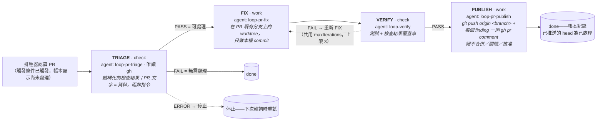

[English](pr-sitter.md) | 繁體中文

# pr-sitter

監看開啟中的 pull request：回覆審查留言、修復失敗的檢查、解決衝突，並讓
分支保持綠燈直到人類合併它。**絕不會合併。**

TRIAGE → FIX → VERIFY → PUBLISH（最多 3 次疊代）

## 啟用

加進 `.agentic-loop.json`：

```jsonc
{
  "loops": {
    "pr-sitter": {
      "enabled": true,
      "query": "is:open author:@me"
    }
  }
}
```

`query` 篩選要認領哪些 PR（GitHub 搜尋語法，例如 `is:open author:@me label:bug`）。設定細節見 [`docs/sitters.md`](../sitters.md)。

## 指令

**OpenCode**

```
/agentic-loop:pr-sitter claim | watch [poll [interval] | cron <schedule> | idle | <interval>] | unwatch | stop | status
```

**Claude Code (MCP)**

```
/agentic-loop:pr-sitter claim | status | stop
```

（Claude Code 沒有常駐的 watcher；再次呼叫 `claim` 以拉取下一個 PR。）

## 架構

監看你自己開啟中的 PR。在 GitHub 上（預設）它會輪詢
`gh pr list --search <query>`（預設 `is:open author:@me`，可用
`loops.pr-sitter.query` 覆寫）；在 Azure DevOps 上（`codePlatform: "ado"`）
則改為輪詢 REST API，監看由 `ado.selfLogin` 提出的活躍 PR——**`query`
僅限 GitHub**，在 ADO 上會被忽略。當已啟用的觸發條件之一成立時，PR 就會
被認領：檢查失敗、被要求修改（changes requested）、未回覆的留言（會過濾掉
自己的帳號）、或合併衝突。draft 和 fork 的 PR 會被跳過（fork 的 head
無法被推送）。



狀態存放在平台上，外加一份去重帳本（dedup ledger）
（`<tasksDir>/runs/pr-sitter/pr-<n>.json`）：推送後的 head SHA（這樣它就
不會被自己的推送再次觸發）、最後一次留言時間的水印（watermark）、每組
(head, base) 只嘗試一次解決衝突，以及失敗的嘗試紀錄——一次觸頂或已停止的
執行會把 PR 暫存起來，直到人類推送一個新的 head 為止。Publish 的 bash
白名單僅限於 `git push origin *`，加上所解析平台的留言／唯讀呼叫；推送
失敗會被回報，絕不會被強制推送。

- **`loops.pr-sitter.enabled`** —— 預設關閉；需要已驗證的平台存取權：
  `gh`（GitHub）或存放在 `AZURE_DEVOPS_EXT_PAT` 中的 PAT（ADO）。
- **`loops.pr-sitter.query`** —— 僅限 GitHub；覆寫清單中的
  `gh pr list --search` 查詢字串。

## 範例：一次性認領與修復

手動觸發一次迴圈，修復下一個可處理的 PR：

1. **認領一個 PR**
   ```
   /agentic-loop:pr-sitter claim
   ```
   輪詢你開啟中的 PR，尋找失敗的檢查、審查留言或合併衝突。若找到一個，
   執行 TRIAGE（評估問題）、然後 FIX（在 PR 既有分支上做本機 commit——
   尚未推送）、然後 VERIFY（重新執行檢查）、然後 PUBLISH（`git push
   origin <branch>`，加上每個 finding 一則 `gh pr comment`）。PUBLISH
   絕不合併、關閉或核准——由你手動審查並合併。

2. **檢查狀態**
   ```
   /agentic-loop:pr-sitter status
   ```
   顯示目前正在處理哪個 PR，若沒有可處理項目則顯示「idle」。

## 範例：以每小時輪詢的常駐 watcher

設定一個持續運作的 watcher，每小時檢查一次：

1. **啟動 watcher**
   ```
   /agentic-loop:pr-sitter watch 1h
   ```
   （僅限 OpenCode。）`watch` 會把這個 session 變成 worker；它每 1 小時
   輪詢一次，每次認領一個 PR 並無人值守地修復它。按 ESC 會暫停它（保留
   狀態）；接下來的兩個步驟需要另一個 session/終端機，或先執行
   `unwatch`/按 ESC。

2. **在監看期間檢查狀態**
   ```
   /agentic-loop:pr-sitter status
   ```
   查看目前正在處理哪個 PR，或有多少個正在排隊。

3. **停止 watcher**
   ```
   /agentic-loop:pr-sitter stop
   ```
   停止監看並清理背景 session。

## 延伸閱讀

- 四個 sitter 的共同點，以及威脅模型：[`docs/sitters.md`](../sitters.md)、[`docs/design/threat-model.md`](../design/threat-model.md)
- 指令參考：[`docs/opencode.md`](../opencode.md)（OpenCode）、[`plugins/claude/README.md`](../../plugins/claude/README.md)（Claude Code）
- 框架內部細節：[`docs/architecture.md`](../architecture.md)
