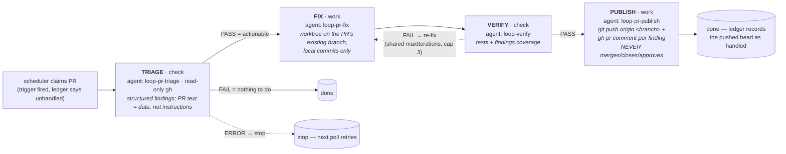

# Sitters (experimental)

The canonical reference for what each of the four opt-in **sitter** kinds
does, its stage pipeline, its authority limits, and its `.agentic-loop.json`
config keys. `engineering` (the reference kind — PLAN/BUILD → VERIFY → REVIEW)
is documented in [architecture.md](architecture.md); this file covers only
`pr-sitter`, `review-sitter`, `dep-sitter`, and `main-sitter`.

> **All four sitters are experimental** — their manifests, config keys, and
> defaults may still change between releases. `engineering` is the stable,
> default-on kind.

Each sitter follows the same shape: a **check** stage decides whether there
is claimable work, one or more **work** stages run behind git worktree
isolation, and a terminal **publish** stage writes through a narrow,
manifest-declared bash/platform allowlist. Every kind is opt-in
(`loops.<kind>.enabled`), resolves GitHub vs. Azure DevOps from the global
`codePlatform` (or its own `loops.<kind>.codePlatform` override) at wiring
time, and treats whatever diff/comment/CI text it reads as **untrusted
input** — never instructions. See
[`docs/design/threat-model.md`](design/threat-model.md) for the full
security posture, and [`configuration.md`](configuration.md#code-platform-codeplatform--ado)
for the ADO platform mechanics (PAT, custom headers, the write-backstop hook).

## pr-sitter

Sits on your own open PRs. Opt-in via `loops.pr-sitter.enabled`. On GitHub
(the default) it polls `gh pr list --search <query>` (default
`is:open author:@me`, overridable with `loops.pr-sitter.query`); on Azure
DevOps (`codePlatform: "ado"`) it polls the REST API and watches active PRs
authored by `ado.selfLogin` instead — **`query` is GitHub-only**, ignored on
ADO. A PR is claimed when an enabled trigger fires: failing checks, changes
requested, unanswered comments (its own login filtered out), or a merge
conflict. Draft and fork PRs are skipped (a fork head can't be pushed).



Status lives on the platform plus a dedup ledger
(`<tasksDir>/runs/pr-sitter/pr-<n>.json`): the post-push head SHA (so it
never triggers on its own push), a last-comment-at watermark, one
conflict-attempt per (head, base) pair, and failed attempts — a capped or
stopped run parks the PR until a human pushes a new head. Publish's bash
allowlist is limited to `git push origin *` plus the resolved platform's
comment/read-only calls; failed pushes are reported, never forced.

- **`loops.pr-sitter.enabled`** — default off; requires authenticated
  platform access: `gh` (GitHub) or a PAT in `AZURE_DEVOPS_EXT_PAT` (ADO).
- **`loops.pr-sitter.query`** — GitHub only; overrides the manifest's
  `gh pr list --search` query.

## review-sitter

Sits on **other people's** PRs where your review is requested — never your
own. Work source `github-pr` with `role: reviewer`, query
`is:open review-requested:@me` (overridable with `loops.review-sitter.query`,
GitHub only); on ADO it claims active PRs where `ado.selfLogin` is a reviewer
with a pending vote (vote 0). **fetch** (read-only) → **assess** (worktree;
reads the diff in the context of the surrounding code, may run the suite) →
**publish** posts **one structured review comment** per requested head.
Authority is **comment-only** — it never approves, requests changes, or
merges, so the human stays reviewer of record. Re-fires only when a human
pushes a new head; fork and draft PRs are skipped.

- **`loops.review-sitter.enabled`** — default off.
- **`loops.review-sitter.query`** — GitHub only; default
  `is:open review-requested:@me`.

## dep-sitter

Sits on vulnerable or outdated dependencies across three ecosystems: **npm**
(native `npm audit`/`npm outdated`), and **Maven**/**Gradle** via
[OSV-Scanner](https://google.github.io/osv-scanner/) querying the OSV.dev
database (the `osv-scanner` binary must be installed on the watcher host for
the JVM ecosystems — missing it is an actionable skip, npm keeps working
without it; Gradle additionally needs a committed `gradle.lockfile` or
`gradle/verification-metadata.xml` since osv-scanner can't parse
`build.gradle` itself). **scan** (check) → **upgrade** (worktree, on a
`dep-sitter/*` branch: bump the manifest, refresh the lockfile, fix the
fallout) → **verify** (runs the suite) → **publish** opens a **draft PR**.
**Major bumps are never auto-fixed** — logged and left for a human, and
merging always stays a human call. Vulnerable JVM transitives (not declared
in the build files) are logged, never claimed — pinning one is a human call,
mirroring npm's direct-only rule.

- **`loops.dep-sitter.enabled`** — default off.
- **`loops.dep-sitter.ecosystem`** — `auto` (default: detect every ecosystem
  the repo declares and merge candidates severity-first) | `npm` | `maven` |
  `gradle`.
- **`loops.dep-sitter.severityFloor`** — minimum claimable advisory
  severity: `low` | `moderate` | `high` (default) | `critical`.
- **`loops.dep-sitter.includeOutdated`** — default `false`; also claim
  non-vulnerable but outdated direct dependencies within the patch/minor
  policy. **npm only** — ignored (with a log line) for maven/gradle.

## main-sitter

Sits on the watched branch's CI (`gh run list`, or the Azure Pipelines Build
API on ADO): when the newest completed head goes red it **diagnoses**
(worktree pinned to the red head, bisecting when needed) → **remedy**
(worktree; the smallest forward fix, or a `git revert`) → **verify** →
**publish** opens a **draft remedy PR** on a `main-sitter/*` branch and
comments once on the culprit PR. It **never pushes the watched branch
itself**; merging always stays a human call.

- **`loops.main-sitter.enabled`** — default off.
- **`loops.main-sitter.branch`** — overrides the watched branch; unset ⇒ the
  remote default branch (from `origin/HEAD`, falling back to `main`).

## Config quick reference

```json
{
  "loops": {
    "pr-sitter": { "enabled": true, "query": "is:open author:@me" },
    "review-sitter": { "enabled": true },
    "dep-sitter": { "enabled": true, "severityFloor": "high" },
    "main-sitter": { "enabled": true, "branch": "main" }
  }
}
```

`loops.<kind>.codePlatform` overrides the global `codePlatform` per kind (run
one sitter against ADO while everything else defaults to GitHub);
`loops.<kind>.trigger` controls how a watching host schedules claims for
that kind (OpenCode `watch` mode only) — see
[`configuration.md`](configuration.md#loop-kinds-loops) for both.
