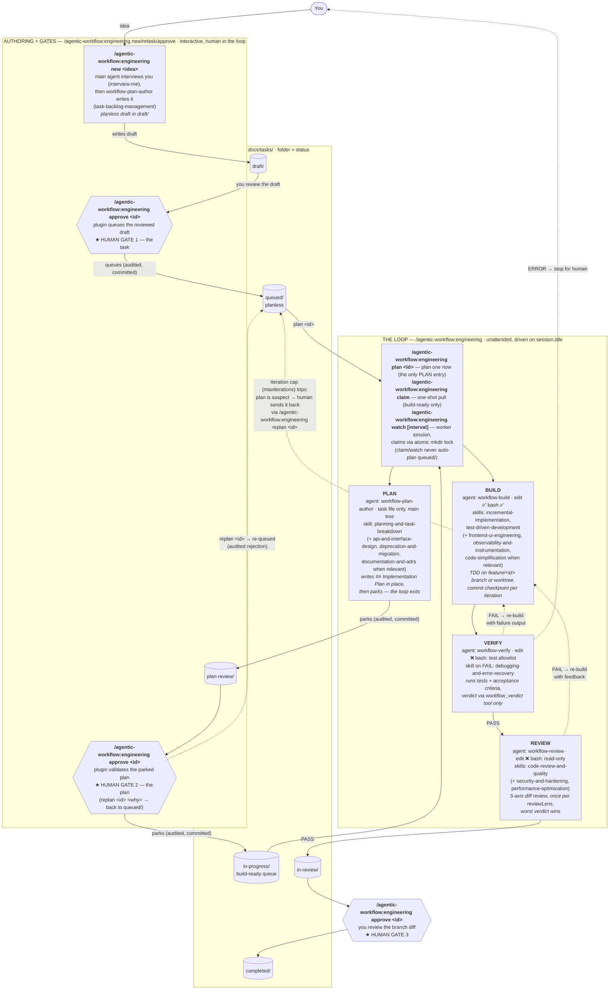

English | [繁體中文](engineering.zh-TW.md)

# engineering

The engineering workflow: PLAN (park at the human plan gate) then BUILD → VERIFY → REVIEW over the docs/tasks backlog.

## Enable

No configuration needed — the engineering loop runs by default. To disable it:

```jsonc
{
  "workflows": {
    "engineering": { "enabled": false }
  }
}
```

## Commands

**OpenCode**

```
/agentic-workflow:engineering new <idea> | retask <id> [note] | approve [id] | replan [id] [reason] | plan <id> | claim | watch [poll [interval] | cron <schedule> | idle | <interval>] | unwatch | recover <id> | kinds | doctor [fix] | stop | status
```

**Claude Code (MCP)**

```
/agentic-workflow:engineering new <idea> | retask <id> [note] | approve [id] | replan [id] [reason] | plan <id> | claim | recover <id> | kinds | doctor [fix] | stop | status
```

(Claude Code has no standing watcher; `claim` is the one-shot pull verb.)

## Architecture

The full picture: three human gates thread an unattended PLAN / BUILD →
VERIFY → REVIEW loop, and the `docs/tasks/` backlog folders *are* the state —
a task's folder is its status. The loop plans a task right before execution
(so plans don't rot while tasks sit parked) and **parks** the plan for human
review instead of blocking on it. The pipeline shape below — stage order,
retry budget, park/done statuses, stop messages — comes from
`packages/core/workflows/engineering/workflow.json`; the engine just interprets it.

### Pipeline



Dotted edges are failure paths. VERIFY/REVIEW FAIL both re-enter BUILD and
share one iteration budget (`maxIterations`, default 3); an ERROR verdict
stops the loop for a human without burning an iteration. PLAN runs only on
demand (`plan <id>` — `claim`/`watch` never auto-plan a `queued/` task) and
never blocks: its only exit is the park into `plan-review/` for your gate. A
`plan <id>` run that crashes leaves a stale claim marker in `queued/.claims/`;
`doctor fix` releases it (the watch walk no longer auto-releases queued
markers). The engineering loop never
pushes or opens a PR on its own — REVIEW PASS just parks the task in
`in-review/` for you. Ship (`in-review/` → `completed/`) is still a
human-invoked gate, but it now pushes the task's `feature/<id>` branch and
opens (or reuses) a **draft** PR — GitHub or Azure DevOps per `codePlatform`
— so the merge decision stays yours while the "now go push and open a PR"
step doesn't.

### Who does what

| Command | Handled by | Subagent | Write access | Skills loaded | Produces |
|---------|-----------|----------|--------------|---------------|----------|
| `/agentic-workflow:engineering new <idea>` | plugin → agent | `workflow-plan-author` | task files only (bash ❌) | `interview-me`, `task-backlog-management` | planless draft in `draft/` |
| `/agentic-workflow:engineering retask <id> [note]` | plugin (places the task) → agent (reshapes) | `workflow-plan-author` (retask mode) | task files only (bash ❌) | `interview-me`, `task-backlog-management` | rewritten **in place** in `draft/` (same id); a `queued/` task is moved back to `draft/` first, withdrawing its approval; refused from `plan-review/` on (use `replan`) |
| `/agentic-workflow:engineering approve [id]` | plugin only (agent writes nothing) | — | — | — | the folder-driven gate: draft → `queued/`, plan-review → `in-progress/`, in-review → `completed/` |
| `/agentic-workflow:engineering replan [id] [why]` | plugin only (agent writes nothing) | — | — | — | task re-queued in `queued/`, rejection audited |
| PLAN (in the loop, on a `queued/` task) | driver → agent | `workflow-plan-author` (task mode) | task files only | `planning-and-task-breakdown` (+ `api-and-interface-design`, `deprecation-and-migration`, `documentation-and-adrs` when relevant) | `## Implementation Plan` in place → task parked in `plan-review/` |
| `/agentic-workflow:engineering plan\|claim\|watch\|recover\|stop\|status` | plugin driver (`plugins/opencode/src/workflow/driver.ts`) | spawns the three stage agents below | — | `workflow-orchestration` protocol | stage sequencing, claims, snapshots, run log |
| BUILD (also `/build`) | driver → agent | `workflow-build` | edit ✅ bash ✅ | `incremental-implementation`, `test-driven-development` (+ `frontend-ui-engineering`, `observability-and-instrumentation`, `code-simplification` when relevant) | code + one commit checkpoint per iteration |
| VERIFY (also `/verify`) | driver → agent | `workflow-verify` | edit ❌ bash: test-runner allowlist | `debugging-and-error-recovery` (on FAIL) | trusted `workflow_verdict` PASS/FAIL/ERROR |
| REVIEW (also `/review`) | driver → agent | `workflow-review` | edit ❌ bash: read-only git/fs | `code-review-and-quality` (+ `security-and-hardening`, `performance-optimization`) | trusted `workflow_verdict` per lens, worst wins |
| `/plan` (ad hoc) | agent | `workflow-plan` | none (read-only) | `spec-driven-development`, `planning-and-task-breakdown` | a plan in chat — writes no file |

Verdicts are only trusted through the `workflow_verdict` plugin tool — a stage
agent claiming "PASS" in prose is ignored. Stage agents can't approve tasks,
move backlog folders, or ship; the plugin and the human own every transition
between statuses.

### Backlog integrity rails

Three layers keep a confused agent from corrupting the folder-is-status
backlog (threat model T3/T3b):

- **Backlog-mutation guard** (`task/guard.ts`, always on): agent tool calls
  that would mutate `<tasksDir>/` are default-denied on both substrates —
  Claude Code via the PreToolUse hook (inline copy, kept in sync), OpenCode
  via `tool.execute.before`. Read-only commands pass; direct writes are
  limited to authoring `draft/*.md` and the live PLAN stage's own `queued/`
  task (the stage marker's `taskId` / the driving loop's state names it). The
  deterministic movers stay authoritative: `moveTask` + `canTransition`
  enforce one-stage-at-a-time, and `statusOf` rejects unknown folders.
- **Reconciliation sweep** (`task/audit.ts`): detects stray folders (a
  `run/` an agent invented), task files outside every status folder, and one
  id duplicated across status folders. Surfaced at session start (both
  substrates), in `workflow_status`, and as warnings on claims.
- **Doctor** (`workflow_doctor` / `/agentic-workflow:engineering doctor [fix]`): reports the sweep's
  findings plus held claim markers; with `fix` it applies only the
  unambiguous repairs — rescue strays back to `draft/` (audited + committed),
  remove emptied stray folders, release stale orphaned claim markers.
  Duplicates are always a human call.

The watch lease (one watch-mode process per clone, across every kind) is
documented once, framework-level, in
[`docs/architecture.md`](../architecture.md#watch-lease).

## Example: Draft, approve, plan, and execute

This walkthrough shows the full happy path from interview through delivery.

1. **Author a task**
   ```
   /agentic-workflow:engineering new Implement dark mode toggle
   ```
   The command interviews you: what's the goal, acceptance criteria, any open questions? It creates a planless draft in `docs/tasks/draft/` with an auto-generated id (e.g., `my-dashboard-dark-mode`). The draft waits in draft/ for you to confirm it's ready to queue.

2. **Approve it into the backlog**
   ```
   /agentic-workflow:engineering approve my-dashboard-dark-mode
   ```
   Moves the task from `draft/` to `queued/` — now it's eligible for execution.

3. **Plan the first task**
   ```
   /agentic-workflow:engineering plan my-dashboard-dark-mode
   ```
   Enters the PLAN stage: the agent reads the task and writes a detailed implementation plan (## Implementation Plan heading in the task file). PLAN parks at a human gate (`plan-review/`) and exits — you review the plan, maybe reshape it, then approve it.

4. **Approve the plan**
   ```
   /agentic-workflow:engineering approve my-dashboard-dark-mode
   ```
   Moves the task from `plan-review/` to `in-progress` — ready for BUILD.

5. **Execute the loop**
   ```
   /agentic-workflow:engineering watch 30s
   ```
   Starts a standing watcher that polls every 30 seconds. When it finds a task in `in-progress`, it runs BUILD (code changes) → VERIFY (tests pass?) → REVIEW (code review) unattended. If all stages PASS, the task lands in `in-review/` (human review before merge). If any stage FAIL, it retries BUILD up to 3 times, then stops. `watch` turns *this* session into the worker — to run the next step, use a separate terminal/session, or press ESC (pauses, keeps the run recoverable) or `unwatch` (stops watching, lets any in-flight loop finish) first.

6. **Approve the finished work**
   ```
   /agentic-workflow:engineering approve my-dashboard-dark-mode
   ```
   BUILD/VERIFY/REVIEW never push or open a PR themselves — this is the step that ships it: it pushes the `feature/my-dashboard-dark-mode` branch and opens (or reuses) a draft PR, then moves the task from `in-review/` to `completed/`.

## Example: Recover a stalled task

If a build crashes or you interrupt it (ESC), the task stalls in `in-progress`. Recover it:

1. **Check status**
   ```
   /agentic-workflow:engineering status
   ```
   Shows the current loop + backlog summary. See which task is stalled.

2. **Recover and resume**
   ```
   /agentic-workflow:engineering recover my-dashboard-dark-mode
   ```
   Resumes immediately, this turn — re-claims the task and re-enters the exact stage its state snapshot stopped at (re-reading the task file first, in case you edited it while stalled), then continues BUILD → VERIFY → REVIEW.

## Learn more

- Framework internals (core package, scheduler, work sources) and the watch lease: [`docs/architecture.md`](../architecture.md)
- Sitters: [`docs/sitters.md`](../sitters.md)
- Command reference & troubleshooting: [`docs/opencode.md`](../opencode.md) (OpenCode-specific), [`plugins/claude/README.md`](../../plugins/claude/README.md) (Claude Code)
- Author a new workflow kind: [`packages/core/workflows/README.md`](../../packages/core/workflows/README.md)
