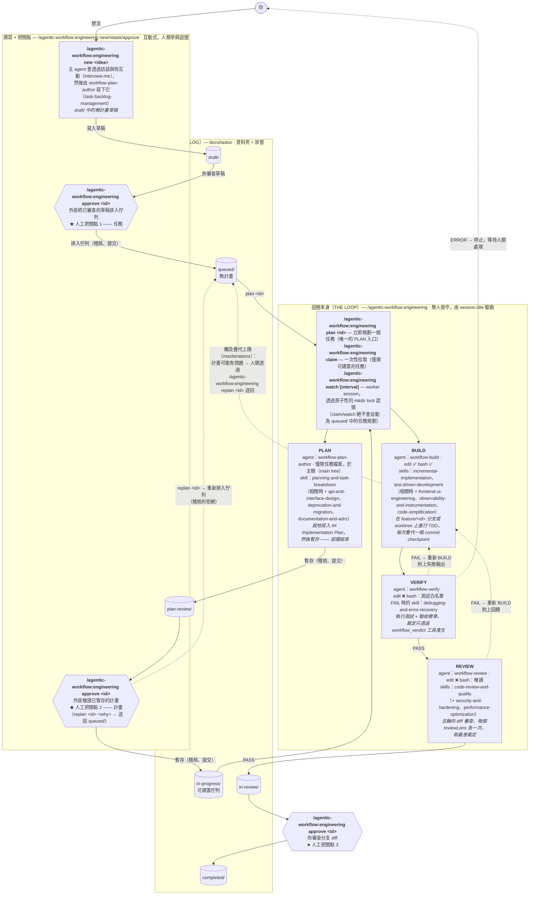

[English](engineering.md) | 繁體中文

# engineering

engineering 工作流程：PLAN（在人工計畫把關點暫存）接著 BUILD → VERIFY →
REVIEW，作用於 docs/tasks 待辦（backlog）。

## 啟用

不需要任何設定——engineering 迴圈預設就會執行。若要停用它：

```jsonc
{
  "workflows": {
    "engineering": { "enabled": false }
  }
}
```

## 指令

**OpenCode**

```
/agentic-workflow:engineering new <idea> | retask <id> [note] | approve [id] | replan [id] [reason] | plan <id> | claim | watch [poll [interval] | cron <schedule> | idle | <interval>] | unwatch | recover <id> | kinds | doctor [fix] | stop | status
```

**Claude Code (MCP)**

```
/agentic-workflow:engineering new <idea> | retask <id> [note] | approve [id] | replan [id] [reason] | plan <id> | claim | recover <id> | kinds | doctor [fix] | stop | status
```

（Claude Code 沒有常駐的 watcher；`claim` 就是一次性的拉取動詞。）

## 架構

完整全貌是：三個人工把關點貫穿一個無人值守的 PLAN / BUILD → VERIFY →
REVIEW 迴圈，而 `docs/tasks/` 待辦資料夾*就是*狀態——一個任務所在的資料夾
就是它的狀態。迴圈會在執行前的最後一刻才規劃一個任務（這樣計畫就不會在
任務暫停等待期間過期），並把計畫**暫存**起來等人工審查，而不是阻塞在
那裡等待。以下的流水線形狀——階段順序、重試預算、暫存/完成狀態、停止
訊息——都來自 `packages/core/workflows/engineering/workflow.json`；引擎只是負責
解讀它。

### 流水線（Pipeline）



虛線邊代表失敗路徑。VERIFY/REVIEW 的 FAIL 都會重新進入 BUILD，並共用同一份
疊代預算（`maxIterations`，預設 3）；ERROR 裁定會停止迴圈交給人類處理，且
不會消耗疊代次數。PLAN 只在按需時執行（`plan <id>` —— `claim`/`watch`
絕不會自動為 `queued/` 中的任務規劃）且從不阻塞：它唯一的出口就是暫存進
`plan-review/` 等待你的把關。一次當機的 `plan <id>` 執行會在
`queued/.claims/` 留下一個過期的認領標記；`doctor fix` 會釋放它（watch
的巡查不再自動釋放 queued 中的標記）。engineering 迴圈從不會自行推送或
開啟 PR——REVIEW PASS 只會把任務暫存進 `in-review/` 等你處理。Ship
（`in-review/` → `completed/`）仍是一個由人類觸發的把關點，但現在它會
推送任務的 `feature/<id>` 分支，並依 `codePlatform` 開啟（或重複使用）
一個 **draft** PR（GitHub 或 Azure DevOps）——這樣合併決定仍然是你的，
而「現在去推送並開一個 PR」這個步驟就不需要你親自動手了。

### 誰負責做什麼

| 指令 | 由誰處理 | 子 agent | 寫入權限 | 載入的 skill | 產出 |
|---------|-----------|----------|--------------|---------------|----------|
| `/agentic-workflow:engineering new <idea>` | 外掛 → agent | `workflow-plan-author` | 僅限任務檔案（bash ❌） | `interview-me`、`task-backlog-management` | `draft/` 中的無計畫草稿 |
| `/agentic-workflow:engineering retask <id> [note]` | 外掛（安置任務）→ agent（重塑） | `workflow-plan-author`（retask 模式） | 僅限任務檔案（bash ❌） | `interview-me`、`task-backlog-management` | **就地**在 `draft/` 中被重寫（相同 id）；`queued/` 的任務會先被移回 `draft/`，核准撤銷；`plan-review/` 之後拒絕（改用 `replan`） |
| `/agentic-workflow:engineering approve [id]` | 僅外掛（agent 不寫入任何東西） | — | — | — | 由資料夾驅動的把關點：draft → `queued/`、plan-review → `in-progress/`、in-review → `completed/` |
| `/agentic-workflow:engineering replan [id] [why]` | 僅外掛（agent 不寫入任何東西） | — | — | — | 任務重新排入 `queued/`，拒絕會被稽核 |
| PLAN（在迴圈中，作用於 `queued/` 中的任務） | driver → agent | `workflow-plan-author`（任務模式） | 僅限任務檔案 | `planning-and-task-breakdown`（相關時 + `api-and-interface-design`、`deprecation-and-migration`、`documentation-and-adrs`） | 就地寫入 `## Implementation Plan` → 任務暫存進 `plan-review/` |
| `/agentic-workflow:engineering plan\|claim\|watch\|recover\|stop\|status` | 外掛 driver（`plugins/opencode/src/workflow/driver.ts`） | 生成以下三個階段 agent | — | `workflow-orchestration` 協定 | 階段排序、認領、快照、執行紀錄 |
| BUILD（也是 `/build`） | driver → agent | `workflow-build` | edit ✅ bash ✅ | `incremental-implementation`、`test-driven-development`（相關時 + `frontend-ui-engineering`、`observability-and-instrumentation`、`code-simplification`） | 程式碼 + 每次疊代一個 commit checkpoint |
| VERIFY（也是 `/verify`） | driver → agent | `workflow-verify` | edit ❌ bash：測試執行器白名單 | `debugging-and-error-recovery`（FAIL 時） | 可信的 `workflow_verdict` PASS/FAIL/ERROR |
| REVIEW（也是 `/review`） | driver → agent | `workflow-review` | edit ❌ bash：唯讀 git/fs | `code-review-and-quality`（+ `security-and-hardening`、`performance-optimization`） | 每個 lens 一份可信的 `workflow_verdict`，取最差裁定 |
| `/plan`（臨時） | agent | `workflow-plan` | 無（唯讀） | `spec-driven-development`、`planning-and-task-breakdown` | 聊天視窗中的一份計畫——不寫入任何檔案 |

裁定只透過 `workflow_verdict` 外掛工具才可信——階段 agent 在文字中宣稱
「PASS」會被忽略。階段 agent 無法核准任務、移動待辦資料夾或發布；每一次
狀態間的轉換都由外掛和人類擁有。

### 待辦完整性防護欄（Backlog integrity rails）

三層防護避免一個困惑的 agent 破壞「資料夾即狀態」的待辦（threat model
T3/T3b）：

- **待辦變更防護（Backlog-mutation guard）**（`task/guard.ts`，一律開啟）：
  會變更 `<tasksDir>/` 的 agent 工具呼叫在兩種基底上都預設被拒絕——Claude
  Code 透過 PreToolUse hook（內嵌副本，保持同步），OpenCode 透過
  `tool.execute.before`。唯讀指令會通過；直接寫入僅限撰寫 `draft/*.md`，
  以及正在執行的 PLAN 階段自己的 `queued/` 任務（由階段標記的 `taskId`／
  驅動迴圈的 state 指名）。具決定性的搬移器仍是權威來源：`moveTask` +
  `canTransition` 強制一次只能處於一個階段，`statusOf` 會拒絕未知的資料夾。
- **調和巡查（Reconciliation sweep）**（`task/audit.ts`）：偵測迷途資料夾
  （一個被 agent 憑空發明的 `run/`）、落在所有狀態資料夾之外的任務檔案，
  以及在多個狀態資料夾中重複出現的同一個 id。會在 session 啟動時（兩種
  基底皆然）、`workflow_status` 中，以及認領時的警告中呈現。
- **Doctor**（`workflow_doctor` / `/agentic-workflow:engineering doctor [fix]`）：
  回報巡查結果加上被持有的認領標記；帶上 `fix` 時只會套用明確無歧義的
  修復——把迷途項目救回 `draft/`（稽核 + 提交）、移除清空後的迷途資料夾、
  釋放過期的孤兒認領標記。重複項目永遠是人類的決定。

watch 租約（每個 clone 一個 watch 模式的行程，橫跨所有類型）只在框架層級
的 [`docs/architecture.md`](../architecture.md#watch-lease) 中記載一次。

## 範例：草擬、核准、規劃並執行

這個操作演練展示了從訪談到交付的完整順利路徑。

1. **撰寫一個任務**
   ```
   /agentic-workflow:engineering new Implement dark mode toggle
   ```
   這個指令會訪談你：目標是什麼、驗收標準是什麼、有沒有未解的問題？它會在
   `docs/tasks/draft/` 中建立一份無計畫草稿，並附上自動產生的 id（例如
   `my-dashboard-dark-mode`）。草稿會停在 draft/ 中，等你確認它已經
   準備好可以排入佇列。

2. **核准它進入待辦**
   ```
   /agentic-workflow:engineering approve my-dashboard-dark-mode
   ```
   把任務從 `draft/` 移到 `queued/`——現在它有資格被執行了。

3. **規劃第一個任務**
   ```
   /agentic-workflow:engineering plan my-dashboard-dark-mode
   ```
   進入 PLAN 階段：agent 會讀取任務並寫出一份詳細的實作計畫（任務檔案中的
   `## Implementation Plan` 標題）。PLAN 會在人工把關點（`plan-review/`）
   暫存並結束——你審查這份計畫、可能重塑它，然後核准它。

4. **核准計畫**
   ```
   /agentic-workflow:engineering approve my-dashboard-dark-mode
   ```
   把任務從 `plan-review/` 移到 `in-progress`——準備好進入 BUILD。

5. **執行迴圈**
   ```
   /agentic-workflow:engineering watch 30s
   ```
   啟動一個每 30 秒輪詢一次的常駐 watcher。當它找到一個位於 `in-progress`
   的任務時，會無人值守地執行 BUILD（程式碼變更）→ VERIFY（測試通過嗎？）
   → REVIEW（程式碼審查）。若所有階段都 PASS，任務會落在 `in-review/`
   （合併前的人工審查）。若任何階段 FAIL，它會重試 BUILD 最多 3 次，然後
   停止。`watch` 會把*這個* session 變成 worker——要執行下一個步驟，請使用
   另一個終端機/session，或先按 ESC（暫停，仍可還原這次執行）或執行
   `unwatch`（停止監看，讓任何進行中的迴圈跑完）。

6. **核准完成的工作**
   ```
   /agentic-workflow:engineering approve my-dashboard-dark-mode
   ```
   BUILD/VERIFY/REVIEW 自己絕不會推送或開啟 PR——這一步才是真正發布它的
   步驟：它會推送 `feature/my-dashboard-dark-mode` 分支並開啟（或重複
   使用）一個 draft PR，然後把任務從 `in-review/` 移到 `completed/`。

## 範例：還原一個卡住的任務

如果一次建置當機，或你中斷了它（ESC），任務會卡在 `in-progress`。還原它：

1. **檢查狀態**
   ```
   /agentic-workflow:engineering status
   ```
   顯示目前的迴圈狀態 + 待辦摘要。查看哪個任務卡住了。

2. **還原並恢復**
   ```
   /agentic-workflow:engineering recover my-dashboard-dark-mode
   ```
   立即在這一輪恢復——重新認領任務，並回到其狀態快照停止時的確切階段
   （會先重新讀取任務檔案，以防你在卡住期間編輯過它），然後繼續
   BUILD → VERIFY → REVIEW。

## 延伸閱讀

- 框架內部細節（核心套件、排程器、工作來源）與 watch 租約：[`docs/architecture.md`](../architecture.md)
- Sitters：[`docs/sitters.md`](../sitters.md)
- 指令參考與疑難排解：[`docs/opencode.md`](../opencode.md)（OpenCode 特定內容）、[`plugins/claude/README.md`](../../plugins/claude/README.md)（Claude Code）
- 編寫一種新的工作流程類型：[`packages/core/workflows/README.md`](../../packages/core/workflows/README.md)
