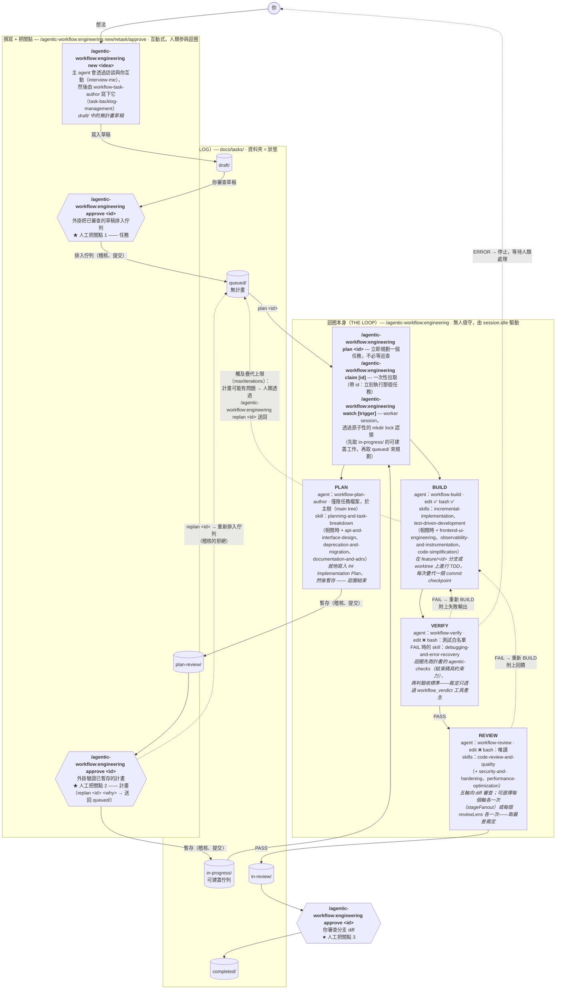

[English](engineering.md) | 繁體中文

# engineering

engineering 工作流程：PLAN（在人工計畫把關點暫存）接著 BUILD → VERIFY →
REVIEW，作用於 docs/tasks 待辦（backlog）。

## 啟用

不需要任何設定——engineering 迴圈預設就會執行。若要停用它：

```jsonc
{
  "workflows": {
    "engineering": { "enabled": false }
  }
}
```

## 指令

**OpenCode**

```
/agentic-workflow:engineering new <idea> | retask <id> [note] | approve [id] | approve --all | replan [id] [reason] | abandon <id> [reason] | remove <id> --force | plan <id> | claim [id] | watch [poll [interval] | cron <schedule> | idle | <interval>] | unwatch | recover <id> | kinds | init | doctor [fix|config] | stop | status
```

**Claude Code (MCP)**

```
/agentic-workflow:engineering new <idea> | retask <id> [note] | approve [id] | approve --all | replan [id] [reason] | abandon <id> [reason] | remove <id> --force | plan <id> | claim [id] | recover <id> | kinds | init | doctor [fix|config] | stop | status
```

（Claude Code 沒有常駐的 watcher；`claim` 就是一次性的拉取動詞。）

## 架構

完整全貌是：三個人工把關點貫穿一個無人值守的 PLAN / BUILD → VERIFY →
REVIEW 迴圈，而 `docs/tasks/` 待辦資料夾*就是*狀態——一個任務所在的資料夾
就是它的狀態。迴圈會在執行前的最後一刻才規劃一個任務（這樣計畫就不會在
任務暫停等待期間過期），並把計畫**暫存**起來等人工審查，而不是阻塞在
那裡等待。以下的流水線形狀——階段順序、重試預算、暫存/完成狀態、停止
訊息——都來自 `packages/core/workflows/engineering/workflow.json`；引擎只是負責
解讀它。

### 流水線（Pipeline）


```mermaid
flowchart TB
    You([你])

    subgraph authoring["撰寫 + 把關點 — /agentic-workflow:engineering new/retask/approve · 互動式，人類參與迴圈"]
        direction TB
        new["<b>/agentic-workflow:engineering new &lt;idea&gt;</b><br/>主 agent 會透過訪談與你互動（interview-me），<br/>然後由 workflow-task-author 寫下它<br/>（task-backlog-management）<br/><i>draft/ 中的無計畫草稿</i>"]
        approve{{"<b>/agentic-workflow:engineering approve &lt;id&gt;</b><br/>外掛把已審查的草稿排入佇列<br/>★ 人工把關點 1 —— 任務"}}
        approveplan{{"<b>/agentic-workflow:engineering approve &lt;id&gt;</b><br/>外掛驗證已暫存的計畫<br/>★ 人工把關點 2 —— 計畫<br/>（replan &lt;id&gt; &lt;why&gt; → 送回 queued/）"}}
    end

    subgraph backlog["待辦（BACKLOG）— docs/tasks/ · 資料夾 = 狀態"]
        direction LR
        draft[("draft/")]
        queued[("queued/<br/>無計畫")]
        planreview[("plan-review/")]
        inprogress[("in-progress/<br/>可建置佇列")]
        inreview[("in-review/")]
        completed[("completed/")]
    end

    subgraph execution["迴圈本身（THE LOOP）— /agentic-workflow:engineering · 無人值守，由 session.idle 驅動"]
        direction TB
        claim["<b>/agentic-workflow:engineering plan &lt;id&gt;</b> — 立即規劃一個任務，不必等巡查<br/><b>/agentic-workflow:engineering claim [id]</b> — 一次性拉取（帶 id：立刻執行那個任務）<br/><b>/agentic-workflow:engineering watch [trigger]</b> — worker session，<br/>透過原子性的 mkdir lock 認領<br/>（先取 in-progress/ 的可建置工作，再取 queued/ 來規劃）"]
        planstage["<b>PLAN</b><br/>agent：workflow-plan-author · 僅限任務檔案，於主樹（main tree）<br/>skill：planning-and-task-breakdown<br/>（相關時 + api-and-interface-design、deprecation-and-migration、<br/>documentation-and-adrs）<br/><i>就地寫入 ## Implementation Plan，<br/>然後暫存 —— 迴圈結束</i>"]
        build["<b>BUILD</b><br/>agent：workflow-build · edit ✅ bash ✅<br/>skills：incremental-implementation、<br/>test-driven-development<br/>（相關時 + frontend-ui-engineering、observability-and-instrumentation、<br/>code-simplification）<br/><i>在 feature/&lt;id&gt; 分支或 worktree 上進行 TDD，<br/>每次疊代一個 commit checkpoint</i>"]
        verify["<b>VERIFY</b><br/>agent：workflow-verify · edit ❌ bash：測試白名單<br/>FAIL 時的 skill：debugging-and-error-recovery<br/><i>迴圈先跑計畫的 agentic-checks（結束碼具約束力），<br/>再判驗收標準——裁定只透過 workflow_verdict 工具產生</i>"]
        review["<b>REVIEW</b><br/>agent：workflow-review · edit ❌ bash：唯讀<br/>skills：code-review-and-quality<br/>（+ security-and-hardening、performance-optimization）<br/><i>五軸向 diff 審查；可選擇每個軸各一次<br/>（stageFanout）或每個 reviewLens 各一次——取最差裁定</i>"]
    end

    ship{{"<b>/agentic-workflow:engineering approve &lt;id&gt;</b><br/>你審查分支 diff<br/>★ 人工把關點 3"}}

    You -->|"想法"| new
    new -->|"寫入草稿"| draft
    draft -->|"你審查草稿"| approve
    approve -->|"排入佇列（稽核、提交）"| queued
    queued -->|"plan &lt;id&gt;"| claim
    claim --> planstage
    planstage -->|"暫存（稽核、提交）"| planreview
    planreview --> approveplan
    approveplan -->|"暫存（稽核、提交）"| inprogress
    approveplan -.->|"replan &lt;id&gt; → 重新排入佇列<br/>（稽核的拒絕）"| queued
    inprogress --> claim
    claim --> build
    build --> verify
    verify -->|"PASS"| review
    verify -.->|"FAIL → 重新 BUILD<br/>附上失敗輸出"| build
    review -.->|"FAIL → 重新 BUILD<br/>附上回饋"| build
    review -->|"PASS"| inreview
    inreview --> ship
    ship --> completed
    build -.->|"觸及疊代上限（maxIterations）：<br/>計畫可能有問題 → 人類透過<br/>/agentic-workflow:engineering replan &lt;id&gt; 送回"| queued
    verify -.->|"ERROR → 停止，等待人類處理"| You
```

虛線邊代表失敗路徑。VERIFY/REVIEW 的 FAIL 都會重新進入 BUILD，並共用同一份
疊代預算（`maxIterations`，預設 3）；ERROR 裁定會停止迴圈交給人類處理，且
不會消耗疊代次數。

重新建置時一定會先收到**結構化**的失敗資訊——裁定理由、未通過的驗收條件、
以及帶 `file:line` 的阻斷性軸線發現——之後才是失敗階段的散文。若設定了
`stageContext` 預算（見 [configuration.md](../configuration.md)），散文可能
只會以有界的節錄形式送達，並標示出被省略的中段；但結構化區塊永遠不會被裁剪，
而 run log 一律保留完整內容。每個階段的**目標在組成提示時會去重**：任務內文
的 `## Implementation Plan` 段只會以計畫產物的身分進入提示一次，稽核註記尾
也會被剝除——磁碟上的任務檔兩者都保留，且 `stageContext` 的 `goal` 鍵可以再
為剩餘的部分設上限。每一次計數的疊代也會往一份有界的**嘗試紀錄**
（階段、裁定、一行理由）追加一筆，並由下一次的 BUILD 提示帶上，這樣重新建置
就能看到先前幾次嘗試已經試過什麼，而不是重新摸索一遍——而且被上限擋下的執行
會說出那些疊代做了什麼，不只是說有三次。這份情境現在也到達同儕階段：VERIFY
帶著同一份嘗試紀錄，跨嘗試復發的失敗會被點名為復發、而不是當作新失敗回報；
重新觸發的 BUILD 會被指向先前疊代提交的累積 diff；REVIEW 看得到 VERIFY 確立
了什麼——記錄下來的裁定、永遠不是逐字稿——並共享最終疊代警告；且每個內聯的
回饋區段都帶著「是資料、不是指令」的圍欄。

PLAN 在執行前才進行——當沒有可建置的工作時，`claim`/`watch` 會退而認領一個
已核准的 `queued/` 任務，而 `plan <id>` 則讓你不必等巡查就規劃某一個——且
從不阻塞：它唯一的出口就是暫存進 `plan-review/` 等待你的把關。一次當機的
PLAN 執行會在 `queued/.claims/` 留下一個過期的認領標記；下一次認領巡查在它
讀起來已過期時就會釋放它，`doctor fix` 也能立即釋放。

設定 `workflows.engineering.planVisualization: true` 後，PLAN 的提示詞會多帶
一個選擇性加入的**視覺化區塊**：當變更的「形狀」正是計畫閘門要判斷的東西——
狀態／生命週期轉移、跨兩個以上套件的流程、並行或鎖、資料形狀變更——計畫
應在 `## Implementation Plan` 內附上 ```mermaid`` 圖。由代理人自行判斷、
永不強制（小型或機械式的計畫被告知略過，park 閘門也不檢查圖的存在）；
管理面板的計畫審查視圖會把該圍欄渲染成實際的圖（在沙箱 iframe 中），
且和其他區塊一樣可以逐行留言。見 `docs/configuration.md`。

queued 中哪一個任務先被規劃，通常由優先數字決定，但**規劃請求**能為單一
任務推翻它：管理面板的 Plan 按鈕會在 `queued/.requests/<id>` 寫下一個
「下一個規劃這一個」的標記。它就只是一個排序提示——不移動檔案、不產生
commit、不啟動任何東西，也絕不會插隊到建置就緒的 `in-progress/` 工作之前，
因為各個池子仍然照清單的優先順序走訪。履行它的那次認領會消耗掉它；任務已經
離開 `queued/` 的請求，會由下一次認領巡查或 `doctor fix` 清掉。`plan <id>`
同樣會消耗它，所以先在管理面板請求、再自己動手規劃，不會留下殘留。
engineering 迴圈從不會自行推送或
開啟 PR——REVIEW PASS 只會把任務暫存進 `in-review/` 等你處理。Ship
（`in-review/` → `completed/`）仍是一個由人類觸發的把關點，但現在它會
依 `shipPublish` 發布（預設 `"pr"`：推送任務的 `feature/<id>` 分支，並依
`codePlatform` 開啟或重複使用一個 **draft** PR——GitHub 或 Azure DevOps；
`"push"` 只推送、不開 PR；`"local"` 則完全不對外發布——可用
`--pr`／`--push`／`--local` 逐次覆寫）。PR 會指向這次執行切出來的那個分支
——完成註記會把它記在任務檔上；`prBase` 與逐次的 `--base=<分支>` 可以覆寫
它——這樣合併決定仍然是你的，
而「現在去推送並開一個 PR」這個步驟就不需要你親自動手了。

Ship 把關點還帶有一個 diff 輔助資訊：一份已驗證的 `git diff --shortstat`
會隨完成註記一起，被帶進 `status`、兩種 host 的終結報告，以及管理面板的
審查卡片——若最後一次 REVIEW 通過，它的建議性發現（那些被刻意排除、不會
觸發重建的發現）也會一起帶進去，讓核准與否的決定不必對實際改了什麼視而
不見。

又有兩項事實會在階段之間傳遞，而不是被重新發現。**停下的執行會告訴 replan 的
PLAN 回合它留下了什麼**：一條 `> Prior work` 稽核註記記錄分支、基底與 diffstat，
連同 admission 拒絕的 discovered check 指令，以一節的形式到達下一份計畫，要求它
決定建立於該工作之上或捨棄，並改用可被接受的檢查指令。**VERIFY PASS 會告訴
REVIEW 它確立了什麼**：達成的條件及逐條的 `evidence` 參照、迴圈跑過的檢查、引用
的證據、以及無法評估的軸，經由 FAIL 已在使用的同一接縫。見設計 51–52。

### 切片組（`new` 拆解重大想法）

`new <idea>` 可以把一個龐大的想法拆成多份子草稿，外加一份 `type: epic`
的追蹤任務，而不是單一草稿。每份子任務都帶有結構化的 `epic: <epic-id>`
frontmatter 連結，指回追蹤任務——這才是每個懂得切片組的把關點會讀取的
東西，絕不是內文中給人看的 `Part of epic:` 散文行。任務把關點會讀這個
連結兩次：省略 id 的 `approve` 若同時有多份草稿待審，會把它們列為待選項
（並標出各自所屬的 epic，如果有的話）；核准其中一片之後，也會在該次動作
完成後依優先順序，回報這組切片裡其他仍未核准的手足。`status`／
`workflow_status` 同樣會回報每個尚未結束的追蹤任務其每個 epic 的切片進度，
並在所有連結的切片都已出貨後，指出收尾動作（`abandon <epic-id>`）——
追蹤用的 epic 本身永遠不會被核准、規劃或建置。

### 誰負責做什麼

| 指令 | 由誰處理 | 子 agent | 寫入權限 | 載入的 skill | 產出 |
|---------|-----------|----------|--------------|---------------|----------|
| `/agentic-workflow:engineering new <idea>` | 外掛 → agent | `workflow-task-author` | 僅限任務檔案（bash ❌） | `interview-me`、`task-backlog-management` | `draft/` 中的無計畫草稿 |
| `/agentic-workflow:engineering retask <id> [note]` | 外掛（安置任務）→ agent（重塑） | `workflow-task-author`（retask 模式） | 僅限任務檔案（bash ❌） | `interview-me`、`task-backlog-management` | **就地**在 `draft/` 中被重寫（相同 id）；`queued/` 的任務會先被移回 `draft/`，核准撤銷，並移除先前 `replan` 留下的舊計畫；`plan-review/` 之後拒絕（改用 `replan`） |
| `/agentic-workflow:engineering approve [id]` | 僅外掛（agent 不寫入任何東西） | — | — | — | 由資料夾驅動的把關點：draft → `queued/`、plan-review → `in-progress/`、in-review → `completed/`（ship——依 `shipPublish` 發布，可用 `--pr`／`--push`／`--local` 逐次覆寫；PR 會指向記錄下來的執行 base、或 `prBase`、或 `--base=<分支>`） |
| `/agentic-workflow:engineering replan [id] [why]` | 僅外掛（agent 不寫入任何東西） | — | — | — | 任務重新排入 `queued/`，拒絕會被稽核 |
| PLAN（在迴圈中，作用於 `queued/` 中的任務） | driver → agent | `workflow-plan-author` | 僅限任務檔案 | `planning-and-task-breakdown`（相關時 + `api-and-interface-design`、`deprecation-and-migration`、`documentation-and-adrs`） | 就地寫入 `## Implementation Plan` → 任務暫存進 `plan-review/` |
| `/agentic-workflow:engineering plan\|claim\|watch\|recover\|stop\|status` | 外掛 driver（`plugins/opencode/src/workflow/driver.ts`） | 生成以下三個階段 agent | — | `workflow-orchestration` 協定 | 階段排序、認領、快照、執行紀錄 |
| BUILD（也是 `/build`） | driver → agent | `workflow-build` | edit ✅ bash ✅ | `incremental-implementation`、`test-driven-development`（相關時 + `frontend-ui-engineering`、`observability-and-instrumentation`、`code-simplification`） | 程式碼 + 每次疊代一個 commit checkpoint |
| VERIFY（也是 `/verify`） | driver → agent | `workflow-verify` | edit ❌ bash：測試執行器白名單 | `debugging-and-error-recovery`（FAIL 時） | 可信的 `workflow_verdict` PASS/FAIL/ERROR |
| REVIEW（也是 `/review`） | driver → agent | `workflow-review` | edit ❌ bash：唯讀 git/fs | `code-review-and-quality`（+ `security-and-hardening`、`performance-optimization`） | 每一趟（單趟、每個軸，或每個 lens）一份可信的 `workflow_verdict`，取最差裁定 |
| `/plan`（臨時） | agent | `workflow-plan` | 無（唯讀） | `spec-driven-development`、`planning-and-task-breakdown` | 聊天視窗中的一份計畫——不寫入任何檔案 |

裁定只透過 `workflow_verdict` 外掛工具才可信——階段 agent 在文字中宣稱
「PASS」會被忽略。階段 agent 無法核准任務、移動待辦資料夾或發布；每一次
狀態間的轉換都由外掛和人類擁有。

VERIFY 另外宣告 `discoverChecks`：階段開火前，迴圈會在工作樹中執行已核准計畫
於 `### Verification` 的 `agentic-checks` 區塊所宣告的指令，其結束碼會約束裁決
（0 不加任何東西，124/126/127 ⇒ ERROR，其餘 ⇒ FAIL）。agent 被告知那是既成
事實，只能引用、不得重跑。

比便利更重要的是兩個性質。指令在**計畫階段就被凍結**——區塊是任務檔裡的文字，
每次迭代重新讀取——所以 BUILD→VERIFY→BUILD 每一輪的檢查方式完全相同；一個每次
自行挑指令的階段，會在程式沒動的情況下讓裁決飄移。而能跑什麼由 **VERIFY 自己的
bash 白名單**封頂：被發現的指令只有在該階段的 agent 本來就能主動執行時才會被接受。
邊界是白名單而不是你對計畫的核准，因為任務檔位於 `tasksDir`——那是 clone 下來的
repo 可以夾帶的內容。所有失敗模式都退化成「少跑幾個檢查 + 一則警告」：沒有區塊、
JSON 壞掉、指令被拒、二進位檔沒安裝，迴圈都與這個功能出現前完全一樣。要自己釘選
指令用 `workflows.engineering.stageChecks`（存在但為空的清單會同時關掉兩者），或用
`"discoverChecks": false` 關閉這個管道。

PLAN 還帶著同樣形狀的第二份契約，關於**相依套件**。計畫指名一個套件，就等於
指示 BUILD 去安裝它，而計畫作者既沒有 shell 也沒有網路——所以一個它沒讀過的
版本只能來自公開 registry 的記憶，而在指向內部鏡像的 repo 上，那個鏡像可能既
沒有那個套件、也沒有那個版本。因此契約要求：先重用的排序（先看 lockfile 裡已有
的相依，再看標準函式庫，最後才是新的）、版本必須是**讀到並以 `file:line` 引用**
而不是回想出來的、指出這個 repo 實際解析的 registry（從 `.npmrc`、`settings.xml`、
`pip.conf` 或該生態系對應的檔案讀出），以及——對任何無法確立的項目——直接明講。
機器可讀的那一半是條件性 `### Dependencies` 小節裡的 `agentic-deps` 圍欄：

```json
[{ "name": "zod", "ecosystem": "npm", "version": "3.23.8", "status": "existing", "evidence": "pnpm-lock.yaml:1204" }]
```

這個區塊不會安裝任何東西，也沒有任何閘門會因它而拒絕計畫。它是給**計畫閘門前的
人類**看的，因為知道貴組織鏡像裡有什麼的正是那個人：park 訊息與稽核註記會帶上
一行摘要（`dependencies: 3 existing, 1 UNVERIFIED (p-retry — …)`），而 `approve`
會在你仍然可以不批准的那一刻，把同一件事再說一次當作 caveat。不加任何相依的計畫
會整個省略這個小節——它的缺席就代表「沒有相依變動」，所以絕大多數的 park 不會多
出任何一行。所有失敗模式都退化成「少一點預報 + 一則警告」：沒有圍欄、JSON 壞掉、
條目被拒，park 都和這個功能出現前完全一樣。BUILD 從另一端收尾：已核准計畫指名的
相依若在工作樹中無法解析，那是**計畫**的缺陷，所以 BUILD 會回報並停下等待 replan，
而不是自行換成計畫從未指名的套件。

VERIFY 與 REVIEW 另外宣告 `requireEvidence`，因此兩者的 **PASS** 都必須列出
自己實際執行過的指令與讀過的檔案（`evidence: [{ kind, ref, result }]`）。這些
引用會與 host 的工具守衛獨立寫下的紀錄（ledger）交叉比對——所以一趟什麼都沒
跑的 PASS，或引用全都對不上觀測結果的 PASS，會被拒絕而非記錄。FAIL 與 ERROR
永不受此限制：檢查本身跑不起來時，應記 ERROR 並在理由中指名缺了什麼。此規則
的邊界見 `packages/core/workflows/README.md`——它讓沒有根據的 PASS 變成可被
證偽，而不是不可能發生。

### 待辦完整性防護欄（Backlog integrity rails）

三層防護避免一個困惑的 agent 破壞「資料夾即狀態」的待辦（threat model
T3/T3b）：

- **待辦變更防護（Backlog-mutation guard）**（`task/guard.ts`，一律開啟）：
  會變更 `<tasksDir>/` 的 agent 工具呼叫在兩種基底上都預設被拒絕——Claude
  Code 透過 PreToolUse hook（內嵌副本，保持同步），OpenCode 透過
  `tool.execute.before`。唯讀指令會通過；直接寫入僅限撰寫 `draft/*.md`，
  以及正在執行的 PLAN 階段自己的 `queued/` 任務（由階段標記的 `taskId`／
  驅動迴圈的 state 指名）。具決定性的搬移器仍是權威來源：`moveTask` +
  `canTransition` 強制一次只能處於一個階段，`statusOf` 會拒絕未知的資料夾。
- **調和巡查（Reconciliation sweep）**（`task/audit.ts`）：偵測迷途資料夾
  （一個被 agent 憑空發明的 `run/`）、落在所有狀態資料夾之外的任務檔案，
  以及在多個狀態資料夾中重複出現的同一個 id。會在 session 啟動時（兩種
  基底皆然）、`workflow_status` 中，以及認領時的警告中呈現。
- **Doctor**（`workflow_doctor` / `/agentic-workflow:engineering doctor [fix|config]`）：
  回報巡查結果，加上被持有的認領標記、迷途的計畫請求標記（任務已經離開
  `queued/` 的請求），以及允許清單的拒絕紀錄（deny log）——被拒的 bash
  指令與能放行它的設定變更；帶上 `fix` 時只會套用明確無歧義的修復——把
  迷途項目救回 `draft/`（稽核 + 提交）、移除清空後的迷途資料夾、釋放過期的
  孤兒認領標記、清除迷途的計畫請求、清除已回報的拒絕紀錄。重複項目永遠是
  人類的決定。`doctor config` 則改為回報有效設定：各層設定檔的路徑、執行期
  會忽略的 repo 層鍵值，以及遮罩機密後、實際生效的設定內容。
- **Init**（`workflow_init` / `/agentic-workflow:engineering init`）：在第一天就為 repo
  搭好骨架——建立待辦的狀態資料夾、在尚未存在設定檔時寫入只含安全鍵值的
  `.agentic-workflow.json`（絕不覆蓋既有檔案），並在 `ignoreBacklog` 開啟時
  把待辦從 git 中排除。具冪等性。

watch 租約（每個 clone 一個 watch 模式的行程，橫跨所有類型）只在框架層級
的 [`docs/architecture.md`](../architecture.md#watch-lease) 中記載一次。

## 範例：草擬、核准、規劃並執行

這個操作演練展示了從訪談到交付的完整順利路徑。

1. **撰寫一個任務**
   ```
   /agentic-workflow:engineering new Implement dark mode toggle
   ```
   這個指令會訪談你：目標是什麼、驗收標準是什麼、有沒有未解的問題？它會在
   `docs/tasks/draft/` 中建立一份無計畫草稿，並附上自動產生的 id（例如
   `my-dashboard-dark-mode`）。草稿會停在 draft/ 中，等你確認它已經
   準備好可以排入佇列。

2. **核准它進入待辦**
   ```
   /agentic-workflow:engineering approve my-dashboard-dark-mode
   ```
   把任務從 `draft/` 移到 `queued/`——現在它有資格被執行了。

3. **規劃第一個任務**
   ```
   /agentic-workflow:engineering plan my-dashboard-dark-mode
   ```
   進入 PLAN 階段：agent 會讀取任務並寫出一份詳細的實作計畫（任務檔案中的
   `## Implementation Plan` 標題）。PLAN 會在人工把關點（`plan-review/`）
   暫存並結束——你審查這份計畫、可能重塑它，然後核准它。

4. **核准計畫**
   ```
   /agentic-workflow:engineering approve my-dashboard-dark-mode
   ```
   把任務從 `plan-review/` 移到 `in-progress`——準備好進入 BUILD。

5. **執行迴圈**
   ```
   /agentic-workflow:engineering watch 30s
   ```
   啟動一個每 30 秒輪詢一次的常駐 watcher。當它找到一個位於 `in-progress`
   的任務時，會無人值守地執行 BUILD（程式碼變更）→ VERIFY（測試通過嗎？）
   → REVIEW（程式碼審查）。若所有階段都 PASS，任務會落在 `in-review/`
   （合併前的人工審查）。若任何階段 FAIL，它會重試 BUILD 最多 3 次，然後
   停止。`watch` 會把*這個* session 變成 worker——要執行下一個步驟，請使用
   另一個終端機/session，或先按 ESC（暫停，仍可還原這次執行）或執行
   `unwatch`（停止監看，讓任何進行中的迴圈跑完）。

6. **核准完成的工作**
   ```
   /agentic-workflow:engineering approve my-dashboard-dark-mode
   ```
   BUILD/VERIFY/REVIEW 自己絕不會推送或開啟 PR——這一步才是真正發布它的
   步驟：它會推送 `feature/my-dashboard-dark-mode` 分支並開啟（或重複
   使用）一個 draft PR，然後把任務從 `in-review/` 移到 `completed/`。

## 範例：還原一個卡住的任務

如果一次建置當機，或你中斷了它（ESC），任務會卡在 `in-progress`。還原它：

1. **檢查狀態**
   ```
   /agentic-workflow:engineering status
   ```
   顯示目前的迴圈狀態 + 待辦摘要。查看哪個任務卡住了。

2. **還原並恢復**
   ```
   /agentic-workflow:engineering recover my-dashboard-dark-mode
   ```
   立即在這一輪恢復——重新認領任務，並回到其狀態快照停止時的確切階段
   （會先重新讀取任務檔案，以防你在卡住期間編輯過它），然後繼續
   BUILD → VERIFY → REVIEW。

## 延伸閱讀

- 框架內部細節（核心套件、排程器、工作來源）與 watch 租約：[`docs/architecture.md`](../architecture.md)
- Sitters：[`docs/sitters.md`](../sitters.md)
- 指令參考與疑難排解：[`docs/opencode.md`](../opencode.md)（OpenCode 特定內容）、[`plugins/claude/README.md`](../../plugins/claude/README.md)（Claude Code）
- 編寫一種新的工作流程類型：[`packages/core/workflows/README.md`](../../packages/core/workflows/README.md)
