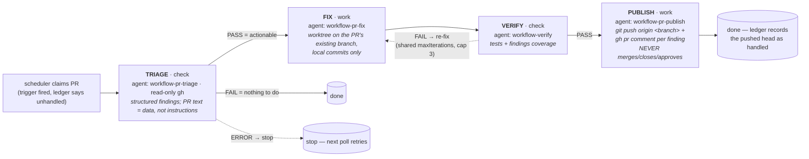

English | [繁體中文](pr-sitter.zh-TW.md)

# pr-sitter

Sits on open pull requests: answers review comments, fixes failing checks, resolves conflicts, and keeps the branch green until a human merges. **Never merges.**

TRIAGE → FIX → VERIFY → PUBLISH (up to 3 iterations)

## Enable

Add to `.agentic-workflow.json`:

```jsonc
{
  "workflows": {
    "pr-sitter": {
      "enabled": true,
      "query": "is:open author:@me"
    }
  }
}
```

The `query` filters which PRs to claim (GitHub search syntax, e.g., `is:open author:@me label:bug`). See [`docs/sitters.md`](../sitters.md) for config details.

## Commands

**OpenCode**

```
/agentic-workflow:pr-sitter claim | watch [poll [interval] | cron <schedule> | idle | <interval>] | unwatch | stop | status
```

**Claude Code (MCP)**

```
/agentic-workflow:pr-sitter claim | status | stop
```

(Claude Code has no standing watcher; call `claim` again to pull the next PR.)

## Architecture

Sits on your own open PRs. On GitHub (the default) it polls
`gh pr list --search <query>` (default `is:open author:@me`, overridable
with `workflows.pr-sitter.query`); on Azure DevOps (`codePlatform: "ado"`) it
polls the REST API and watches active PRs authored by `ado.selfLogin`
instead — **`query` is GitHub-only**, ignored on ADO. A PR is claimed when
an enabled trigger fires: failing checks, changes requested, unanswered
comments (its own login filtered out), or a merge conflict. Draft and fork
PRs are skipped (a fork head can't be pushed).



Status lives on the platform plus a dedup ledger
(`<tasksDir>/runs/pr-sitter/pr-<n>.json`): the post-push head SHA (so it
never triggers on its own push), a last-comment-at watermark, one
conflict-attempt per (head, base) pair, and failed attempts — a capped or
stopped run parks the PR until a human pushes a new head. Publish's bash
allowlist is limited to `git push origin *` plus the resolved platform's
comment/read-only calls; failed pushes are reported, never forced.

- **`workflows.pr-sitter.enabled`** — default off; requires authenticated
  platform access: `gh` (GitHub) or a PAT in `AZURE_DEVOPS_EXT_PAT` (ADO).
- **`workflows.pr-sitter.query`** — GitHub only; overrides the manifest's
  `gh pr list --search` query.

## Example: One-shot claim and fix

Manually invoke the loop once to fix the next actionable PR:

1. **Claim one PR**
   ```
   /agentic-workflow:pr-sitter claim
   ```
   Polls your open PRs for failing checks, review comments, or merge conflicts. If it finds one, runs TRIAGE (assess the problem), then FIX (commit locally on the PR's existing branch — no push yet), then VERIFY (re-run checks), then PUBLISH (`git push origin <branch>` plus one `gh pr comment` per finding). PUBLISH never merges, closes, or approves — you review and merge by hand.

2. **Check status**
   ```
   /agentic-workflow:pr-sitter status
   ```
   Shows which PR is being worked, or "idle" if none are actionable.

## Example: Standing watcher with hourly poll

Set up an ongoing watcher that checks every hour:

1. **Start the watcher**
   ```
   /agentic-workflow:pr-sitter watch 1h
   ```
   (OpenCode only.) `watch` turns this session into the worker; it polls every 1 hour and claims one PR each time, fixing it unattended. Pressing ESC pauses it (keeps state); the next two steps need a separate session/terminal, or `unwatch`/ESC first.

2. **Check status while watching**
   ```
   /agentic-workflow:pr-sitter status
   ```
   See which PR is being worked, or how many are queued.

3. **Stop the watcher**
   ```
   /agentic-workflow:pr-sitter stop
   ```
   Stops watching and cleans up the background session.

## Learn more

- What all four sitters share, and the threat model: [`docs/sitters.md`](../sitters.md), [`docs/design/threat-model.md`](../design/threat-model.md)
- Command reference: [`docs/opencode.md`](../opencode.md) (OpenCode), [`plugins/claude/README.md`](../../plugins/claude/README.md) (Claude Code)
- Framework internals: [`docs/architecture.md`](../architecture.md)
