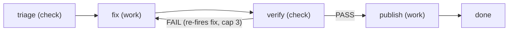

# Workflow kinds beyond engineering

The declarative kinds shipped under `packages/core/workflows/<kind>/`, other
than the default `engineering` one. Reached from `workflow-orchestration`,
which owns the mechanics every kind shares — manifests, stages, the
`workflow_verdict` contract, claim markers, the scheduler. This file is only
the per-kind detail, needed when you are working on one of these sitters.

**All four sitters are experimental.** Each is off until its
`workflows.<kind>` section in `.agentic-workflow.json` says `"enabled": true`,
and its manifest, config keys, and the `ado` code platform they can run against
may still change. Each enabled kind gets its own `/agentic-workflow:<kind>`
command, whose `claim`/`watch` are scoped to that kind's work source.

None of them merges, approves, or pushes a protected branch. That boundary is
the point of the design, not a temporary limitation — see
`docs/design/threat-model.md` T11–T13, and `docs/configuration.md` for every
knob.

## pr-sitter

Sits on open pull requests matching a configured `gh` query and keeps them
green until a human merges.



- **triage** — read-only `gh` inspection of a PR needing attention (failing
  checks, changes requested, new comments, merge conflict); emits findings and
  a verdict: PASS = actionable, FAIL = nothing to do → done, ERROR = could not
  inspect → stop.
- **fix** — commits on the PR's **existing branch** in a worktree; never pushes.
- **verify** — tests plus findings coverage, reusing the shared
  `workflow-verify` agent; FAIL re-fires fix within the cap (3).
- **publish** — `git push origin <branch>` plus one `gh pr comment` reply per
  addressed finding. **Never merges, closes, or approves.**

Dedup is a per-PR ledger under `<tasksDir>/runs/pr-sitter/pr-<n>.json`
(ledgers are namespaced per kind under `runs/<kind>/`): head-SHA and
comment-timestamp watermarks plus an own-login filter, so the sitter never
reacts to its own pushes or replies. A capped or failed attempt parks the PR
until a human pushes a new head.

```jsonc
{ "workflows": { "pr-sitter": { "enabled": true, "query": "is:open author:@me" } } }
```

## review-sitter

`fetch (check) → assess (work) → publish (work)` over PRs whose review is
requested from you (`is:open review-requested:@me`; on ADO, a pending reviewer
vote). Reads the diff in the context of the surrounding code and posts ONE
structured review comment per requested head, re-firing only on a human's new
push.

**Comment-only**: never approves, votes, pushes, or merges. The human stays
reviewer of record.

## dep-sitter

`scan (check) → upgrade (work) → verify (check) → publish (work)` over
dependency advisories.

Scanners: `npm audit` / `npm outdated` for npm; OSV-Scanner
(`osv-scanner --format json -L <pom.xml|gradle.lockfile>`) for Maven and
Gradle; or a site's own CLI via `workflows.dep-sitter.scannerCommand`
(user-scope config only), whose output may be an osv-scanner report or a raw
OSV record list. The `ecosystem` binding defaults to `auto` — detect and merge.
Gradle needs a committed lockfile, and undeclared JVM transitives are never
claimed.

Patch and minor advisories become verified DRAFT PRs on `feature/*` branches.
**Major bumps are skipped and logged for a human.** Publish opens the PR via
`gh` or the ADO REST API, per `codePlatform`.

## main-sitter

`diagnose (check) → remedy (work) → verify (check) → publish (work)` over the
watched branch's CI — `gh run list` on GitHub, the Azure Pipelines Build API on
`ado`.

When the newest head goes red it reproduces the failure, bisects to the
culprit, and publishes a verified DRAFT fix-or-revert PR on a `main-sitter/*`
branch, commenting once on the culprit PR. **The watched branch is never
pushed.**
