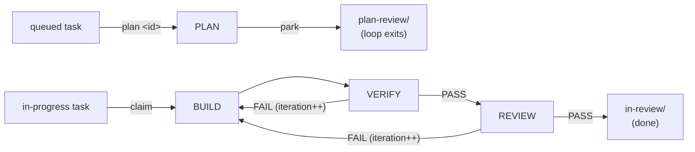
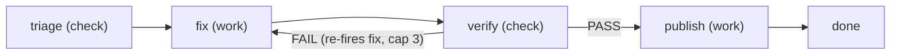
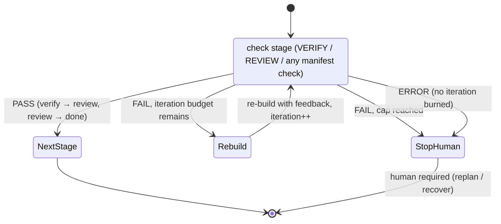

# The agentic loop

## Overview

One command carries the whole engineering lifecycle. The **authoring verbs**
are the authoring-and-gates side: its agent interviews you into a planless
draft (`new <idea>`), `retask <id>` re-interviews and reshapes a planless task
in place (a `draft/` one, or a `queued/` one sent back to `draft/` first),
`approve [id]` is the one folder-driven gate — a reviewed draft to
`queued/` (task gate), a parked plan to `in-progress/` (plan gate), a
finished review to `completed/` (ship) — and `replan [id]` is the sole
rejection verb. **`/agentic-loop:engineering`** is
the loop side: it plans a queued task **right before execution** (so plans
don't rot while tasks sit parked) and drives BUILD, VERIFY, REVIEW as one
automatic pipeline over a plan-approved task. The PLAN stage never blocks on
a human: it writes the `## Implementation Plan` onto the task file, **parks
the task in `plan-review/`, and exits** — park-at-gate, not block-at-gate.
The OpenCode plugin (`src/index.ts` → `src/loop/`) advances stages on
`session.idle`, threading each stage's output into the next as context.

The pipeline shape is **not hardcoded**. It is the **engineering loop
kind**, declared in `packages/core/loops/engineering/loop.json` (stages, transitions,
iteration cap, work source, per-stage bash allowlists) with prompt templates
under `packages/core/loops/engineering/stages/`, and interpreted by the pure engine in the
shared `@agentic-loop/core` package. Other kinds — like `pr-sitter` —
declare different pipelines over different work sources; see
"Loop kinds and the scheduler" below. Everything else in this skill —
PLAN/BUILD/VERIFY/REVIEW, the gates, park-at-gate, the verdict protocol —
describes the engineering kind, whose behavior is identical to the original
hardcoded loop.

(Historical note: an earlier design had planning fully outside the loop in a
`/agent-loop-plan` command, and before that an in-loop PLAN with a blocking
`go` gate. The current shape keeps planning in the loop for
freshness but replaces the blocking gate with the plan-review park. Earlier
still there were DEFINE and SHIP stages; a REVIEW PASS finishes the loop
directly — ship the diff yourself.)

## When to Use

- Use when a backlog task should run the whole BUILD→REVIEW lifecycle
  unattended, instead of invoking `/build`, `/verify`, `/review` one at a time.
- Use when picking up an approved task (`/agentic-loop:engineering claim`, `/agentic-loop:engineering watch`,
  or `/agentic-loop:engineering plan <id>` to plan one) — see `task-backlog-management`.
- Not for a single standalone stage — `/plan`, `/build`, `/verify`, `/review`
  each work outside the loop too, for one-off use.
- Not for changes you want to hand-hold through every step — the loop's value
  is in running BUILD→VERIFY→REVIEW unattended; if you want to review each
  stage individually, drive the stage commands by hand.

## The pipeline

```
authoring + gates (interactive /agentic-loop:engineering verbs):
  /agentic-loop:engineering new <idea>      ──▶ interview ──▶ planless draft in draft/
  /agentic-loop:engineering retask <id> [note] ▶ re-interview ──▶ rewritten in place in draft/ (same id)
                                        queued/ → draft/            ← approval withdrawn, re-approve after
  /agentic-loop:engineering approve [id]    ──▶ the one folder-driven gate:
                                        draft/ → queued/            ← the task gate
                                        plan-review/ → in-progress/ ← the plan gate
                                        in-review/ → completed/     ← ship
  /agentic-loop:engineering replan [id] [why] ▶ back to queued/ (audited rejection)

the loop (the /agentic-loop:engineering command, unattended — never blocks on a human):
  /agentic-loop:engineering plan <id>  — run PLAN on one queued task now (parks, exits — the only PLAN entry)
  /agentic-loop:engineering claim      — one-shot pull of the next build-ready task (never auto-plans queued/)
  /agentic-loop:engineering watch [interval] — claim build work as it appears (idle events + polling timer)
```



| Stage | Writes code? | Role |
|-------|--------------|------|
| plan | no (task file only) | reads the task + relevant code and writes the `## Implementation Plan` onto the task file in place, in the main tree; terminates with a park — the task moves to `plan-review/` for the human gate |
| build | **yes** | implements the approved plan test-first on the loop's own `feature/<id>` branch, or applies a VERIFY/REVIEW stage's feedback on a re-build; each iteration is committed as a checkpoint |
| verify | no | runs tests (bash allowlist), checks acceptance criteria, records `PASS`/`FAIL`/`ERROR` via the `loop_verdict` tool |
| review | no | five-axis code review of exactly `git diff base...branch` (read-only bash allowlist), records `PASS`/`FAIL`/`ERROR` via the `loop_verdict` tool |

## Process

1. `/agentic-loop:engineering new <idea>` — the command's own agent **always
   interviews you** (a restate-and-confirm at minimum, a full interview when
   the idea is vague) to pin down the goal and testable acceptance criteria and
   confirms the draft with you; subagents can't converse, so it then hands the
   confirmed intent to the `loop-plan-author` subagent, which writes the
   planless draft to `draft/`. A **heavy idea is split into sibling drafts** —
   vertical, independently shippable slices ordered by `priority`, plus one
   `type: epic` tracking draft that is never approved. See
   `task-backlog-management` → "Slicing a heavy idea".
2. `/agentic-loop:engineering approve <id>` — after you review the draft — the plugin
   moves it to `queued/` with an audited "Task approved" note and commits.
   No plan yet, by design.
3. The loop plans it: `/agentic-loop:engineering plan <id>` now, or a `/agentic-loop:engineering watch`
   session when no build work remains. The PLAN stage (the
   `loop-plan-author` agent in task mode) reads the code, writes the
   `## Implementation Plan` onto the task file in place, and the driver
   parks the task in `plan-review/` — the loop exits rather than waiting.
4. `/agentic-loop:engineering approve <id>` — the plugin validates the plan
   exists, moves the file to `in-progress/`, appends an audited note, and
   commits. This is the human sign-off before any code is written.
   `/agentic-loop:engineering replan <id> <why>` rejects instead: back to `queued/`
   with the reason audited, and the next PLAN pass must address it.
5. Execute: `/agentic-loop:engineering claim` pulls the next build-ready task now, in
   this session; or
   `/agentic-loop:engineering watch [interval]` turns this session into a standing worker
   that claims work as it appears — on every idle tick, plus a polling timer
   (default cadence `watchIntervalMinutes`, override per-session:
   `/agentic-loop:engineering watch 30s`). Build-ready tasks beat queued ones. The loop
   enters at BUILD with the approved plan threaded in.
   - A VERIFY FAIL within `maxIterations` **re-builds** with the failure fed
     back in, inline in this same session.
   - A REVIEW FAIL within `maxIterations` re-builds with the review's
     findings fed back in, same session.
   - The cap tripping means the plan itself is suspect — the loop stops and
     a human sends it back via `/agentic-loop:engineering replan <id> <why>`.
6. On a REVIEW PASS, the loop is done and the task moves to `in-review/` —
   the human diff gate. Review `git diff <base>...feature/<id>` yourself, push
   and open the PR, then run `/agentic-loop:engineering approve <id>` to move the task to
   `completed/` (an audited move) — the loop never does those steps for you.
7. `/agentic-loop:engineering stop` aborts and exits watch mode (timer included); `/agentic-loop:engineering unwatch`
   exits watch mode alone (a build already claimed still finishes); `/agentic-loop:engineering
   status` shows the current loop plus a whole-backlog roll-up (counts +
   awaiting-approval/claimable/interrupted/in-review flags); `/agentic-loop:engineering recover
   <id>` resumes an in-progress task whose run died mid-build
   (crash/restart) — from its **state snapshot** at the exact stage it
   reached, or from the persisted plan when no valid snapshot exists. Plugin
   startup logs any interrupted tasks and leftover snapshots it finds.

## The gates are a command, planning and execution are the loop

- **Interview (always, inside `/agentic-loop:engineering new`).** The command's own
  agent runs the `interview-me` skill live with you on every `new` — a single
  restate-and-confirm when the idea already carries a clear goal and testable
  criteria, one question at a time until there's an explicit yes on a
  restated intent when it doesn't. It also confirms the drafted task before
  handing it to the `loop-plan-author` subagent to write (subagents can't
  converse with you).
- **Two approvals (always).** `/agentic-loop:engineering approve <id>` on a draft gates
  the task (scope + acceptance) into `queued/`; the same verb on a parked
  plan gates the loop-written plan into `in-progress/` — the folder the task
  sits in picks the move, so the one gate verb is never ambiguous. Nothing
  gets built until a human has approved both — deterministic plugin code
  validates the `## Implementation Plan` heading at the plan gate. There is
  no way to build an ungated task: BUILD only ever claims from `in-progress/`.
  Id-less `/agentic-loop:engineering approve` resolves the single task waiting at a loop
  wait-gate (parked plan, or finished review); only when neither has anything
  waiting does it fall back to a lone `draft/` task. Loop gates always outrank
  the authoring gate, so a pile of drafts never shadows a parked plan, and
  never-approved epic tracking drafts are skipped entirely.
  `/agentic-loop:engineering replan [id]` is the matching rejection verb.
- **Park, don't block.** The PLAN stage ends its loop by parking the task in
  `plan-review/`. A watcher can plan an entire queue overnight and exit each
  time; you batch-review the plans whenever suits and approve or replan each
  — the pipeline never sits blocked inside a live session.
- **Watch → claim (explicit opt-in, `/agentic-loop:engineering watch`).** No session plans or
  builds anything just because it went idle. A human must run
  `/agentic-loop:engineering watch` in a session for it to become a worker; that session then
  claims and drives work unattended until `/agentic-loop:engineering unwatch`/`/agentic-loop:engineering stop`.

## Execution: `/agentic-loop:engineering watch`

A watch session claims work from two triggers: its own `session.idle` events,
and a per-session **polling timer** (`/agentic-loop:engineering watch [interval]`; default
`watchIntervalMinutes` from config, floor 10s). Each timer tick first asks
the server whether the session is actually idle (`client.session.status()`)
and does nothing otherwise — the timer exists for the case idle events miss:
a task approved in *another* session while this one sat quiet.

When it fires, the watcher first scans `docs/tasks/in-progress/` for tasks
where `isClaimable(task)` is true — has a persisted plan (`## Implementation
Plan`), and has **never** had any `> BUILD started` note (not just "the last
one is unmatched" — that's `wasInterrupted`, a different check used for crash
recovery). With no build work, it falls back to `docs/tasks/queued/` for a
task to plan-and-park — build work always beats plan work, so tasks in
flight finish before new ones spin up. The watch is scoped to the
engineering kind: other enabled loop kinds run under their own command's
`watch`/`claim` (e.g. `/agentic-loop:pr-sitter watch` polling its PR query) — see
"Loop kinds and the scheduler". Within the backlog it picks the
lowest-priority claimable task (ties by id) and claims it **atomically**: a
non-recursive `mkdir` of `<folder>/.claims/<id>` either succeeds (claim won)
or fails because another watcher on the same filesystem got there first. The
`> BUILD started` note remains the human-readable audit record; the marker
directory is the lock. (A queued claim marker orphaned by a crashed PLAN is
always safe to release once stale — PLAN writes no code.)

In **shared-tree mode** (default), a per-directory execution lock additionally
serializes drives within one opencode instance — all sessions share one
working tree and one checked-out branch, so only one loop may run stages in it
at a time. In **worktree mode** (`worktreesDir` set) each loop owns its own
worktree, so that lock is dropped and multiple `/agentic-loop:engineering watch` sessions can
drive different tasks concurrently in one instance. **Not covered either way:**
separate opencode *processes* racing the same backlog clone on `index.lock`
during backlog commits (best-effort). Run additional watchers in their own
clones for hard isolation.

## Loop kinds and the scheduler

A loop kind is declared in `packages/core/loops/<kind>/loop.json`: its stages (each
`work` — edits things — or `check` — records a verdict), a transition table
(effects `fire` the next stage, `park` at a human gate, `done` the loop, or
`stop` for a human), an iteration cap, a **work source** binding (where
claimable work comes from), and per-stage bash allowlists for check stages.
Stage prompts live in `packages/core/loops/<kind>/stages/*.md`. The engine in
`@agentic-loop/core` interprets the manifest; adding a kind means writing a
manifest and prompts, not driver code.

A common scheduler step (`pollOnce`) runs on every claim trigger — idle
events and the watch timer — and walks work sources in claim-priority
order; the first source that yields a claim wins the tick. Each kind
command's `claim`/`watch` scopes the poll to its own kind's source
(engineering: the backlog-folder source with its atomic `.claims/` markers,
semantics unchanged; pr-sitter: its PR query). Kinds are enabled per
`loops.<kind>` sections in `.agentic-loop.json` — engineering is on by
default; every other kind is off until you add its section, and each
enabled kind gets its own `/agentic-loop:<kind>` command.

### The pr-sitter kind

`packages/core/loops/pr-sitter/` sits on open pull requests matching a configured `gh`
query and keeps them green until a human merges:



- **triage** — read-only `gh` inspection of a PR needing attention (failing
  checks, changes requested, new comments, merge conflict); emits findings
  and a `loop_verdict`: PASS = actionable, FAIL = nothing to do → done,
  ERROR = couldn't inspect → stop.
- **fix** — commits on the PR's **existing branch** in a worktree; never
  pushes.
- **verify** — tests + findings coverage, reusing the existing `loop-verify`
  agent; FAIL re-fires fix within the cap (3).
- **publish** — `git push origin <branch>` plus `gh pr comment` replies per
  addressed finding. It **never merges, closes, or approves** — merging
  stays a human call.

Dedup is a per-PR ledger under `<tasksDir>/runs/pr-sitter/pr-<n>.json`
(ledgers are namespaced per kind under `runs/<kind>/`): head-SHA and
comment-timestamp watermarks plus an own-login filter, so the sitter never
reacts to its own pushes or replies; a capped/failed attempt parks the PR
until a human pushes a new head. Enable it with:

```jsonc
{ "loops": { "pr-sitter": { "enabled": true, "query": "is:open author:@me" } } }
```

### The review-sitter, dep-sitter, and main-sitter kinds

Three further opt-in kinds follow the same shape (see
`docs/configuration.md` for their knobs and `docs/design/threat-model.md`
T11–T13 for their authority):

- **review-sitter** — `fetch (check) → assess (work) → publish (work)` over
  PRs whose review is requested from you (`is:open review-requested:@me`;
  ADO: pending reviewer vote). Reads the diff in the context of the
  surrounding code and posts ONE structured review comment per requested
  head, re-firing only on a human's new push. **Comment-only**: never
  approves, votes, pushes, or merges.
- **dep-sitter** — `scan (check) → upgrade (work) → verify (check) →
  publish (work)` over dependency advisories: `npm audit`/`npm outdated` for
  npm, OSV-Scanner (`osv-scanner --format json -L <pom.xml|gradle.lockfile>`)
  for Maven/Gradle — the `ecosystem` binding defaults to `auto` (detect and
  merge; Gradle needs a committed lockfile; undeclared JVM transitives are
  never claimed). Auto-fixes patch/minor advisories into verified DRAFT PRs
  on `feature/*` branches; majors are skipped and logged for a human.
  Publish opens the PR via `gh` or the ADO REST API depending on
  `codePlatform`.
- **main-sitter** — `diagnose (check) → remedy (work) → verify (check) →
  publish (work)` over the watched branch's CI (`gh run list` on GitHub, the
  Azure Pipelines Build API on `ado`). When the newest head goes red it
  reproduces, bisects to the culprit, and publishes a verified DRAFT
  fix/revert PR on a `main-sitter/*` branch, commenting once on the culprit
  PR. The watched branch is never pushed.

## The verdict contracts

VERIFY and REVIEW each record their verdict by calling the **`loop_verdict`
plugin tool** — the loop's only trusted verdict channel. The driver accepts
a verdict only from the session whose loop is currently sitting in that
exact check stage; a `LOOP_VERIFY:`/`LOOP_REVIEW:` line in the stage's text
is a human-readable echo for the transcript and is deliberately **ignored**
(free text is untrusted — a quoted contract or echoed repo content must
never flip control flow):

```
PASS     # verify: every criterion met, tests green → review; review: no Critical/Important findings → done
FAIL     # otherwise → re-build with the failure fed back, if iteration budget remains
ERROR    # the check itself could not run (broken environment) → stop for a human, no iteration burned
```



No tool call at all is treated as FAIL, not as a stall — the loop still
terminates via the iteration cap rather than hanging indefinitely.

The same contract covers every manifest **check** stage, not just VERIFY and
REVIEW: `loop_verdict` accepts any check stage of the running loop's kind
(engineering: `verify`/`review`; pr-sitter: `triage`/`verify`), validated
against that kind's manifest, and a missing verdict on a check stage is
still FAIL.

The tool also accepts optional `reason` (a one-line summary) and `criteria`
(per-acceptance-criterion `{criterion, pass}` results). These steer only the
**next iteration's prompt** — the failed criteria are threaded ahead of the
stage's prose so the re-build leads with what actually failed — never
control flow, which remains `verdict` alone. They arrive through the same
trusted tool call as the verdict, so they carry no extra trust.

## Termination

- **REVIEW PASS** → loop done; the task moves to `in-review/`. Review
  `git diff <base>...feature/<id>`, push/open the PR, then run `/agentic-loop:engineering approve <id>`
  to move the task to `completed/`.
- **FAIL** (verify or review) and `iteration + 1 < maxIterations` → re-build
  with the failure feedback threaded in (a verify-FAIL re-build drops stale
  review feedback and vice versa — old feedback judged an older build).
- **FAIL** and the cap is reached → stop and report; if the plan itself is
  wrong, send it back with `/agentic-loop:engineering replan <id> <why>`. Default
  `maxIterations` is 3, shared across both feedback loops (configurable).
- **ERROR** (verify or review) → stop immediately for a human; fix the
  environment, then `/agentic-loop:engineering recover <id>`.
- A stage exceeding `stageTimeoutMinutes` fails the loop (partial work is
  checkpointed on the branch) instead of wedging the driver.

## Audit trail

Every lifecycle event — task approved, plan written/parked, plan approved or
rejected (with the approver's git identity and the rejection reason),
build start/finish, each verdict (with its reason and any failed criteria),
stop, recovery, completion — is appended to the task file as a timestamped
note, and each stage's full output is written to `<tasksDir>/runs/<id>.md`.
On termination the run log also gets a `## Run summary` table: per-stage
wall-clock, verdict history, and iterations used. Secrets echoed into any of
these durable artifacts are shape-redacted (`AKIA…`, `sk-…`, tokens, PEM
blocks, `key/secret/token: …`) before they are written. Approval commits are
scoped to the tasks dir; execution-phase notes ride the branch checkpoints in
shared-tree mode, or are committed to the main tree per terminal event in
worktree mode. See `docs/design/threat-model.md`.

## Config

Optional `.agentic-loop.json` at the repo root, layered over an optional
user-scope `~/.agentic-loop.json` (repo wins field by field; nested objects
merge per key, arrays/scalars replace — see `docs/configuration.md`). Every
field has a default:

```jsonc
{
  "maxIterations": 3,           // shared cap on verify-FAIL + review-FAIL re-builds
  "tasksDir": "docs/tasks",     // root of the task backlog — see task-backlog-management
  "stageTimeoutMinutes": 60,    // wall-clock cap per stage; exceeding it fails the loop
  "watchIntervalMinutes": 5,    // default /agentic-loop:engineering watch polling cadence (override: /agentic-loop:engineering watch 30s)
  "worktreesDir": ".loop-worktrees", // DEFAULT: per-task git worktree isolation (set to `false` to opt into shared-tree branch switching)
  "worktreeSetup": "npm ci",    // OPTIONAL: command run in a fresh worktree (deps aren't checked out otherwise)
  "reviewLenses": ["correctness", "security", "test-adequacy"], // OPTIONAL: multi-pass review, worst verdict wins
  "loops": {                    // OPTIONAL: per-kind sections; engineering is on by default, other kinds off until listed
    "pr-sitter": { "enabled": true, "query": "is:open author:@me" }
  }
}
```

(`gateBeforeBuild` and `interviewBeforePlan` no longer exist — the gates are
the folder-driven `/agentic-loop:engineering approve` verb, and interviewing lives inside
`/agentic-loop:engineering new`. Old config files carrying them still parse; the keys
are ignored.)

**Worktree isolation** (`worktreesDir`): each loop's BUILD/VERIFY/REVIEW runs
in its own `git worktree` on the `feature/<id>` branch instead of switching the
shared checkout's branch. The human's tree is never touched, and multiple
`/agentic-loop:engineering watch` sessions can drive tasks concurrently in one instance (the
per-directory serialization lock is dropped in this mode). Stage prompts carry
a `Worktree:` line pinning all reads/edits/tests there; VERIFY/REVIEW
allowlists accept `cd <worktree> && <runner>` and `git -C <worktree> …`. The
task backlog stays canonical in the main tree — audit notes and moves are
committed there per terminal event. A task's worktree is created on its first
BUILD and removed only when the task **ships** — a run ending (iteration cap,
ESC, crash, or even `done`) keeps it, so a retry, a `recover`, or a `replan`
bounce out of `in-review/` resumes in the same directory on top of the previous
iteration's work and its `worktreeSetup` output. On by default
(`worktreesDir: ".loop-worktrees"`; set `false` for shared-tree mode). See
`docs/design/improvements/01`.

**Multi-lens review** (`reviewLenses`): REVIEW runs once per lens, each pass
focused on that lens, and the loop takes the **worst** verdict across passes —
a single prompt-injected reviewer can't wave a change through (threat model
T1). Costs ~N× review time. Off by default (single review).

## Common Rationalizations

| Rationalization | Reality |
|---|---|
| "The plan looks obviously right, skip the plan gate" | BUILD is the only stage that edits files — a bad plan compounds into a bad diff. `/agentic-loop:engineering approve <id>` is one command; it also writes the audit note and commit that say who approved what. |
| "Just run /build directly, the loop is overhead" | Fine for a single isolated change. Once VERIFY/REVIEW feedback loops matter (multi-step goals, backlog tasks), the loop's re-build wiring is exactly the part you'd otherwise hand-roll. |
| "The verify keeps failing, the loop should re-plan itself" | Rejected on purpose — a plan only enters BUILD through the human gate. The iteration cap stops execution; `/agentic-loop:engineering replan <id> <why>` re-queues it and the next PLAN pass runs with the failure context, but its output parks for your review again. |
| "Any idle session should just pick up ready work" | Rejected on purpose — an ordinary chat session must never spontaneously start writing code because it went idle. `/agentic-loop:engineering watch` is explicit opt-in, per session. |
| "Poll every second so pickup is instant" | The interval floor is 10s and the default 5m for a reason — each tick costs a status query and a folder scan, and the idle-event path already gives instant pickup in the common case. |

## Red Flags

- A re-build (from a VERIFY FAIL) that ignores the "Verify failure to
  address" context and repeats the previous implementation verbatim.
- A check stage that wrote a `LOOP_VERIFY`/`LOOP_REVIEW` text line but never
  called `loop_verdict` — the loop logs the discrepancy and records FAIL;
  the subagent didn't follow its contract.
- An approved task sitting in `queued/` or `in-progress/` indefinitely —
  nothing is watching it. `/agentic-loop:engineering watch` in some session, or
  `/agentic-loop:engineering claim` it directly (`plan <id>` for a queued task you only
  want planned).
- A stale `.claims/<id>` marker for a task with no live loop — the claiming
  run died; `/agentic-loop:engineering recover <id>` re-claims and resumes it.
- A task sitting in `in-review/` — that's not a stall, it's the human diff
  gate; review the branch and run `/agentic-loop:engineering approve <id>` when it ships.
- A task in `plan-review/` that nobody approves or rejects — the pipeline
  only moves when a human runs `/agentic-loop:engineering approve <id>` (or
  `replan <id>`).

## Verification

- [ ] `/agentic-loop:engineering status` reflects the actual current stage while a loop runs, and
      the watch cadence when watching.
- [ ] Every VERIFY and REVIEW turn calls `loop_verdict` exactly once, and its
      text line matches the recorded verdict.
- [ ] No file was edited by a task that never got its plan `/agentic-loop:engineering
      approve`d, and every build edit landed on the `feature/<id>` branch,
      never the base branch (the PLAN stage edits only the task file).
- [ ] A stopped/failed loop leaves its task (if any) in `in-progress/` with a
      timestamped note — never silently disappears or is left in `completed/`.
- [ ] A REVIEW PASS parks the task in `in-review/`; only a human moves it to
      `completed/`.
- [ ] `/agentic-loop:engineering approve <id>` refuses a task with no
      `## Implementation Plan` heading, and the PLAN stage never parks a
      planless task in `plan-review/`.
- [ ] A `/agentic-loop:engineering watch` session only ever claims a build task that
      `isClaimable` returns `true` for (or a queued task for PLAN), and
      holds its `.claims/<id>` marker while driving it.
- [ ] No session builds anything without a human having run `/agentic-loop:engineering watch`
      (or `/agentic-loop:engineering claim`) in it first.
- [ ] `/agentic-loop:engineering unwatch` and `/agentic-loop:engineering stop` stop the polling timer — no further
      tick fires after either.
