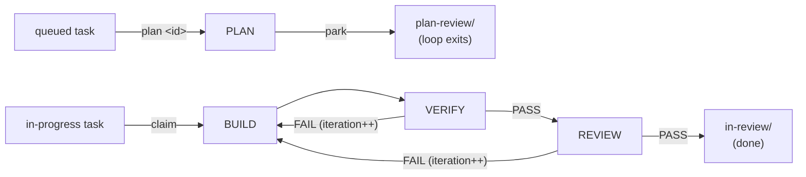

# The agentic loop

One command carries the whole engineering lifecycle. Two halves sit inside it:
the **authoring verbs** run interactively and hold the human gates, and the
**loop** claims approved work and drives it unattended.

The dividing rule is **park, don't block**: no stage ever waits on a human
inside a live session. A stage that reaches a gate writes its output, moves the
task to the gate's folder, and exits. That is why a watcher can plan a whole
queue overnight and you can review the results whenever it suits.

The pipeline shape is **not hardcoded**. It is the **engineering kind**,
declared in `packages/core/workflows/engineering/workflow.json` — stages,
transitions, iteration cap, work source, per-stage bash allowlists — with
prompt templates under `.../engineering/stages/`, interpreted by the pure
engine in `@agentic-workflow/core`. Everything below describes that kind. The
other kinds are in `references/workflow-kinds.md`.

Use the loop when a backlog task should run BUILD→REVIEW unattended. For a
single change you want to hand-hold, drive `/plan`, `/build`, `/verify`,
`/review` yourself — they each work standalone.

## The pipeline



| Stage | Writes code? | Role |
|-------|--------------|------|
| plan | no (task file only) | reads the task and the relevant code, writes `## Implementation Plan` onto the task file in place, in the main tree; then parks the task in `plan-review/` |
| build | **yes** | implements the approved plan test-first on the loop's own `feature/<id>` branch, or applies a VERIFY/REVIEW stage's feedback on a re-build; each iteration is committed as a checkpoint |
| verify | no | runs tests (bash allowlist), checks acceptance criteria, records its verdict via `workflow_verdict` |
| review | no | five-axis review of exactly `git diff base...branch` (read-only allowlist), records its verdict via `workflow_verdict` |

PLAN runs **right before execution** — on `plan <id>`, or a `claim`/`watch` tick
with no build work left — so plans cannot rot while tasks sit parked.

## The gates

Three human decisions, one verb. **`approve [id]`** advances a task by
whichever gate its folder implies — draft → `queued/` (scope and acceptance),
parked plan → `in-progress/` (the sign-off before any code is written), and
finished review → `completed/` (ship, with `--pr`/`--push`/`--local` choosing
what the ship publishes). Id-less, it resolves the single task
waiting at a loop wait-gate, falling back to a lone draft only when no loop
gate is waiting, so a pile of drafts never shadows a parked plan and
never-approved epic drafts are skipped. **`replan [id] [why]`** is the sole rejection verb — back to `queued/` marked
plan-next, with a PLAN pass chained in the same session so the revised plan
parks straight back in `plan-review/` (a busy session or a claim race leaves it
plan-next instead, which the next `claim`/`watch` honours first). The reason is
audited on the task file and threaded into the next PLAN pass's prompt as a
structured "Rejection reason from the plan gate" section — on the explicit
`plan <id>` path and the claim/watch path alike — so the new plan addresses it
instead of digging through notes. A successful park (the `Plan written` note)
retires it, whether PLAN replaced its section in place or stacked a new
heading.

Deterministic plugin code enforces the plan gate by grepping for the
`## Implementation Plan` heading — and, since the PLAN stage carries the plan
contract (`planContract` in the manifest), it also refuses to park a plan with
no `### Verification` subsection, so a plan reaches the human gate already
naming how each acceptance criterion will be proven. A refusal is recorded as
the same rejection note a human `replan` writes, so the retry PLAN pass is
told exactly why; after three consecutive refusals with no successful park
between them, the task is returned to `draft/` for human triage instead of
burning a PLAN run per poll tick forever. BUILD only ever claims
from `in-progress/`. There is no path that builds an ungated task.

**`new <idea>` always interviews you** — a restate-and-confirm when the idea
already carries a clear goal and testable criteria, a full `interview-me` run
when it does not. The interview happens in the calling agent's own turn because
subagents cannot converse; only after your confirmation does it hand the intent
to the `workflow-task-author` subagent to write the draft.

**A session claims work only when a human runs `watch` in it — never because it
merely goes idle.** That session then drives work until `unwatch` or `stop`.

The full folder lifecycle and file schema are `task-backlog-management`.

## Execution

`claim` pulls the next task once, now — build-ready work first, else one to
plan; `claim <id>` runs exactly that task instead of the priority walk (BUILD
if build-ready, else its PLAN pass). A task approved with `--auto-plan`
crosses the plan gate automatically when its plan parks and continues into
BUILD — the human chose that at the task gate; the ship gate is never
automated. `watch [interval]` turns the
session into a standing worker firing on its own `session.idle` events plus a
per-session **polling timer** (`workflows.<kind>.trigger.intervalMinutes`,
else 5m; floor 10s).
Each tick first asks the server whether the session is actually idle
(`client.session.status()`) and does nothing otherwise — the timer exists for
the case idle events miss, a task approved in *another* session while this one
sat quiet.

On a tick, the watcher scans `in-progress/` for tasks where `isClaimable` holds
— has a plan, and has **never** had any `> BUILD started` note. Only with no
build work does it fall back to `queued/` for something to plan-and-park:
**build work always beats plan work**, so tasks in flight finish before new
ones spin up. Within the backlog it takes the lowest-`priority` claimable task
(ties by id).

**A claim is atomic and means a live loop.** A non-recursive `mkdir` of
`<folder>/.claims/<id>` either succeeds or fails because another watcher won;
the `> BUILD started` note is the human-readable audit record, the marker
directory is the lock. Every gate verb refuses on a held marker for that
reason. A queued claim orphaned by a crashed PLAN is always safe to release
once stale — PLAN writes no code.

In **worktree mode** (the default, `worktreesDir`) each loop owns its own
worktree, so several `watch` sessions drive different tasks concurrently in one
instance. In **shared-tree mode** (`worktreesDir: false`) all sessions share one
checkout and one branch, so a per-directory execution lock serializes drives; a
finished run leaves that checkout on `feature/<id>`, and the next run re-bases
off the default branch rather than stacking on it.
Neither covers separate opencode *processes* racing the same clone on
`index.lock` during backlog commits — run additional watchers in their own
clones for hard isolation.

**Current-branch mode** (`taskBranch: false`) is the third: the loop cuts no
branch and moves nothing, running in the main tree on the branch already checked
out. It forces worktrees off, refuses to start on the default branch (its
checkpoints `git add -A` the human's own tree), and holds a cross-process
one-run-per-tree marker under `<git-common-dir>` — two runs sharing a branch
would land inside each other's diff boundary. `git.base` is a commit sha there,
not a branch.

`recover <id>` resumes a run that died mid-build, from its **state snapshot** at
the exact stage it reached or from the persisted plan when no valid snapshot
exists; cross-process liveness is judged by the stage marker and the claim
stamp's own writer identity, never by any in-memory map. It resumes at once when
either proves the run is dead, and waits out the stale window only when the
holder might still be alive. `stop` aborts and exits watch mode; `unwatch` leaves watch mode
alone, letting a claimed build finish. `status` reports the current loop plus a
backlog roll-up.

## Kinds and the scheduler

A workflow kind declares its stages (each `work` — edits things — or `check` —
records a verdict), a transition table (effects `fire` the next stage, `park`
at a human gate, `done` the loop, or `stop` for a human), an iteration cap, a
**work source** binding, and per-stage bash allowlists. Adding a kind means
writing a manifest and prompts, not driver code.

A common scheduler step (`pollOnce`) runs on every claim trigger and walks work
sources in claim-priority order; the first source yielding a claim wins the
tick. Each kind's command scopes the poll to its own source, so
`/agentic-workflow:engineering watch` never claims a PR and vice versa.
`engineering` is on unless disabled; every other kind is experimental and off
until listed with `"enabled": true` in `.agentic-workflow.json`. The four
sitters — pr-sitter, review-sitter, dep-sitter, main-sitter — are in
`references/workflow-kinds.md`.

## The verdict contract

VERIFY and REVIEW record their verdict by calling the **`workflow_verdict`
plugin tool**, the loop's only trusted verdict channel. The driver accepts a
verdict only from the session whose loop is sitting in that exact check stage.
A `WORKFLOW_VERIFY:`/`WORKFLOW_REVIEW:` line in the stage's text is a
human-readable echo and is deliberately **ignored** — free text is untrusted,
and a quoted contract or echoed repo content must never flip control flow.

```
PASS     # verify: every criterion met, tests green → review; review: no critical/important findings → done
FAIL     # otherwise → re-build with the failure fed back, if iteration budget remains
ERROR    # the check itself could not run (broken environment) → stop for a human, no iteration burned
```

**A missing verdict is never a stall**, and never a silent FAIL either: the
driver re-runs that pass once (no iteration burned — a broken channel must not
buy a rebuild of already-done work), and if the second attempt records nothing
the stage is an ERROR that stops the loop for a human. The same contract covers
every manifest check stage of the running kind, validated against that kind's
manifest.

**A REJECTED verdict is not a missing one.** A call the admission rules refuse —
an axis missing, a FAIL naming no critical/important finding, a PASS citing no
evidence — records nothing, so the pass is re-run exactly as above, this time
told what the refusal said. If the second call is refused too, the stage is
recorded **as it declared**: a rejected FAIL becomes the stage's FAIL and
re-fires BUILD with the findings. Only an unearned PASS still ERRORs (laundering
one would ship unreviewed work), and that ERROR names the refusal instead of
blaming the plugin wiring. A review that plainly failed therefore always reaches
a rebuild, even when it never managed to phrase its verdict.

The tool also accepts optional `reason` and `criteria` (per-criterion
`{criterion, pass}`). These steer only the **next iteration's prompt** — failed
criteria are threaded ahead of the stage's prose so the re-build leads with
what actually failed — never control flow, which is `verdict` alone.

### Declared check commands are established fact

A check stage may carry **check commands** from any of three places, in
precedence order: `workflows.<kind>.stageChecks`, the manifest stage's `checks`,
or — when the stage sets `discoverChecks`, as engineering's VERIFY does — the
`agentic-checks` block the approved plan declared. The **driver** runs them in
the stage's work tree before the stage fires, and the stage does not get to
disagree:

- **Exit 0** adds nothing — the verdict is what the stage recorded.
- **Exit 124/126/127** (timed out / not found / not executable) means the check
  could not run: **ERROR**, which stops for a human without spending an iteration.
- **Any other exit code** resolves the stage to **FAIL**, however it voted.

Discovered commands are frozen at plan time, not re-derived per run — that is
the point, since a stage that picks its own commands each time moves the verdict
without the code moving — and each one is admitted only if the stage's own bash
allowlist would have let its agent run it.

The mechanism is the findings one: each red check becomes a `critical` finding
on a synthetic `checks` axis, so `effectiveVerdict` derives the stage down. A
stage cannot argue a red check into a PASS; a broken check is fixed by a human
editing the plan's block or pinning `stageChecks`, not by disputing it in the
transcript. Those commands also
count as **observed evidence**, so a `requireEvidence` stage should cite them
rather than re-run them — re-running is exactly the run-to-run variance the
declaration exists to remove.

## What a stage receives

Every stage's prompt carries its **contract** — goal, acceptance criteria,
worktree instructions, diff boundary, and the verdict-or-scope block — plus
earlier stages' captured output as *artifacts*. A check stage's artifact leads
with the **structured verdict block**: the reason, the failed criteria, and the
blocking axis findings with `file:line`.

The **goal arrives deduplicated**: the task file's `## Implementation Plan`
section rides only in the `plan` artifact, and the audit-note tail
(`> CLAIMED …`, `> BUILD started …`) is stripped at render — the task file on
disk keeps both. A stage that needs the audit history reads the task file at
its `task.path`.

`workflows.<kind>.stageContext` (and a manifest stage's `context`) caps what a
stage reads of each artifact; unset means unbounded. Under a budget: the
**contract is never trimmed** (it is composed after the budget applies, so a
budget can starve the history, never the contract); the **verdict block is
never trimmed** (bounded by construction, highest signal in the prompt); the
**prose may arrive as an excerpt**, head and tail kept with the elided middle
marked — the findings carry `file:line`, the prose is commentary. The **run log
is always complete**: each pass's full text is written to
`<tasksDir>/runs/<id>.md` before it becomes an artifact, so a budget costs
prompt weight, never evidence.

A re-build also receives a bounded **attempts ledger** — one line per counted
iteration (stage, verdict, one-line reason) — so it can avoid re-trying a fix
that already failed. It is absent on the first iteration.

## Termination

- **REVIEW PASS** → done; the task moves to `in-review/`. Review
  `git diff <base>...feature/<id>`, then `approve <id>` — the ship gate, which
  completes the task and publishes the branch as far as its `--pr`/`--push`/
  `--local` and `--base=` flags ask (the command body defines them; omitted,
  the repo's `shipPublish` and the recorded base decide). The loop never ships
  for you.
- **FAIL** with budget remaining → re-build with the failure threaded in. A
  verify-FAIL re-build drops stale review feedback and vice versa: old feedback
  judged an older build.
- **FAIL** at the cap → stop and report. The cap tripping means the plan itself
  is suspect, so the move is `replan <id> <why>`, which immediately re-plans
  and parks a fresh plan for review. Default `maxIterations` is 3, shared
  across both feedback loops.
- **ERROR** → stop immediately for a human; fix the environment, then
  `recover <id>`.
- A stage exceeding `stageTimeoutMinutes` fails the loop, with partial work
  checkpointed on the branch, rather than wedging the driver.

## Audit trail

Every lifecycle event — task approved, plan written and parked, plan approved
or rejected (with the approver's git identity and the reason), build
start/finish, each verdict with its reason and failed criteria, stop, recovery,
completion — is appended to the task file as a timestamped note, and each
stage's full output goes to `<tasksDir>/runs/<id>.md`. On termination the run
log gains a `## Run summary`: per-stage wall-clock, verdict history, iterations
used. Secrets echoed into any durable artifact are shape-redacted (`AKIA…`,
`sk-…`, tokens, PEM blocks, `key/secret/token: …`) before writing. See
`docs/design/threat-model.md`.

## Config

Optional `.agentic-workflow.json` at the repo root, layered over an optional
user-scope `~/.agentic-workflow.json` (repo wins field by field; nested objects
merge per key, arrays and scalars replace). Every field has a default — the
full set is `docs/configuration.md`.

```jsonc
{
  "maxIterations": 3,           // shared cap on verify-FAIL + review-FAIL re-builds
  "tasksDir": "docs/tasks",     // root of the task backlog
  "stageTimeoutMinutes": 60,    // wall-clock cap per stage
  "worktreesDir": ".workflow-worktrees", // per-task worktree isolation; false = shared-tree
  "taskBranch": "feature/",     // work-branch prefix; false = build on the branch already checked out
  "worktreeSetup": "npm ci",    // OPTIONAL: run in a fresh worktree (deps aren't checked out)
  "workflows": {                // OPTIONAL: per-kind sections; sitters off until "enabled": true
    "engineering": { "stageFanout": { "review": "axis" } },
    "pr-sitter": { "enabled": true, "query": "is:open author:@me" }
  }
}
```

**Worktree isolation** keeps the human's tree untouched and lets several watch
sessions drive concurrently. Stage prompts carry a `Worktree:` line pinning all
reads, edits, and tests there. The backlog stays canonical in the main tree,
committed there per terminal event. A task's
worktree is created on its first BUILD and removed only when the task
**ships** — a run ending for any reason keeps it, so a retry, a `recover`, or a
`replan` bounce out of `in-review/` resumes on top of the previous iteration's
work and its `worktreeSetup` output.

**Multi-pass review.** `workflows.<kind>.stageFanout` runs a check stage several
times and takes the **worst** verdict, so a single prompt-injected reviewer
cannot wave a change through (threat model T1), at ~N× stage time. `"axis"` gives
one pass per required axis, each enforced against its own; a list of free-text
lenses gives one pass each, enforced only if the list names every required axis.
That difference, and the unreviewed-axis warning, are in
`docs/configuration.md`. The retired top-level `reviewLenses` moved here.

## Verification

- [ ] `status` reflects the actual current stage while a loop runs, and the
      watch cadence when watching
- [ ] Every VERIFY and REVIEW turn calls `workflow_verdict` exactly once, and
      its text echo matches the recorded verdict
- [ ] No file was edited for a task whose plan was never approved, and every
      build edit landed on `feature/<id>`, never the base branch
- [ ] A stopped or failed loop leaves its task in `in-progress/` with a
      timestamped note, and released its `.claims/<id>` marker
- [ ] A REVIEW PASS parks the task in `in-review/`; only a human moves it to
      `completed/`
- [ ] `approve <id>` refuses a task with no `## Implementation Plan`, and PLAN
      never parks a planless task
- [ ] A watch session only ever claims a task `isClaimable` returns true for
      (or a queued task for PLAN), and holds its marker while driving it
- [ ] No session builds anything without a human having run `watch` or `claim`
      in it first
- [ ] `unwatch` and `stop` stop the polling timer — no tick fires after either
- [ ] A re-build's diff changes the file(s)/behavior the failure reason named,
      not a byte-for-byte repeat of the previous attempt
